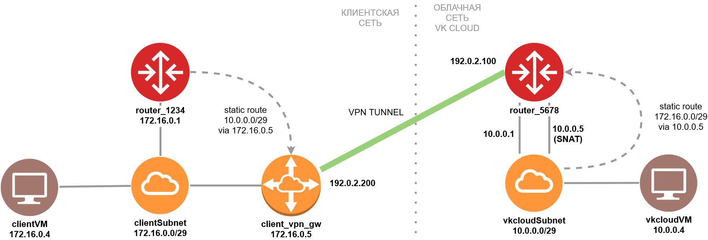

Далее вы научитесь организовывать взаимодействие виртуальной сети VK Cloud с внешней (клиентской) сетью через VPN-туннель. Также будут созданы несколько виртуальных машин для проверки работоспособности туннеля.

<info>

Далее будет построен VPN-туннель до другой сети платформы VK Cloud, в качестве VPN-эндпоинта будет использоваться виртуальная машина. Приведенную информацию по настройке VPN-туннеля можно адаптировать под работу с любым другим VPN-эндпоинтом, например, корпоративным межсетевым экраном или другим сетевым оборудованием.

</info>

## 1. Подготовительные шаги

1. Убедитесь, что OpenStack CLI [установлен](../../../../base/account/project/cli/setup) и вы можете [авторизоваться](../../../../base/account/project/cli/authorization) в нем.

1. Создайте сети.

   <info>

   Можно создать сеть с любыми параметрами на ваш выбор. Скорректируйте дальнейшие шаги в этом сценарии при необходимости.

   </info>

   <tabs>
   <tablist>
   <tab>Клиентская сеть</tab>
   <tab>Виртуальная сеть</tab>
   </tablist>
   <tabpanel>

   Эта сеть будет выступать в роли клиентской сети.

   При создании сети задайте следующие параметры:

   - **Имя сети**: `clientNet`.
   - **Доступ в интернет**: убедитесь, что эта опция выбрана. Она позволит назначить виртуальным машинам в этой сети публичные плавающие IP-адреса.
   - **Маршрутизатор**: `Создать новый`.
   - **Список подсетей**: отредактируйте единственную подсеть в списке. Задайте следующие параметры для подсети:

     - **Имя**: `clientSubnet`.
     - **Адрес**: `172.16.0.0/29`.
     - **Шлюз**: `172.16.0.1`.
     - **Включить DHCP**: убедитесь, что эта опция выбрана.
     - **Пул DHCP IP-адресов**: `172.16.0.2 - 172.16.0.6`.
     - **Приватный DNS**: убедитесь, что эта опция выбрана.

   </tabpanel>
   <tabpanel>

   Эта сеть будет выступать в роли виртуальной сети.

   При создании сети задайте следующие параметры:

   - **Имя сети**: `vkcloudNet`.
   - **Доступ в интернет**: убедитесь, что эта опция выбрана. Она позволит обеспечить работу VPN-туннеля и назначить виртуальным машинам в этой сети публичные плавающие IP-адреса.
   - **Маршрутизатор**: `Создать новый`.
   - **Список подсетей**: отредактируйте единственную подсеть в списке. Задайте следующие параметры для подсети:

     - **Имя**: `vkcloudSubnet`.
     - **Адрес**: `10.0.0.0/29`.
     - **Шлюз**: `10.0.0.1`.
     - **Включить DHCP**: убедитесь, что эта опция выбрана.
     - **Пул DHCP IP-адресов**: `10.0.0.2 - 10.0.0.6`.
     - **Приватный DNS**: убедитесь, что эта опция выбрана.

   </tabpanel>
   </tabs>

1. Определите, какие маршрутизаторы были созданы для этих сетей. Эта информация понадобится при дальнейшей настройке VPN.

   Далее предполагается, что:

   - для сети `clientNet` был создан маршрутизатор `router_1234`;
   - для сети `vkcloudNet` был создан маршрутизатор `router_5678`.

1. Определите IP-адрес интерфейса `SNAT` для маршрутизатора `router_5678`:

   1. Откройте страницу со списком подсетей для сети `vkcloudNet`.
   1. Нажмите на имя подсети `vkcloudSubnet`.
   1. Перейдите на вкладку **Порты**.
   1. Найдите в списке портов порт устройства `SNAT` и скопируйте его IP-адрес.

1. Создайте виртуальную машину, которая будет выступать в качестве VPN-шлюза в клиентской сети `clientNet`, со следующими параметрами:

   - **Имя виртуальной машины**: `client_vpn_gw`.
   - **Тип виртуальной машины**: `Basic-1-2`.
   - **Количество машин в конфигурации**: одна.
   - **Операционная система**: `Ubuntu 22.04`.
   - **Сеть**: клиентская сеть и соответствующая подсеть `clientNet: clientSubnet`.
   - **Ключ виртуальной машины**: ключ, с помощью которого будет выполняться подключение по SSH.
   - **Настройки Firewall**: все разрешено (`all`).
   - **Назначить внешний IP**: убедитесь, что эта опция выбрана.

   Прочие параметры виртуальной машины выберите на свое усмотрение.

1. Соберите сведения, необходимые для дальнейшей работы. Далее предполагается, что:

   | Объект                                                               | Значение        |
   | -------------------------------------------------------------------- | --------------- |
   | Публичный IP-адрес маршрутизатора `router_5678`                      | `192.0.2.100`   |
   | IP-адрес виртуальной машины `client_vpn_gw` в подсети `clientSubnet` | `172.16.0.5`    |
   | Плавающий публичный IP-адрес виртуальной машины `client_vpn_gw`      | `192.0.2.200`   |
   | Клиентская подсеть со стороны клиентского VPN-шлюза `client_vpn_gw`  | `172.16.0.0/29` |
   | Виртуальная подсеть со стороны облачного VPN-шлюза                      | `10.0.0.0/29`   |
   | IP-адрес порта `SNAT` в облачной подсети                             | `10.0.0.5`      |



## 2. Настройте VPN-туннель на стороне облачной сети

Создайте VPN со следующими параметрами:

<tabs>
<tablist>
<tab>1. Настройка IKE</tab>
<tab>2. Настройка IPsec</tab>
<tab>3. Создание Endpoint Groups</tab>
<tab>4. Настройка туннеля</tab>
</tablist>
<tabpanel>

Выберите **IKE-политика** — `Новая IKE-политика`, и задайте:

- **Имя политики**: `vkcloud-client-ike`.
- **Время жизни ключа**: 3600 секунд.
- **Алгоритм авторизации**: `sha256`.
- **Алгоритм шифрования**: `aes-256`.
- **Версия IKE**: `v2`.
- **Группа Диффи-Хеллмана**: `group14`.

</tabpanel>
<tabpanel>

Выберите **IPsec-политика** — `Новая IPsec-политика`, и задайте:

- **Имя политики**: `vkcloud-client-ipsec`.
- **Время жизни ключа**: 3600 секунд.
- **Алгоритм авторизации**: `sha256`.
- **Алгоритм шифрования**: `aes-256`.
- **Группа Диффи-Хеллмана**: `group14`.

</tabpanel>
<tabpanel>

Выберите:

- **Маршрутизатор**: `router_5678`.

- **Local Endpoint**: `Новая endpoint-группа`.
  - **Имя**: `vkcloud-endpoint-group`.
  - **Подсети**: `vkcloudSubnet`.

- **Remote Endpoint**: `Новая endpoint-группа`.
  - **Имя группы**: `client-endpoint-group`.
  - **Адрес подсети**: `172.16.0.0/29`.

</tabpanel>
<tabpanel>

Выберите **Настройки** — `Базовые`, и задайте:

- **Имя туннеля**: `vkcloud-client-vpn`.
- **Публичный IPv4 адрес пира (Peer IP)**: `192.0.2.200`.
- **Ключ совместного использования (PSK)**: любой pre-shared key по вашему выбору, удовлетворяющий требованиям к ключу.

  Ключ должен:

  - быть длиной не менее 16 символов;
  - содержать хотя бы одну букву или цифру;
  - состоять только из следующих допустимых символов:
    - заглавные и строчные буквы латинского алфавита;
    - цифры;
    - символы `-+&!@#$%^*(),.:;_=<>{}/`.

</tabpanel>
</tabs>

## 3. Настройте VPN-туннель на стороне клиентской сети

1. Отключите IP Source Guard для порта VPN-шлюза, чтобы он мог пересылать любой трафик:

   1. Найдите порт с приватным IP-адресом `172.16.0.5` виртуальной машины `client_vpn_gw`. Получите идентификатор этого порта.

   1. Разрешите прохождение трафика с любых адресов через этот порт:

      ```bash
      openstack port set <идентификатор порта> --allowed-address ip-address=0.0.0.0/0
      ```

1. Подключитесь к виртуальной машине `client_vpn_gw` по SSH. Все дальнейшие действия должны выполняться на этой виртуальной машине.

1. Включите IP Forwarding, чтобы виртуальная машина могла маршрутизировать трафик из приватной сети в VPN-туннель:

   ```bash
   echo 'net.ipv4.ip_forward = 1' | sudo tee -a /etc/sysctl.conf
   sudo sysctl -p

   ```

1. Установите StrongSwan — реализацию IPsec VPN для Linux:

   ```bash
   sudo apt update
   sudo apt install -y strongswan libcharon-extra-plugins libcharon-extauth-plugins libstrongswan-extra-plugins

   ```

1. Добавьте параметры VPN-соединения со стороны клиентской сети в файл `/etc/ipsec.conf`. Эти параметры — зеркальное отражение настроек туннеля, сделанных на [предыдущем шаге](#2--nastroyte-vpn-tunnel-na-storone-oblachnoy-seti).

   ```ini
   conn client-vkcloud-vpn
      authby=secret
      left=%defaultroute
      leftid=192.0.2.200
      leftsubnet=172.16.0.0/29
      right=192.0.2.100
      rightsubnet=10.0.0.0/29
      ike=aes256-sha2_256-modp2048!
      esp=aes256-sha2_256!
      keyingtries=0
      ikelifetime=3600
      lifetime=8h
      dpddelay=30
      dpdtimeout=120
      dpdaction=hold
      auto=start
   ```

   <info>

   Для группы Диффи-Хеллмана `group14` эквивалентное обозначение — `modp_2048`. Соответствие `modp` именам групп приводится в [RFC 3526](https://www.rfc-editor.org/rfc/rfc3526).

   </info>

1. Укажите в файле `/etc/ipsec.secret` ключ совместного использования (PSK). Ключ должен совпадать с ключом, указанным [ранее](#2--nastroyte-vpn-tunnel-na-storone-oblachnoy-seti):

   ```ini
   192.0.2.200 192.0.2.100 : PSK "<pre-shared key, заданный ранее>"
   ```

1. Перезапустите сервис StrongSwan:

   ```bash
   sudo systemctl restart strongswan-starter
   ```

## 4. Добавьте статические маршруты

Чтобы трафик проходил через VPN-туннель, требуется добавить статические маршруты:

<tabs>
<tablist>
<tab>На стороне облачной сети</tab>
<tab>На стороне клиентской сети</tab>
</tablist>
<tabpanel>

1. Откройте в личном кабинете страницу со списком подсетей для сети `vkcloudNet`.
1. Раскройте меню подсети `vkcloudSubnet` и выберите пункт `Редактировать подсеть`.
1. Убедитесь, что выбрана опция **Показывать поле статических маршрутов**.
1. В поле пропишите статический маршрут до клиентской сети `172.16.0.0/29`. В качестве next hop требуется указать IP-адрес интерфейса `SNAT` маршрутизатора `router_5678` в облачной подсети `vkcloudSubnet`.

   ```text
   172.16.0.0/29 - 10.0.0.5
   ```

</tabpanel>
<tabpanel>

1. Откройте в личном кабинете страницу с информацией о маршрутизаторе `router_1234`, к которому подключены клиентская подсеть `clientSubnet` и VPN-шлюз `client_vpn_gw`.
1. На вкладке **Статические маршруты** нажмите кнопку **Добавить статический маршрут**.
1. Пропишите статический маршрут до облачной сети `10.0.0.0/29`:

   - **Сеть назначения**: `10.0.0.0/29`.
   - **Промежуточный узел (Next HOP)**: `172.16.0.5` (IP-адрес VPN-шлюза в клиентской подсети).

1. Нажмите кнопку **Добавить интерфейс**.

</tabpanel>
</tabs>

## 5. Проверьте работоспособность VPN-туннеля

1. Посмотрите состояние VPN-туннеля со стороны платформы VK Cloud.

   Для этого откройте страницу VPN `vkcloud-client-vpn` в личном кабинете и перейдите на вкладку **Параметры туннеля**. VPN должен находиться в статусе `ACTIVE`.

1. Создайте группу правил файервола `icmp`, разрешающую ICMP-трафик.

   В этой группе создайте входящее правило:

   - **Тип**: `ICMP`.
   - **Удаленный адрес**: `Все IP-адреса`.

   Это нужно, чтобы тестовые виртуальные машины могли пинговать друг друга.

1. Создайте две виртуальные машины:

   - `clientVM`:

     - в сети `clientNet`, подсети `clientSubnet`;
     - с плавающим IP-адресом для подключения к ней по SSH;
     - с группами правил файервола `default`, `ssh`, `icmp`.

   - `vkcloudVM`:
     - в сети `vkcloudNet`, подсети `vkcloudSubnet`;
     - с плавающим IP-адресом для подключения к ней по SSH;
     - с группами правил файервола `default`, `ssh`, `icmp`.

1. Определите приватные IP-адреса виртуальных машин в соответствующих подсетях. Пусть:

   - `clientVM` имеет IP-адрес `172.16.0.4`;
   - `vkcloudVM` имеет IP-адрес `10.0.0.4`.

1. Подключитесь к виртуальной машине `vkcloudVM` по SSH.

1. Выполните пинг виртуальной машины `clientVM` с виртуальной машины `vkcloudVM`:

   ```bash
   ping 172.16.0.4
   ```

   Хост `clientVM` должен отвечать на пинг.

## Проконтролируйте использование ресурсов

Если созданные ресурсы вам больше не нужны, удалите их:

1. [Удалите](/ru/base/iaas/vm-start/manage-vm/vm-delete) виртуальные машины.
1. [Удалите](../../operations/manage-vpn#udalenie-vpn-tunnelya) VPN-туннель.
1. [Удалите](../../operations/manage-router#upravlenie-staticheskimi-marshrutami) статические маршруты, прописанные на стороне клиентской сети.

   <info>

   Статические маршруты на стороне облачной сети будут удалены вместе с подсетью, для которой они были прописаны.

   </info>

1. [Удалите](../../operations/manage-router#udalenie-marshrutizatora) маршрутизаторы клиентской и облачной сетей.
1. Удалите клиентскую и облачную [подсети](../../operations/manage-net#udalenie-podseti) и [сети](../../operations/manage-net#udalenie-seti).
1. [Удалите](../../operations/manage-floating-ip#udalenie-plavayushchego-ip-adresa-iz-proekta) плавающие IP-адреса.
