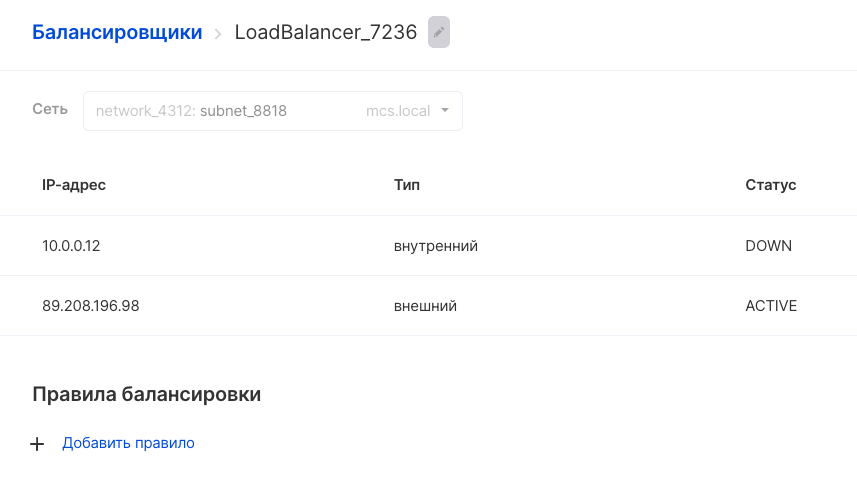
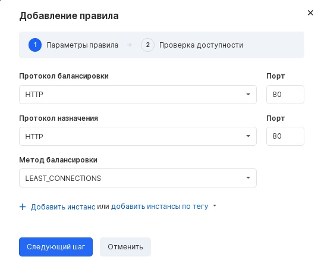
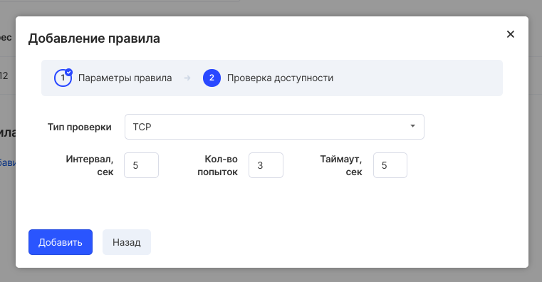

Для добавления правила в созданный балансировщик необходимо выбрать его в списке созданных балансировщиков в разделе "Балансировщики нагрузки" сервиса Виртуальные сети:

При выборе балансировкища откроется окно для просмотра, добавления и редактирования правил:

Для добавления правила следует указать необходимые значения полей:

-
- Протокол балансировки
- Протокол назначения
- Метод балансировки
- Порт

На следующем шаге будет предложено настроить проверку доступности:

