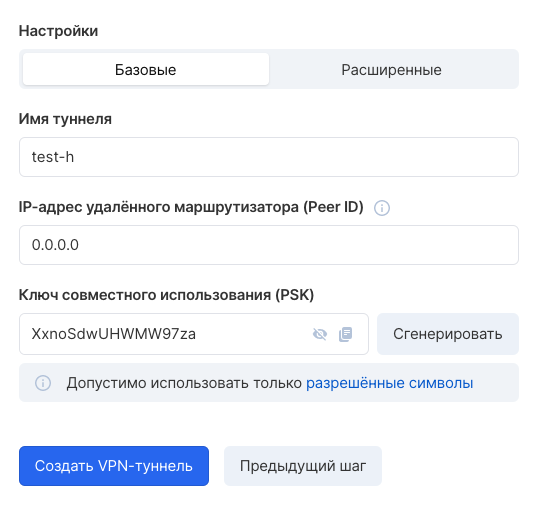
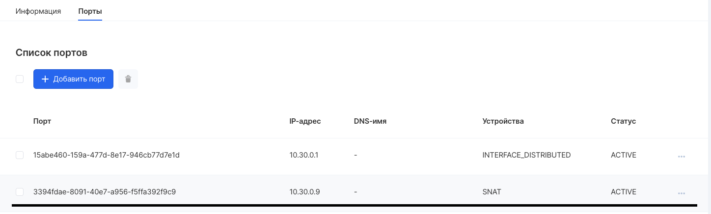
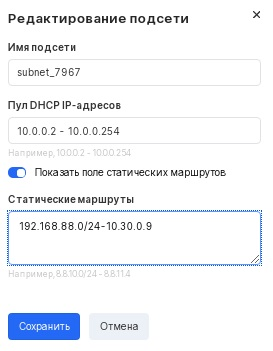

## Описание

VK Cloud предоставляет Site-to-Site IPsec VPN как сервис, позволяющий связать удаленную сеть клиента и приватную сеть проекта.

Сервис работает для сетей, подключенных к маршрутизатору VK Cloud, основан на программном обеспечении strongSwan.

**Информация**

Получить лог сервиса со стороны VK Cloud возможно с помощью обращения в техническую поддержку.

## Создание

Для создания соединения в [личном кабинете VK Cloud](https://mcs.mail.ru/app/services/server/vpn-tunnels/) требуется перейти на страницу "VPN" сервиса "Виртуальные Сети" и выбрать "Добавить" в верхнем меню. Откроется мастер создания нового VPN:

На первом шаге потребуется настроить параметры IKE соединения. Со стороны сервиса поддерживается только main режим установления соединения.

Второй шаг требует настройки времени жизни ключа, выбор группы Диффи-Хеллмана и алгоритма шифрования.

На третьем шаге нужно выбрать существующий маршрутизатор, указать параметры локальной endpoint группы со стороны проекта VK Cloud и удаленной - со стороны сети клиента:

На четвертом шаге настраивается имя туннеля, адрес удаленного маршрутизатора - маршрутизируемый адрес оборудования клиента и PSK ключ:

**Разрешенные символы PSK:**

Заглавные и строчные буквы латинского алфавита, цифры, символы !"#$%&()\*+,-.:;<=>?@[]^\_\`{}~

Ключ должен содержать хотя бы одну букву или цифру, помимо специальных символов.

После нажатия "Создать VPN-туннель" начнется процесс создания туннеля.

## Настройка маршрутов

Для корректной работы соединения помимо настройки оборудования удаленной стороны необходимо настроить маршруты для сети клиента и проектной сети VK Cloud: трафик в сеть клиента от виртуальных машин должен идти через порт c IP-адресом, соответствующим порту маршрутизатора "SNAT".

1.  Найти порт и его IP-адрес возможно в разделе Сети → <название приватной сети> → Выбрать требуемую подсеть  → Порты (Устройство имеет обозначение "SNAT").
2.  После получения адреса SNAT порта следует указать маршрут в свойствах сети:

    В разделе "Сети" следует выбрать сеть, перейти в настройки требуемой подсети. В окне конфигурирования подсети выбрать элемент "Показать поле статических маршрутов" и ввести маршрут до удаленной сети в формате <адрес сети> - <адрес SNAT порта>:

3.  После сохранения параметров следует обновить аренду DHCP на виртуальных машинах указанной подсети.

## Создание средствами terraform

Как правило, при использовании Terraform возникает необходимость прокладывания VPN между Terraform и другими сетями на сервисе VK Cloud, которые используют протокол IPSec.

Используя Terraform, необходимо создать VPN-шлюз и клиентский шлюз с параметрами удаленной сети в той мере, в какой это возможно.

Затем создать VPN-соединение и соответствующий маршрут.

**Код создания VPN в Terraform** выглядит следующим образом:

Создаем IKE политику:

```
resource "openstack_vpnaas_ike_policy_v2" "policy" {
  # Имя ike политики
  name = "ike_policy"

  # Алгоритм целостности
  # Допустимые значения sha1, sha256, sha384, sha512.
  auth_algorithm = "sha1"

  # Алгоритм шифрования
  # Допустимые значения 3des, aes-128, aes-192, aes-256
  encryption_algorithm = "aes-256"

  # Используемая группа Диффи-Хеллман.
  # Группы с большим номером используют большую длину ключа, что увеличивает стойкость.
  # Допустимые значния group2, group5, group14.
  pfs = "group5"

  # Версия IKE
  # Используемая версия протокола IKE. Версии несовместимы.
  # Рекомендуется использование актуальной версии (IKEv2).
  ike_version = "v2"

  # Время жизни ключа IKE (IKE SA).
  # Рекомендуется устанавливать значение,
  # превышающее аналогичное для ключей IPsec (CHILD SA ESPAH).
  # Настройка может различаться между участниками IPsec соединения.
  # По умолчанию 3600
  lifetime {
      units = "seconds"
      value = 3600
  }
}
```

Создаем IPSEC политику:

```
resource "openstack_vpnaas_ipsec_policy_v2" "policy" {
  # Имя ipsec политики
  name = "ipsec_policy"

  # Алгоритм целостности
  # Допустимые значения sha1, sha256, sha384, sha512.
  auth_algorithm = "sha1"

  # Режим инкапсуляции
  # Допустимые значения tunnel и transport
  encapsulation_mode = "tunnel"

  # Алгоритм шифрования
  # Допустимые значения 3des, aes-128, aes-192, aes-256
  encryption_algorithm = "aes-256"

  # Группа Диффи-Хеллмана
  # Используемая группа Диффи-Хеллман, группы с большим номером
  # используют большую длину ключа, что увеличивает стойкость.
  # Допустимые значния group2, group5, group14.
  pfs = "group5"

  # Транспортный протокол
  # Допустимые значения esp, ah и ah-esp
  transform_protocol = "esp"

  # Время жизни ключа IKE (IKE SA).
  # Рекомендуется устанавливать значение, превышающее аналогичное для ключей IPsec (CHILD SA ESPAH).
  # Настройка может различаться между участниками IPsec соединения.
  # По умолчанию 3600
  lifetime {
      units = "seconds"
      value = 3600
  }
}
```

Добавляем роутер который будет использоваться как шлюз для доступа во внутреннею сеть проекта:

```
resource "openstack_vpnaas_service_v2" "service" {
  # Маршрутизатор который будет использоваться для маршрутизации
  # во внутреннею сеть
  router_id      = "2068c8f6-497c-4ef4-a3b8-1229db3739f8"
  # Принутительно указываем сервису, что он поднят
  admin_state_up = "true"
}
```

Добавляем local endpoint группу:

```
resource "openstack_vpnaas_endpoint_group_v2" "local_group" {
  # Название local endpoint группы
  name = "local_enpoint"
  # Допустимые значения subnet и cidr
  # В качестве subnet указывается subnet id
  type = "subnet"
  # Список подсетей либо cidr маски
  endpoints = [
    "01a79bc6-8fed-49b6-b94b-25c97a12ccdb",
    "1cc6714e-e917-4724-a495-edf673d4b8cf",
    "33bdf637-ec7d-4540-b2c2-181e4d47f44a",
    "42d36b9d-1e3c-4832-9c0b-bfc87b1a9374"
  ]
}
```

Добавляем remote endpoint группу:

```
resource "openstack_vpnaas_endpoint_group_v2" "remote_group" {
  # Название remote endpoint группы
  name = "remote_enpoint"
  type = "cidr"
  # Адрес удаленной подсети
  endpoints = [
    "192.168.0.0/24",
  ]
}
```

Создаем соединение:

```
resource "openstack_vpnaas_site_connection_v2" "connection" {
  # Имя туннеля
  name              = "tunnel"
  # Ключ совместного использования (PSK)
  psk               = "MViK7FSyhiweGkGF"
  peer_address      = "192.168.0.1"
  # IP-адрес удалённого маршрутизатора
  # Используется вместе с ключом PSK для идентификации удалённого шлюза.
  peer_id           = "192.168.0.1"
  ikepolicy_id      = openstack_vpnaas_ike_policy_v2.policy.id
  ipsecpolicy_id    = openstack_vpnaas_ipsec_policy_v2.policy.id
  vpnservice_id     = openstack_vpnaas_service_v2.service.id
  local_ep_group_id = openstack_vpnaas_endpoint_group_v2.local_group.id
  peer_ep_group_id  = openstack_vpnaas_endpoint_group_v2.remote_group.id
}
```
