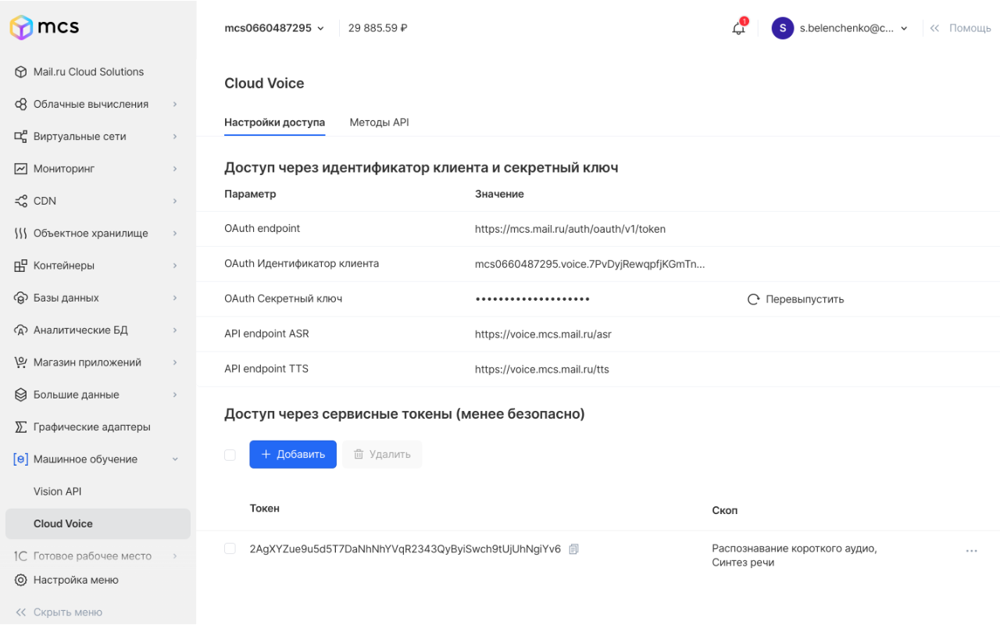

Cloud Voice — сервис, который позволяет распознавать и синтезировать речь. С его помощью можно озвучить контент на сайте, проанализировать звонки клиентов или добавить в приложение голосовое управление.

Для начала использования сервиса перейдите на страницу [Cloud Voice](https://msk.cloud.vk.com/app/services/machinelearning/voice/methods/). Для этого вы должны быть авторизованы.

Чтобы воспользоваться сервисом, необходимо получить токен доступа. О том как получить токен доступа, читайте в [статье](../../service-management/get-voice-token).

### Смотрите также

[Получение токена доступа](../../service-management/get-voice-token)

[Распознавание речи](../../service-management/speech-recognition)

[Синтез речи](../../service-management/text-to-speech)
