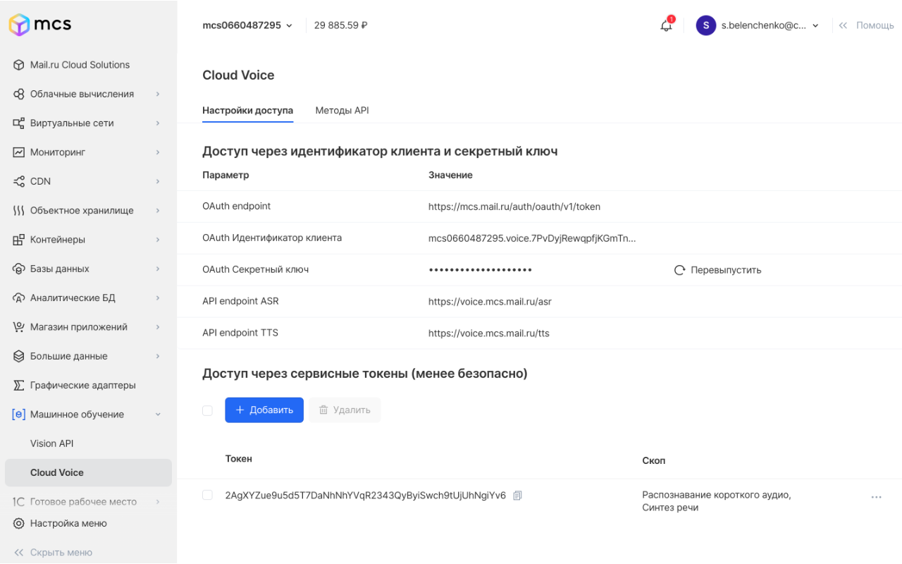

# {heading(О сервисе)[id=cloud_voice-concepts-about]}

Cloud Voice — сервис, который позволяет распознавать и синтезировать речь. С его помощью можно озвучить контент на сайте, проанализировать звонки клиентов или добавить в приложение голосовое управление.

Для начала использования сервиса перейдите на страницу [Cloud Voice](https://msk.cloud.vk.com/app/services/machinelearning/voice/methods/). Для этого вы должны быть авторизованы.

Чтобы воспользоваться сервисом, необходимо получить токен доступа. О том как получить токен доступа, читайте в {linkto(../../instructions/get-voice-token#cloud_voice-instructions-get_voice_token)[text=статье]}.

### Смотрите также

{linkto(../../instructions/get-voice-token#cloud_voice-instructions-get_voice_token)[text=Получение токена доступа]}

{linkto(../../instructions/speech-recognition#cloud_voice-instructions-speech_recognition)[text=Распознавание речи]}

{linkto(../../instructions/text-to-speech#cloud_voice-instructions-text_to_speech)[text=Синтез речи]}
