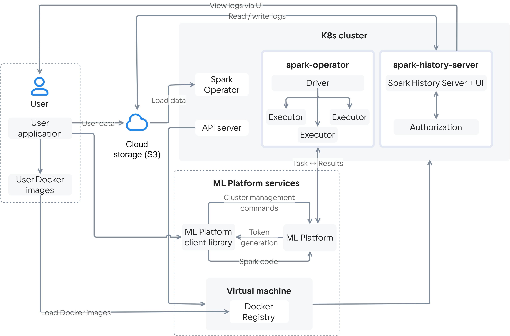

Сервис Cloud Spark включает в себя следующие компоненты:

- [кластер Cloud Spark](#cluster_spark);
- [виртуальная машина с Docker Registry](#vm_docker_registry);
- [Cloud Storage](#cloud_storage);
- [сервис Cloud ML Platform](#service_ml_platform).

## {heading(Кластер Cloud Spark)[id=cluster_spark]}

Кластер Cloud Spark — это кластер K8s, развернутый на базе сервиса Cloud Containers. В состав кластера входят:

- Master-узел, на котором запущен процесс Spark Driver. Этот процесс разбивает пользовательское приложение на *задачи* (единицы исполнения) и распределяет их по worker-узлам для параллельного выполнения.
- Worker-узлы, число которых меняется в заданных пределах в зависимости от потребностей пользовательского приложения. При старте пользовательского приложения на worker-узлах запускается процесс Spark Executor, который выполняет задачи, приходящие из процесса Spark Driver, и возвращает результат обратно в Spark Driver.
- Spark Operator — инструмент для управления жизненным циклом кластера. Он автоматизирует процессы развертывания, масштабирования и обновления. Spark Operator принимает *задания* (запросы на выполнение приложений пользователя) и запускает поды, необходимые для выполнения заданий и сбора результатов.
- Spark History Server — сервис, в котором аккумулируется информация о выполнении заданий. Сервис предоставляет интерфейс, в котором можно просматривать историю выполнения заданий, анализировать производительность кластера и диагностировать проблемы.
- Authorization — сервис авторизации для Spark History Server.
- API server — сервер, содержащий API для взаимодействия с компонентами Spark.

## {heading(ВМ с Docker Registry)[id=vm_docker_registry]}

В [Docker Registry](/ru/kubernetes/k8s/service-management/addons/advanced-installation/install-advanced-registry) хранится используемый по умолчанию Docker-образ контейнера, который включает библиотеки, зависимости и настройки для развертывания кластера Cloud Spark и запуска на нем пользовательских приложений.

При необходимости пользователь может загрузить в Docker Registry собственные Docker-образы и затем использовать их в сервисе.

## {heading(Cloud Storage)[id=cloud_storage]}

[Cloud Storage](/ru/storage/s3) — объектное хранилище платформы VK Cloud с поддержкой S3. При развертывании сервиса Cloud Spark автоматически создается [бакет](/ru/storage/s3/reference#baket), интегрированный с сервисом. Он используется по умолчанию для хранения логов для Spark History Server, для загрузки зависимостей, файлов с кодом пользовательских приложений и других артефактов, необходимых для выполнения заданий пользователя.

К сервису Cloud Spark также можно подключить дополнительные бакеты.

## {heading(Сервис Cloud ML Platform)[id=service_ml_platform]}

Сервис Cloud ML Platform включает [встроенную Python-библиотеку](../../ml-platform-library), которая предоставляет методы для работы с кластером Cloud Spark. Использование библиотеки позволяет:

- Получать информацию о параметрах и состоянии кластера и управлять его работой.
- Получать готовые к использованию манифесты типа SparkApplication и настраивать их под свои приложения.
- Запускать на кластере задания Spark с помощью манифестов типа SparkApplication.
- Собирать информацию о ходе выполнения заданий Spark.
- Создавать [секреты Kubernetes](https://kubernetes.io/docs/concepts/configuration/secret/). Секреты позволяют безопасно хранить и использовать чувствительные данные, необходимые при выполнении заданий пользователя.
- Создавать [ConfigMaps](https://kubernetes.io/docs/concepts/configuration/configmap/) — объекты Kubernetes, предназначенные для хранения конфигурационных данных. Цель использования ConfigMaps — упростить перенос кода пользовательского приложения между различными средами выполнения.
