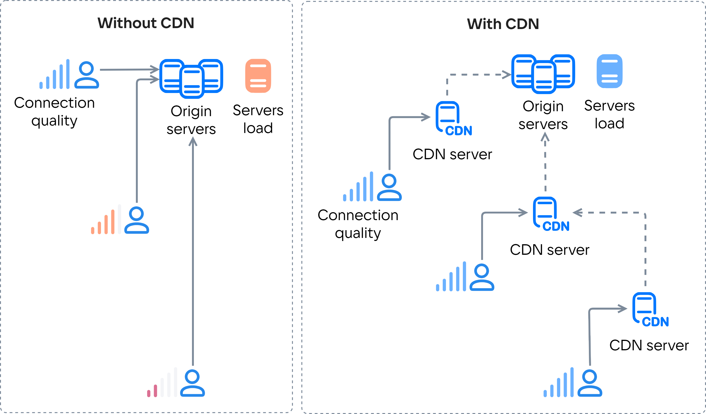

# {heading(О сервисе)[id=cdn-about]}

{include(../../../../_includes/_cdn_seo_intro.md)}

## {heading(Принцип работы CDN)[id=cdn-about-principle]}

CDN — это географически распределенные кеширующие серверы для раздачи контента, которые объединены в сеть.

При использовании CDN контент раздается с ближайшего к потребителю CDN-сервера. Если на этом сервере нет нужного контента, то он запрашивается с серверов-источников (origin) или соседних CDN-серверов и кешируется на некоторое время. В сервисе CDN {var(cloud)} также есть возможность {linkto(../../../../networks/cdn/instructions/upload-content#cdn-upload-content)[text=предварительной загрузки контента]} на CDN-серверы, что дополнительно снижает нагрузку на серверы-источники.

Таким образом:

- Повышается скорость и надежность доставки контента конечному потребителю.

  Без CDN потребители, расположенные далеко от серверов-источников, могут испытывать проблемы с получением доступа к контенту. Например, возможно медленное или нестабильное соединение с этими серверами.

- Снижается нагрузка на серверы-источники. Также появляется возможность выдерживать повышенную нагрузку при запросе контента множеством потребителей.

  Без CDN все потребители обращаются к серверам-источникам, что создает большую нагрузку на эти серверы. CDN позволяет перенести нагрузку на CDN-серверы и распределить ее между ними.

{params[noBorder=true]}

## {heading(Возможности CDN {var(cloud)})[id=cdn-about-scope]}

- Более 46 точек присутствия в Европе, СНГ, Северной и Южной Америке.
- Более 200 кеширующих CDN-серверов.
- Более 700 пиринговых партнеров.
- Емкость сети более 12 Тбит/с.

{note:info}
Для доступа к сервису необходимо подтвердить номер телефона. Если вашей {linkto(../../../../tools-for-using-services/account/concepts/rolesandpermissions#tools-account-concepts-rolesandpermissions)[text=роли]} сервис CDN доступен, но не отображается в личном кабинете, подтвердите свой номер телефона через [техническую поддержку](/ru/contacts).
{/note}
