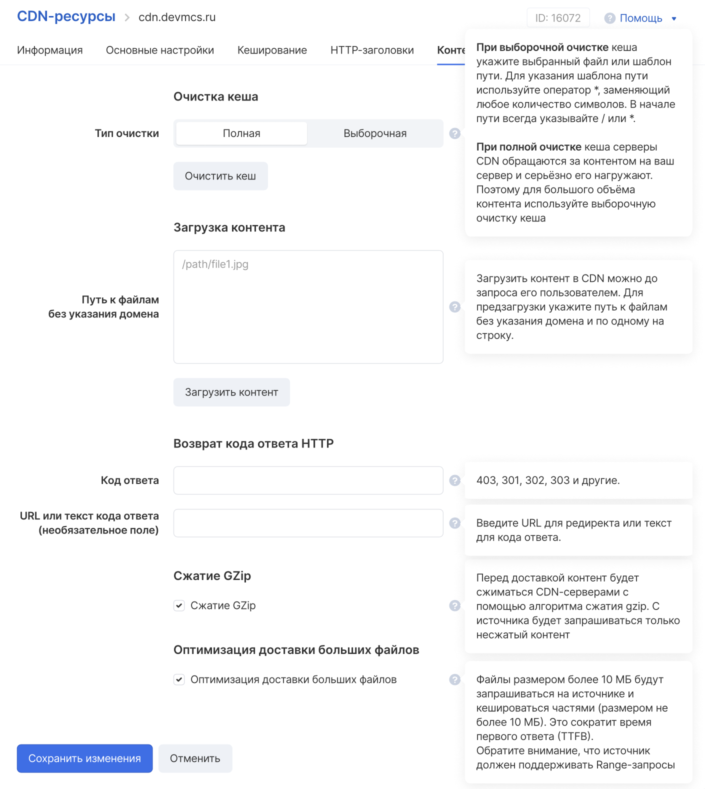

## HTTP-заголовки

Когда браузер запрашивает ресурс с сервера, он использует HTTP. Этот запрос включает набор пару ключ-значение, содержащих такую информацию, как версия браузера или форматы файлов, которые он понимает. Эти пары называются заголовками запросов.

Сервер отвечает запрашиваемым ресурсом, но также отправляет заголовки ответа, содержащие информацию о ресурсе или самом сервере.

В настройках CDN-ресурса можно настроить нужные заголовки с нужными параметрами:


## Настройки контента

В настройках ресурса CDN можно выставить необходимые настройки контента, включая код ответа HTTP и URL для редиректа:



## Настройка DNS

Создайте CNAME-запись cdn для доменной зоны devmcs.ru, направленную на домен `cl-541e19d9.service.cdn.msk.vkcs.cloud`.

Пример в формате BIND ниже:

```bash
$ORIGIN devmcs.ru. cdn CNAME cl-541e19d9.service.cdn.msk.vkcs.cloud.
```

## Интеграция с CDN / раздача контента

1.  Надо определиться, какой контент (какие файлы) нужно раздавать через CDN.
2.  Надо определиться с источником/группой источников, через которые будет раздаваться контент.
3.  Надо загрузить контент в интерфейс VK Cloud.
4.  Надо создать DNS-запись (об этом выше).
5.  Надо заменить в пути до статических файлов оригинальный домен на персональный.
6.  Получившийся путь/URL и будет именно тем, который надо подставить в вёрстке веб-страницы (или иного ресурса) как URL нужного контента.
