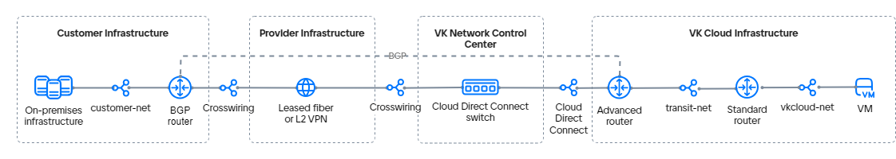

# {heading(Подключение к {var(cloud)} через сеть Cloud Direct Connect и дополнительный стандартный маршрутизатор)[id=directconnect-dc-standard-router]}

Cloud Direct Connect позволяет организовать разные {linkto(../../../../networks/vnet/concepts/onpremise-connect#vnet-onpremise-connect)[text=варианты подключения]} сети, которая находится в вашей локальной инфраструктуре, к виртуальным сетям {var(cloud)}. В этом примере подключение будет создано с помощью выделенного канала связи Cloud Direct Connect, продвинутого маршрутизатора с динамической маршрутизацией по протоколу [BGP](https://datatracker.ietf.org/doc/html/rfc1163) и дополнительного стандартного маршрутизатора.

Продвинутый маршрутизатор в этом примере отвечает за интеграцию и  обеспечивает связь с удаленной инфраструктурой. Сеть, где размещаются виртуальные машины, обслуживается стандартным маршрутизатором {var(cloud)}.

{note:info}
Использовать протокол BGP для такого варианта подключения не обязательно. Ваша схема подключения может отличаться от той, которая используется в этом руководстве.
{/note}

Рассматриваемый вариант подключения предполагает использование трех виртуальных сетей:

- сеть сетевого стыка (Cloud Direct Connect);
- сеть для подключения стандартного маршрутизатора к продвинутому маршрутизатору (транзитная сеть);
- сеть для размещения виртуальных машин.

Схема организации сетевой связности для варианта с использованием протокола BGP выглядит следующим образом:

{params[noBorder=true]}

Использование комбинации из стандартного и продвинутого маршрутизаторов позволяет обойти ограничения {linkto(../../../../networks/directconnect/how-to-guides/dc-advanced-router#directconnect-dc-advanced-router)[text=подключения]}, которое не использует стандартный маршрутизатор.

{note:info}
{var(cloud)} позволяет настроить разные {linkto(../../../../networks/vnet/concepts/onpremise-connect#vnet-onpremise-connect)[text=варианты подключения]} к удаленной инфраструктуре. Выбор варианта зависит от SDN проекта, доступа к интернету из удаленной инфраструктуры и требований к отказоустойчивости соединения.
{/note}

## {heading(Подготовительные шаги)[id=directconnect-dc-standard-router-prep]}

1. {linkto(../../../../tools-for-using-services/api/rest-api/enable-api#rest-api-enable-activate)[text=Активируйте доступ по API]}, если этого еще не сделано.
1. Убедитесь, что клиент OpenStack {linkto(../../../../tools-for-using-services/cli/openstack-cli#openstack-install)[text=установлен]}, и {linkto(../../../../tools-for-using-services/cli/openstack-cli#openstack-authorize)[text=пройдите аутентификацию]} в проекте.
1. Убедитесь, что на вашем компьютере установлены пакеты [curl](https://curl.se/docs) и [jq](https://jqlang.org).
1. Выберите или создайте сеть в вашей локальной инфраструктуре.  Сеть может не иметь доступа к интернету, но должна быть подключена к маршрутизатору, который:

   - поддерживает соединение по BGP-протоколу;
   - (опционально) поддерживает BFD-протокол: это позволит сократить время восстановления маршрутизации в случае сбоя;
   - может быть устройством или виртуальной машиной в клиентской сети.

   Запишите следующую информацию:

   - имя и IP-адрес подсети;
   - имя сети, в которой находится подсеть;
   - IP-адрес машины в подсети, которая будет использоваться для проверки связи между сетями;
   - имя BGP-маршрутизатора.

   Для примера будет использована сеть с виртуальной машиной Router OS 7.10 (MikroTik), выполняющей функции BGP-маршрутизатора.

1. Выберите или {linkto(../../../../networks/vnet/instructions/net#vnet-net-add)[text=создайте]} виртуальную сеть в вашем проекте в {var(cloud)}. Сеть не должна быть подключена к маршрутизатору.

   Запишите следующую информацию:

   - имя и IP-адрес подсети;
   - имя сети, в которой находится подсеть.

1. {linkto(../../../../computing/iaas/instructions/vm/vm-create#iaas-vm-create)[text=Создайте виртуальную машину]} в выбранной сети. Запишите IP-адрес созданной ВМ.
1. {linkto(../../../../networks/vnet/instructions/net#vnet-net-add)[text=Создайте]} транзитную виртуальную сеть в вашем проекте в {var(cloud)}. Сеть не должна быть подключена к маршрутизатору.
1. {linkto(../../../../networks/vnet/instructions/net#vnet-net-view)[text=Узнайте UUID]} транзитной сети. В этом примере: `323d97cf-aaaa-bbbb-cccc-deaa6a11ab25`.
1. {linkto(../../../../networks/directconnect/connect#directconnect-connect)[text=Подключитесь]} к сервису [Cloud Direct Connect](/ru/networks/directconnect), если этого еще не сделано.
1. Узнайте UUID подключенной сети сетевого стыка (Cloud Direct Connect):

    1. В [личном кабинете](https://msk.cloud.vk.com/app/) перейдите в раздел **Виртуальные сети** → **Сети**.
    1. В списке сетей найдите сеть сетевого стыка с именем `external-vni-10XXX`. Здесь `XXX` — индивидуальный порядковый номер вашего подключения.
    1. Сохраните UUID этой сети. В этом примере UUID сетевого стыка `b2b8468e-aaaa-bbbb-cccc-327c8c2670d4`.
1. Убедитесь, что собраны все сведения, необходимые для дальнейшей работы. Далее в качестве примера используются следующие данные:

   [cols="1,1,1,1,1", options="header"]
   |===
   |Объект
   |Клиентская сеть
   |Виртуальная сеть
   |Транзитная сеть
   |Сеть Cloud Direct Connect

   |Сеть
   |`customer-net`
   |`vkcloud-net`
   |`transit-net`, `323d97cf-aaaa-bbbb-cccc-deaa6a11ab25`
   |`external-vni-10XXX`, `b2b8468e-aaaa-bbbb-cccc-327c8c2670d4`

   |Подсеть
   |`customer-subnet`, `10.0.0.0/24`
   |`vkcloud-subnet`, `172.17.0.0/24`
   |
   |

   |Виртуальная машина
   |`client-vm`, `10.0.0.5`
   |`vkcloud-vm`, `172.17.0.8`
   |
   |

   |BGP-маршрутизатор
   |`MikroTik`
   |
   |
   |
   |===

{note:info}
Далее в примере будет рассматриваться вариант, в котором для сетевого стыка и транзитной сети используются подсети с маской `/30`. Вы можете также {linkto(../../../../networks/vnet/instructions/net#vnet-net-subnet-add)[text=создать]} стандартные подсети с маской `/24`.
{/note}

## {heading(1. Добавьте подсеть для Cloud Direct Connect)[id=directconnect-dc-standard-router-add-cdc-subnet]}

В сеть сетевого стыка Cloud Direct Connect добавьте {linkto(../../../../networks/vnet/how-to-guides/custom-subnet#vnet-custom-subnet)[text=подсеть с маской `/30`]}.
При добавлении переменных окружения укажите параметры:

- `N_CIDR="192.168.0.0/30"`;
- `N_ID="<UUID_СЕТЕВОГО_СТЫКА>"`.

Запишите имя и CIDR подсети. В этом примере: `dc-subnet`, `192.168.0.0/30`.

## {heading(2. Добавьте подсеть для транзитной сети)[id=directconnect-dc-standard-router-add-transit-subnet]}

В транзитную сеть добавьте {linkto(../../../../networks/vnet/how-to-guides/custom-subnet#vnet-custom-subnet)[text=подсеть с маской `/30`]}.
При добавлении переменных окружения укажите параметры:

- `N_CIDR="192.168.1.0/30"`;
- `N_ID="<UUID_ТРАНЗИТНОЙ_СЕТИ>"`.

При создании подсети через API передайте параметр `"gateway_ip": <IP_АДРЕС_ШЛЮЗА_ДЛЯ_СТАНДАРТНОГО_МАРШРУТИЗАТОРА>`.
В подсети Cloud Direct Connect этот параметр определен как `null`.

Запишите имя и CIDR подсети. В этом примере: `transit-subnet`, `192.168.1.0/30`.

## {heading(3. Добавьте стандартный маршрутизатор)[id=directconnect-dc-standard-router-add-standart-router]}

{linkto(../../../../networks/vnet/instructions/router#vnet-router-add)[text=Создайте]} стандартный маршрутизатор со следующими параметрами:

- **SDN**: `Sprut`. Поле отображается, если к проекту подключены SDN Sprut и Neutron.
- **Название**: в этом примере `Standard router`.
- **Подключение к внешней сети**: опция включена.

## {heading(4. Добавьте продвинутый маршрутизатор)[id=directconnect-dc-standard-router-add-advanced-router]}

{linkto(../../../../networks/vnet/instructions/advanced-router/manage-advanced-routers#vnet-manage-advanced-routers-add)[text=Создайте]} продвинутый маршрутизатор со следующими параметрами:

- **Название**: в этом примере `Advanced router`.
- **SNAT**: опция выключена.

## {heading(5. Настройте сетевые интерфейсы продвинутого маршрутизатора)[id=directconnect-dc-standard-router-advanced-router-network-configure]}

1. {linkto(../../../../networks/vnet/instructions/advanced-router/manage-interfaces#vnet-manage-interfaces-add)[text=Добавьте]} интерфейс продвинутого маршрутизатора, направленный в виртуальную сеть:

   - **Название**: `transit-net-iface`;
   - **Подсеть**: `transit-subnet`;
   - **IP-адрес интерфейса**: `192.168.1.1`.
1. {linkto(../../../../networks/vnet/instructions/advanced-router/manage-interfaces#vnet-manage-interfaces-add)[text=Добавьте]} интерфейс продвинутого маршрутизатора, направленный в сеть Cloud Direct Connect:

   - **Название**: `dc-iface`;
   - **Подсеть**: `dc-subnet`;
   - **IP-адрес интерфейса**: `192.168.0.1`.

## {heading(6. Настройте сетевые интерфейсы BGP-маршрутизатора клиентской сети)[id=directconnect-dc-standard-router-client-network-configure]}

1. Добавьте сетевые интерфейсы:

   - Направленный в сеть Cloud Direct Connect — `dc-subnet`. Этот интерфейс поможет организовать связность между {var(cloud)} и клиентской сетью.
   - Направленный в клиентскую сеть, где расположен BGP-маршрутизатор. Этот интерфейс используется для подключения к ресурсам внутри сети. Количество таких интерфейсов зависит от структуры сети.

   В этом примере:

   - `192.168.0.2` — интерфейс в подсеть `dc-subnet`;
   - `10.0.0.15` — интерфейс в клиентскую сеть до виртуальной машины `10.0.0.5`.

1. Настройте интерфейсы с использованием DHCP.

1. Настройте системный идентификатор (System ID).

1. Подготовьте список сетей для BGP-анонса.

1. (Опционально) Если маршрутизатор поддерживает BFD, настройте BFD-протокол.

{cut(Пример настройки для MikroTik)}

1. Для добавления сетевых интерфейсов подключитесь к MikroTik по SSH и выполните команду:

   ```console
    /ip address add address=192.168.0.2/30 interface ether1
    /ip address add address=10.0.0.15/24 interface ether2
   ```

1. Настройте интерфейсы с использованием DHCP:

   ```console
    /ip dhcp-client
    add add-default-route=no interface=ether1
    add add-default-route=no interface=ether2
   ```

1. Настройте системный идентификатор (System ID):

   ```console
    /system identity
    set name=bgp-customer
   ```

1. Подготовьте список сетей для BGP-анонса:

   ```console
    /ip firewall address-list
    add address=10.0.0.0/24 list=bgp_networks
   ```

1. Настройте BFD-протокол:

   ```console
    /routing bfd configuration
    add disabled=no interfaces=ether1
   ```

{/cut}

## {heading(7. Подключите транзитную сеть к стандартному маршрутизатору)[id=directconnect-dc-standard-router-connect-transit-network]}

1. В [личном кабинете](https://msk.cloud.vk.com/app) перейдите в раздел **Виртуальные сети** → **Сети**.
1. Нажмите на имя транзитной сети `transit-net` и перейдите на вкладку **Настройка сети**.
1. Выберите стандартный маршрутизатор `Standard router`.
1. Включите опцию **Доступ в интернет**.
1. Нажмите кнопку **Сохранить изменения**.
1. Проверьте регистрацию шлюза для подсети:

   1. В личном кабинете перейдите в раздел **Виртуальные сети** → **Сети**.
   1. Нажмите на имя транзитной сети `transit-net`, затем на имя подсети `transit-subnet` и перейдите на вкладку **Порты**.
   1. Убедитесь, что порт с IP-адресом шлюза зарегистрирован в подсети и имеет статус **Подключен**.

## {heading(8. Настройте eBGP-соседство для продвинутого маршрутизатора)[id=directconnect-dc-standard-router-bgp-advanced-router]}

Чтобы настроить связь по BGP-протоколу, нужно добавить динамические маршруты и указать BGP-соседей. Для настройки динамической маршрутизации используйте приватные номера автономных сетей (ASN) из диапазона `64512`–`65534`.  Номера ASN на маршрутизаторах в {var(cloud)} и на стороне удаленной инфраструктуры должны отличаться. В примере будут использованы следующие номера:

- `65512` для сети `customer-net`;
- `64512` для сети `vkcloud-net`.

Чтобы настроить динамические маршруты на продвинутом маршрутизаторе:

1. В [личном кабинете](https://msk.cloud.vk.com/app/) перейдите в раздел **Виртуальные сети** → **Маршрутизаторы**.
1. Откройте добавленный продвинутый маршрутизатор и перейдите на вкладку **Динамическая маршрутизация**.
1. Нажмите кнопку **Создать BGP маршрутизатор**.
1. Укажите параметры BGP-маршрутизатора:

   - **Название**: `to-MikroTik`;
   - **Router ID**: `192.168.0.1`;
   - **ASN**: `64512`.

1. Нажмите кнопку **Создать**.
1. Откройте добавленный BGP-маршрутизатор и перейдите на вкладку **BGP соседи**.
1. Добавьте BGP-соседа. Укажите параметры:

   - **Название**: `MikroTik`;
   - **Remote neighbor**: `192.168.0.2`;
   - **Remote ASN**: `65512`.

1. Нажмите кнопку **Создать**.

Убедитесь, что маршрутизатор установил связь с соседом: маркер рядом с названием зеленый. Если вы используете BFD, убедитесь, что маркер BFD также горит зеленым.

Продвинутый маршрутизатор начнет передавать BGP-анонсы своему соседу сразу после успешного согласования BGP-соседства. Перейдите на вкладку **BGP анонсы** и убедитесь, что маршрутизатор передает анонсы всех сетей, в которые направлены его интерфейсы:

- `172.17.0.0/24`;
- `192.168.0.0/30`;
- `192.168.1.0/30`.

Все анонсы должны иметь зеленые маркеры.

## {heading(9. Настройте BGP-соседство для маршрутизатора клиентской сети)[id=directconnect-dc-standard-router-bgp-client-network]}

1. Подключитесь к маршрутизатору в вашей локальной сети.
1. Укажите параметры для подключения по BGP-протоколу:

   - ASN локальной сети: `65512`;
   - ID маршрутизатора: `192.168.0.2`;
   - ASN внешней сети: `64512`;
   - ID BGP-соседа: `192.168.0.1`;
   - использовать BFD.

1. (Опционально) Проверьте, что установлена связь по BFD-протоколу.
1. Проверьте, что установлена связь с BGP-соседом. Если BGP-соединение установлено, в ответе должны прийти значения `keepalive-time` и `uptime`, отличные от нуля.
1. Просмотрите все доступные BGP-маршруты. В списке маршрутов должны быть указаны сети `172.17.0.0/24` и `192.168.0.0/30`.

{cut(Пример настройки для MikroTik)}

1. Подключитесь к MikroTik по SSH и выполните команду:

    ```console
    /routing bgp connection
    add address-families=ip as=65512 local.address=192.168.0.2 .role=ebgp name=bgp-customer output.network=bgp_networks remote.address=192.168.0.1 .as=64512 router-id=192.168.0.2 use-bfd=yes
    ```
1. Проверьте, что установлена связь по BFD-протоколу. Выполните команду:

   ```console
   /routing bfd session print
   ```

   Пример ответа:

   ```console
      Flags: U - up, I - inactive 
   0 U multihop=no vrf=main remote-address=192.168.0.1%ether1 local-address=192.168.0.2 state=up state-changes=1 uptime=3h27m12s desired-tx-interval=200ms actual-tx-interval=100ms 
     required-min-rx=200ms remote-min-rx=10ms multiplier=5 hold-time=1s packets-rx=75343 packets-tx=72203
   ```

1. Проверьте, что установлена связь с BGP-соседом на стороне MikroTik. Выполните команду:

   ```console
   /routing bgp session print
   ```

   Пример ответа:

   ```console
      Flags: E - established
   0 E name="tw-bgp-mikrotik-1"
        remote.address=192.168.0.1 .as=64512 .id=192.168.0.1 .capabilities=mp,rr,gr,as4,ap,err,llgr .hold-time=4m
       .messages=5 .bytes=131 .gr-time=120 .eor=ip
      local.address=192.168.0.2 .as=65512 .id=192.168.0.2 .capabilities=mp,rr,gr,as4 .messages=4 .bytes=105 .eor=""
        output.procid=20 .network=bgp_networks
       input.procid=20 ebgp
      hold-time=3m keepalive-time=1m uptime=2m51s380ms last-started=aug/28/2023 07:27:15
   ```
1. Выполните команду, чтобы посмотреть все маршруты MikroTik:

   ```console
   /ip route print where bgp
   ```

   Пример ответа:

   ```console
   Flags: D - DYNAMIC; A - ACTIVE; b, y - BGP-MPLS-VPN
   Columns: DST-ADDRESS, GATEWAY, DISTANCE
       DST-ADDRESS    GATEWAY       DISTANCE
   DAb 172.17.0.0/24  192.168.0.1        20
   D b 192.168.0.0/30 192.168.0.1        20
   ```

{/cut}

## {heading(10. Настройте статические маршруты в клиентскую сеть на стандартном маршрутизаторе)[id=directconnect-dc-standard-router-standart-static-routs]}

1. В [личном кабинете](https://msk.cloud.vk.com/app/) перейдите в раздел **Виртуальные сети** → **Маршрутизаторы**.
1. Нажмите на имя стандартного маршрутизатора `Standard router` и перейдите на вкладку **Статические маршруты**.
1. Нажмите кнопку **Добавить статический маршрут**.
1. Укажите сеть назначения: адресный префикс клиентской сети, в этом примере `10.0.0.0/24`.
1. Укажите промежуточный узел (Next HOP): IP-адрес продвинутого маршрутизатора.
1. Нажмите кнопку **Добавить маршрут**.

## {heading(11. Настройте статические маршруты в сеть виртуальных машин на продвинутом маршрутизаторе)[id=directconnect-dc-standard-router-advanced-static-routs]}

1. В [личном кабинете](https://msk.cloud.vk.com/app/) перейдите в раздел **Виртуальные сети** → **Маршрутизаторы**.
1. Нажмите на имя продвинутого маршрутизатора `Advanced router` и перейдите на вкладку **Статические маршруты**.
1. Нажмите кнопку **Добавить статический маршрут**.
1. Укажите сеть назначения: адресный префикс сети виртуальных машин, в этом примере `172.17.0.0/24`.
1. Укажите промежуточный узел (Next HOP): IP-адрес стандартного маршрутизатора.
1. Нажмите кнопку **Добавить**.

## {heading(12. Добавьте статический маршрут в сеть виртуальных машин в BGP-анонс)[id=directconnect-dc-standard-router-bgp-static-route]}

1. В [личном кабинете](https://msk.cloud.vk.com/app/) перейдите в раздел **Виртуальные сети** → **Маршрутизаторы**.
1. Нажмите на имя продвинутого маршрутизатора `Advanced router` и перейдите на вкладку **Динамическая маршрутизация**.
1. Нажмите на созданную ранее настройку BGP и перейдите на вкладку **BGP анонсы**.
1. Нажмите кнопку **Добавить новый анонс**.
1. Укажите параметры:

   - **Тип анонса**: статический.
   - **Сеть назначения**: адресный префикс сети виртуальных машин, в этом примере `172.17.0.0/24`.
   - **Шлюз по умолчанию**: IP-адрес стандартного маршрутизатора.

1. Нажмите кнопку **Добавить**.
1. Перезагрузите машины `172.17.0.8` и `10.0.0.5`, чтобы маршруты попали в их маршрутную сеть.

## {heading(13. Проверьте работоспособность)[id=directconnect-dc-standard-router-check]}

Для проверки отправьте `ping` или `traceroute` из одной сети до машины в подключенной сети. Если из другой сети приходит ответ, то настройка связности сетей выполнена правильно.

Например, выполните пинг с машины `172.17.0.8` в виртуальной сети до машины `10.0.0.5` в клиентской сети:

1. Откройте сессию терминала с ВМ `vkcloud-vm`.
1. Выполните пинг внутреннего IP-адреса машины в клиентской сети:

   ```console
   ping 10.0.0.5
   ```

IP-адрес должен отвечать на пинг.

## {heading(Удалите неиспользуемые ресурсы)[id=directconnect-dc-standard-router-delete]}

Если созданные ресурсы вам больше не нужны, удалите их:

1. {linkto(../../../../computing/iaas/instructions/vm/vm-manage#iaas-vm-manage-delete)[text=Удалите]} виртуальную машину.
1. {linkto(../../../../networks/vnet/instructions/router#vnet-router-delete)[text=Удалите]} маршрутизаторы.
1. Удалите {linkto(../../../../networks/vnet/instructions/net#vnet-net-subnet-delete)[text=подсети]} и {linkto(../../../../networks/vnet/instructions/net#vnet-net-delete)[text=сети]}: транзитную и для размещения виртуальных машин.
