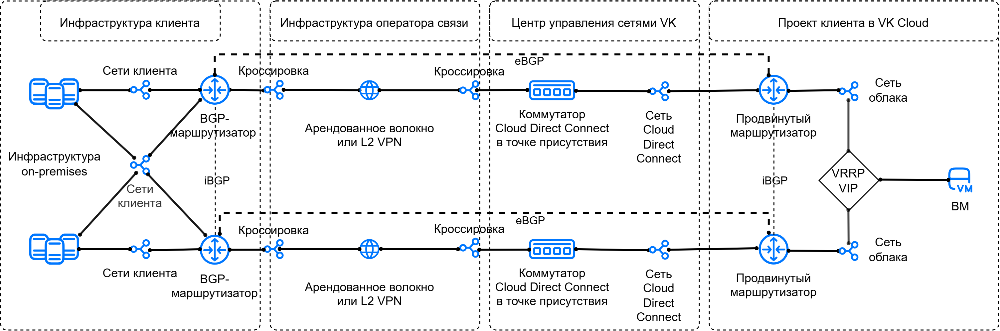
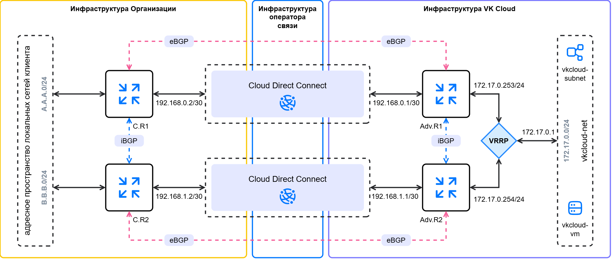

# {heading(Подключение к {var(cloud)} через Cloud Direct Connect в отказоустойчивой конфигурации с VRRP)[id=directconnect-dc-vrrp]}

{note:info}
{var(cloud)} позволяет настроить разные {linkto(../../../vnet/concepts/onpremise-connect#vnet-onpremise-connect)[text=варианты подключения]} к удаленной инфраструктуре. Выбор варианта зависит от SDN проекта, доступа к интернету из удаленной инфраструктуры и требований к отказоустойчивости соединения.
{/note}

Cloud Direct Connect позволяет организовать соединение между виртуальными сетями {var(cloud)} и внешней сетевой инфраструктурой (например, вашими локальными сетями), используя отказоустойчивое L3-подключение на основе протокола VRRP. Для этого используется виртуальный IP-адрес сетевого шлюза (VRRP VIP). При отказе активного маршрутизатора трафик, направляемый на VRRP VIP, переводится на резервный маршрутизатор.

Отказоустойчивость L2-подключения обеспечивается физическим дублированием канала связи в двух независимых точках присутствия.

При организации соединения Cloud Direct Connect с VRRP используются:

- два выделенных канала связи Cloud Direct Connect;
- два продвинутых маршрутизатора с динамической маршрутизацией по протоколу [BGP](https://datatracker.ietf.org/doc/html/rfc1163);
- VRRP-протокол для создания виртуального IP-адреса в качестве шлюза в сети облака.

Продвинутые маршрутизаторы в этой конфигурации отвечают за интеграцию и обеспечивают связь с удаленной инфраструктурой, а также обслуживают сеть, где размещаются виртуальные машины.

Рассматриваемый вариант подключения предполагает использование трех виртуальных сетей:

- две независимые сети сетевого стыка (Cloud Direct Connect);
- сеть облака, где размещены виртуальные машины и формируется виртуальный IP-адрес шлюза.

Такой вариант предполагает, что каждая из сетей сетевого стыка доводится до своего продвинутого маршрутизатора индивидуально и имеет следующие особенности:

- обмен адресными префиксами между удаленной инфраструктурой и облаком осуществляется с помощью eBGP-протокола;
- обмен адресными префиксами между продвинутыми маршрутизаторами осуществляется с помощью iBGP-протокола.

Все вместе это позволяет сформировать надежную отказоустойчивую сетевую интеграцию облака с внешней инфраструктурой.

Схема организации сетевой связности выглядит следующим образом:

{params[noBorder=true]}

## {heading(Подготовительные шаги)[id=directconnect-dc-vrrp-prep]}

1. {linkto(../../../../networks/directconnect/connect#directconnect-connect)[text=Подключитесь]} к сервису Cloud Direct Connect, если этого еще не сделано.
1. {linkto(../../../../tools-for-using-services/api/rest-api/enable-api#rest-api-enable-activate)[text=Активируйте доступ по API]}, если этого еще не сделано.
1. Убедитесь, что клиент OpenStack {linkto(../../../../tools-for-using-services/cli/openstack-cli#openstack-install)[text=установлен]}, и {linkto(../../../../tools-for-using-services/cli/openstack-cli#openstack-authorize)[text=пройдите аутентификацию]} в проекте.
1. Убедитесь, что на вашем компьютере установлены пакеты [curl](https://curl.se/docs) и [jq](https://jqlang.org).
1. Узнайте UUID подключенных сетей сетевого стыка Cloud Direct Connect:

    1. В [личном кабинете](https://msk.cloud.vk.com/app/) перейдите в раздел **Виртуальные сети** → **Сети**.
    1. В списке сетей найдите две сети сетевого стыка с именами вида `external-vni-10XXX`. Здесь `XXX` — индивидуальный порядковый номер вашего подключения.
    1. Сохраните UUID этих сетей. В этом примере UUID сетей сетевого стыка:
        - первая сеть стыка `external-vni-10XX1` — `b2b8468e-aaaa-bbbb-cccc-327c8c2670d4`;
        - вторая сеть стыка `external-vni-10XX2`— `a2b8967e-aaaa-bbbb-cccc-327f9a2670e5`.
1. Определите адресные префиксы (CIDR) подсетей в локальной инфраструктуре, которые будут анонсироваться в облако с использованием BGP-маршрутизации.
1. Убедитесь, что маршрутизаторы локальной инфраструктуры, подключенные к сервису Cloud Direct Connect:

    - оповещены об определенных ранее адресных префиксах и могут анонсировать их в сторону облака с использованием BGP-маршрутизации;
    - взаимодействуют друг с другом с помощью iBGP-протокола;
    - (опционально) поддерживают BFD-протокол: это позволит сократить время восстановления маршрутизации в случае сбоя.

1. Запишите IP-адрес машины в локальной инфраструктуре, которая будет использоваться для проверки связи между сетями.

1. Выберите или {linkto(../../../../networks/vnet/instructions/net#vnet-net-add)[text=создайте]} виртуальную сеть в вашем проекте в {var(cloud)}. Сеть не должна быть подключена к маршрутизатору.

    Запишите следующую информацию:

    - Имя и CIDR подсети.
    - IP-адрес, который определен в качестве шлюза по умолчанию, например `172.17.0.1`. Этот адрес будет использоваться при {linkto(#directconnect-dc-vrrp-set-vrrp)[text=настройке VRRP]}.
    - Имя сети, в которой находится подсеть.

1. {linkto(../../../../computing/iaas/instructions/vm/vm-create#iaas-vm-create)[text=Создайте]} виртуальную машину в выбранной сети. Запишите присвоенный ей IP-адрес.
1. Убедитесь, что собраны все сведения, необходимые для дальнейшей работы. Далее в качестве примера используются следующие данные:

   [cols="1,1,1", options="header"]
   |===
   |Объект
   |Сеть облака
   |Сеть Cloud Direct Connect

   |Сеть
   |`vkcloud-net`
   |- `external-vni-10XX1`, `b2b8468e-aaaa-bbbb-cccc-327c8c2670d4`;
- `external-vni-10XX2`, `a2b8967e-aaaa-bbbb-cccc-327f9a2670e5`

   |Подсеть
   |`vkcloud-subnet`, `172.17.0.0/24`
   |

   |Виртуальная машина
   |`vkcloud-vm`, `172.17.0.8`
   |
   |===

{note:info}
Далее в примере будет рассматриваться вариант, в котором для сетевого стыка используются подсети с маской `/30`. Вы можете также {linkto(../../../vnet/instructions/net#vnet-net-subnet-add)[text=создать]} стандартные подсети с маской `/24`.
{/note}

После выполнения описанных ниже действий итоговая схема организации сетевой связности с учетом адресации должна выглядеть следующим образом:

{params[noBorder=true]}

Здесь:

- `C.R1` (`ClientRouter1`) — первый BGP-маршрутизатор в локальной инфраструктуре;
- `C.R2` (`ClientRouter2`) — второй BGP-маршрутизатор в локальной инфраструктуре;
- `A.A.A.0/24` — первый анонсируемый CIDR из адресного пространства локальных сетей;
- `B.B.B.0/24` — второй анонсируемый CIDR из адресного пространства локальных сетей;
- `Adv.R1` (`AdvancedRouter1`) — первый продвинутый маршрутизатор в облаке;
- `Adv.R2` (`AdvancedRouter2`) — второй продвинутый маршрутизатор в облаке;
- `172.17.0.0/24` — анонсируемый CIDR из облака.

## {heading({counter(dc-vrrp)}. Добавьте подсети для Cloud Direct Connect)[id=directconnect-dc-vrrp-add-cdc-subnets]}

1. В сеть сетевого стыка Cloud Direct Connect `external-vni-10XX1` добавьте {linkto(../../../vnet/how-to-guides/custom-subnet#vnet-custom-subnet)[text=подсеть с маской `/30`]}.
При добавлении переменных окружения укажите параметры:

    - `N_CIDR="192.168.0.0/30"`;
    - `N_ID="<UUID_СЕТЕВОГО_СТЫКА_1>"`.

    Запишите имя и CIDR подсети.

    В этом примере для сети `external-vni-10XX1`:

    - имя подсети: `dc-subnet1`;
    - CIDR: `192.168.0.0/30`;
    - UUID: `b2b8468e-aaaa-bbbb-cccc-327c8c2670d4`.

1. В сеть сетевого стыка Cloud Direct Connect `external-vni-10XX2` добавьте {linkto(../../../vnet/how-to-guides/custom-subnet#vnet-custom-subnet)[text=подсеть с маской `/30`]}.
При добавлении переменных окружения укажите параметры:

    - `N_CIDR="192.168.1.0/30"`;
    - `N_ID="<UUID_СЕТЕВОГО_СТЫКА_2>"`.

    Запишите имя и CIDR подсети.

    В этом примере для сети `external-vni-10XX2`:

    - имя подсети: `dc-subnet2`;
    - CIDR: `192.168.1.0/30`;
    - UUID: `a2b8967e-aaaa-bbbb-cccc-327f9a2670e5`.

## {heading({counter(dc-vrrp)}. Добавьте продвинутые маршрутизаторы)[id=directconnect-dc-vrrp-add-routers]}

1. {linkto(../../../vnet/instructions/advanced-router/manage-advanced-routers#vnet-manage-advanced-routers-add)[text=Создайте]} первый продвинутый маршрутизатор со следующими параметрами:

    - **Название**: в этом примере `AdvancedRouter1`;
    - **SNAT**: опция выключена.
1. {linkto(../../../vnet/instructions/advanced-router/manage-advanced-routers#vnet-manage-advanced-routers-add)[text=Создайте]} второй продвинутый маршрутизатор со следующими параметрами:

    - **Название**: в этом примере `AdvancedRouter2`;
    - **SNAT**: опция выключена.

## {heading({counter(dc-vrrp)}. Настройте сетевые интерфейсы продвинутых маршрутизаторов)[id=directconnect-dc-vrrp-set-advanced-routers]}

1. {linkto(../../../vnet/instructions/advanced-router/manage-interfaces#vnet-manage-interfaces-add)[text=Добавьте]} интерфейс первого продвинутого маршрутизатора, направленный в сеть облака:

    - **Название**: `vkcloud-net-iface1`;
    - **Подсеть**: `vkcloud-subnet`;
    - **IP-адрес интерфейса**: `172.17.0.253`.
1. {linkto(../../../vnet/instructions/advanced-router/manage-interfaces#vnet-manage-interfaces-add)[text=Добавьте]} интерфейс первого продвинутого маршрутизатора, направленный в сеть Cloud Direct Connect `external-vni-10XX1`:

    - **Название**: `dc-iface1`;
    - **Подсеть**: `dc-subnet1`;
    - **IP-адрес интерфейса**: `192.168.0.1`.
1. {linkto(../../../vnet/instructions/advanced-router/manage-interfaces#vnet-manage-interfaces-add)[text=Добавьте]} интерфейс второго продвинутого маршрутизатора, направленный в сеть облака:

    - **Название**: `vkcloud-net-iface2`;
    - **Подсеть**: `vkcloud-subnet`;
    - **IP-адрес интерфейса**: `172.17.0.254`.

1. {linkto(../../../vnet/instructions/advanced-router/manage-interfaces#vnet-manage-interfaces-add)[text=Добавьте]} интерфейс второго продвинутого маршрутизатора, направленный в сеть Cloud Direct Connect `external-vni-10XX2`:

    - **Название**: `dc-iface2`;
    - **Подсеть**: `dc-subnet2`;
    - **IP-адрес интерфейса**: `192.168.1.1`.

## {heading({counter(dc-vrrp)}. Настройте сетевые интерфейсы BGP-маршрутизаторов локальной сети)[id=directconnect-dc-vrrp-set-client-routers]}

1. Убедитесь, что интерфейсы маршрутизаторов локальной инфраструктуры (`ClientRouter1`, `ClientRouter2`), подключенных к сервису Cloud Direct Connect, активны.
1. Настройте на маршрутизаторах статическую IP-адресацию с использованием свободных IP-адресов из CIDR сетей Cloud Direct Connect.

   В этом примере:

    - `192.168.0.2` — интерфейс первого маршрутизатора в подсеть `dc-subnet1` сети стыка `external-vni-10XX1`;
    - `192.168.1.2` — интерфейс второго маршрутизатора в подсеть `dc-subnet2` сети стыка `external-vni-10XX2`;

1. (Опционально) Если маршрутизатор поддерживает BFD, настройте BFD-протокол.

   {note:info}
   Виртуальные маршрутизаторы {var(cloud)} поддерживают работу с BFD-протоколом, который можно использовать на маршрутизаторах в локальной инфраструктуре для ускорения сходимости.
   {/note}

## {heading({counter(dc-vrrp)}. Настройте eBGP-соседство для первого продвинутого маршрутизатора через первую сеть стыка)[id=directconnect-dc-vrrp-set-first-bgp]}

Чтобы настроить связь по BGP-протоколу, нужно добавить динамические маршруты и указать BGP-соседей. Для настройки динамической маршрутизации используйте приватные номера автономных сетей (ASN) из диапазона `64512`–`65534`.  Номера ASN на маршрутизаторах в {var(cloud)} и на стороне удаленной инфраструктуры должны отличаться. В примере будут использованы следующие номера:

- `65512` для сети локальной инфраструктуры;
- `64512` для сети облака `vkcloud-net`.

Чтобы настроить динамические маршруты на продвинутом маршрутизаторе через сеть стыка `external-vni-10XX1`:

1. В [личном кабинете](https://msk.cloud.vk.com/app/) перейдите в раздел **Виртуальные сети** → **Маршрутизаторы**.
1. Откройте продвинутый маршрутизатор `AdvancedRouter1` и перейдите на вкладку **Динамическая маршрутизация**.
1. Нажмите кнопку **Создать BGP маршрутизатор**.
1. Укажите параметры BGP-маршрутизатора:

    - **Название**: `to-ClientRouter1`;
    - **Router ID**: `192.168.0.1`;
    - **ASN**: `64512`.

1. Нажмите кнопку **Создать**.
1. Откройте добавленный BGP-маршрутизатор и перейдите на вкладку **BGP соседи**.
1. Добавьте BGP-соседа. Укажите параметры:

    - **Название**: `ClientRouter1`;
    - **Remote neighbor**: `192.168.0.2`;
    - **Remote ASN**: `65512`.

1. Нажмите кнопку **Создать**.
1. Убедитесь, что маршрутизатор установил связь с соседом: маркер рядом с названием зеленый. Если вы используете BFD, убедитесь, что маркер BFD также горит зеленым.

    Продвинутый маршрутизатор начнет передавать BGP-анонсы своему соседу сразу после успешного согласования BGP-соседства. Перейдите на вкладку **BGP анонсы** и убедитесь, что маршрутизатор передает анонсы всех сетей, в которые направлены его интерфейсы:

    - `172.17.0.0/24`;
    - `192.168.0.0/30`.

    Все анонсы должны иметь зеленые маркеры.

## {heading({counter(dc-vrrp)}. Настройте eBGP-соседство для второго продвинутого маршрутизатора через вторую сеть стыка)[id=directconnect-dc-vrrp-set-second-bgp]}

Чтобы настроить связь по BGP-протоколу, нужно добавить динамические маршруты и указать BGP-соседей. Для настройки динамической маршрутизации используйте приватные номера автономных сетей (ASN) из диапазона `64512`–`65534`.  Номера ASN на маршрутизаторах в {var(cloud)} и на стороне удаленной инфраструктуры должны отличаться. В примере будут использованы следующие номера:

- `65512` для локальной сети;
- `64512` для сети облака `vkcloud-net`.

Чтобы настроить динамические маршруты на продвинутом маршрутизаторе через сеть стыка `external-vni-10XX2`:

1. В [личном кабинете](https://msk.cloud.vk.com/app/) перейдите в раздел **Виртуальные сети** → **Маршрутизаторы**.
1. Откройте продвинутый маршрутизатор `AdvancedRouter2` и перейдите на вкладку **Динамическая маршрутизация**.
1. Нажмите кнопку **Создать BGP маршрутизатор**.
1. Укажите параметры BGP-маршрутизатора:

    - **Название**: `to-ClientRouter2`;
    - **Router ID**: `192.168.1.1`;
    - **ASN**: `64512`.

1. Нажмите кнопку **Создать**.
1. Откройте добавленный BGP-маршрутизатор и перейдите на вкладку **BGP соседи**.
1. Добавьте BGP-соседа. Укажите параметры:

    - **Название**: `ClientRouter2`;
    - **Remote neighbor**: `192.168.1.2`;
    - **Remote ASN**: `65512`.

1. Нажмите кнопку **Создать**.
1. Убедитесь, что маршрутизатор установил связь с соседом: маркер рядом с названием зеленый. Если вы используете BFD, убедитесь, что маркер BFD также горит зеленым.

    Продвинутый маршрутизатор начнет передавать BGP-анонсы своему соседу сразу после успешного согласования BGP-соседства. Перейдите на вкладку **BGP анонсы** и убедитесь, что маршрутизатор передает анонсы всех сетей, в которые направлены его интерфейсы:

    - `172.17.0.0/24`;
    - `192.168.1.0/30`.

    Все анонсы должны иметь зеленые маркеры.

## {heading({counter(dc-vrrp)}. Настройте BGP-соседство для первого маршрутизатора локальной сети через первую сеть стыка)[id=directconnect-dc-vrrp-set-third-bgp]}

1. Подключитесь к маршрутизатору в вашей локальной сети.
1. Укажите параметры для подключения по BGP-протоколу через сеть `external-vni-10XX1`:

    - ASN локальной сети: `65512`.
    - (Опционально) ID маршрутизатора: `192.168.0.2`.

       {note:warn}
       ID можно назначить только один раз.
       {/note}
    - ASN внешней сети: `64512`.
    - ID BGP-соседа: `192.168.0.1`.
    - Использовать BFD — включите опцию, если ранее включили ее для продвинутых маршрутизаторов облачной сети. В случае использования BFD-протокола убедитесь, что BFD-связь установлена.
1. Проверьте, что установлена связь с BGP-соседом. Если BGP-соединение установлено, в ответе должны прийти значения `keepalive-time` и `uptime`, отличные от нуля.
1. Просмотрите все доступные BGP-маршруты. В списке маршрутов должны быть указаны сети `172.17.0.0/24` и `192.168.0.0/30`.

## {heading({counter(dc-vrrp)}. Настройте BGP-соседство для второго маршрутизатора локальной сети через вторую сеть стыка)[id=directconnect-dc-vrrp-set-fourth-bgp]}

1. Подключитесь к маршрутизатору в вашей локальной сети.
1. Укажите параметры для подключения по BGP-протоколу через сеть `external-vni-10XX2`:

    - ASN локальной сети: `65512`.
    - (Опционально) ID маршрутизатора: `192.168.1.2`.

       {note:warn}
       ID можно назначить только один раз.
       {/note}
    - ASN внешней сети: `64512`.
    - ID BGP-соседа: `192.168.1.1`.
    - Использовать BFD — включите опцию, если ранее включили ее для продвинутых маршрутизаторов облачной сети. В случае использования BFD-протокола убедитесь, что BFD-связь установлена.
1. Проверьте, что установлена связь с BGP-соседом. Если BGP-соединение установлено, в ответе должны прийти значения `keepalive-time` и `uptime`, отличные от нуля.
1. Просмотрите все доступные BGP-маршруты. В списке маршрутов должны быть указаны сети `172.17.0.0/24` и `192.168.0.0/30`.

## {heading({counter(dc-vrrp)}. Настройте iBGP-соседство между продвинутыми маршрутизаторами)[id=directconnect-dc-vrrp-set-bgp-advanced-routers]}

1. В [личном кабинете](https://msk.cloud.vk.com/app/) перейдите в раздел **Виртуальные сети** → **Маршрутизаторы**.
1. Настройте BGP-соседство для первого продвинутого маршрутизатора:

    1. Откройте продвинутый маршрутизатор `AdvancedRouter1` и перейдите на вкладку **Динамическая маршрутизация**.
    1. Откройте {linkto(#directconnect-dc-vrrp-set-first-bgp)[text=ранее добавленный]} BGP-маршрутизатор и перейдите на вкладку **BGP соседи**.
    1. Укажите параметры:
        - **Название**: логическое название, которое позволит легко идентифицировать BGP-соседа, в этом примере `to-AdvancedRouter2`;
        - **Remote neighbor**: IP-адрес BGP-соседа в {var(cloud)}, в этом примере `172.17.0.254`;
        - **Remote ASN**: удаленный номер ASN, который использован на маршрутизаторе в {var(cloud)}, в этом примере `64512`.
    1. Нажмите кнопку **Создать**.
1.	Настройте BGP-соседство для второго продвинутого маршрутизатора:

    1. Откройте продвинутый маршрутизатор `AdvancedRouter2` и перейдите на вкладку **Динамическая маршрутизация**.
    1. Откройте {linkto(#directconnect-dc-vrrp-set-second-bgp)[text=ранее добавленный]} BGP-маршрутизатор и перейдите на вкладку **BGP соседи**.
    1. Укажите параметры:
        - **Название**: логическое название, которое позволит легко идентифицировать BGP-соседа, в этом примере `to-AdvancedRouter1`;
        - **Remote neighbor**: IP-адрес BGP-соседа в {var(cloud)}, в этом примере `172.17.0.253`;
        - **Remote ASN**: удаленный номер ASN, который использован на маршрутизаторе в {var(cloud)}, в этом примере `64512`.
    1. Нажмите кнопку **Создать**.

## {heading({counter(dc-vrrp)}. Настройте VRRP-адрес)[id=directconnect-dc-vrrp-set-vrrp]}

1.	В [личном кабинете](https://msk.cloud.vk.com/app/) перейдите в раздел **Виртуальные сети** → **Маршрутизаторы**.
1.	Перейдите на вкладку **VRRP** и нажмите кнопку **Добавить VRRP группу**.
1.	Укажите имя VRRP-группы. В этом примере: `vrrp-group`.
1.	Укажите подсеть, для которой будет создан виртуальный IP-адрес.
1.	(Опционально) Измените предложенный параметр **Advertise timer** — интервал, с которым мастер отправляет пакеты объявления VRRP.
1. (Опционально) Добавьте описание VRRP-группы.
1.	(Опционально) Измените предложенный параметр **Номер группы**.
1.	Включите VRRP-группу с помощью переключателя.
1.	Нажмите кнопку **Добавить**.
1.	Нажмите на название созданной VRRP-группы в списке и перейдите на вкладку **Интерфейсы**.
1. Добавьте интерфейс для первого маршрутизатора:

    1. Нажмите кнопку **Добавить интерфейс**.
    1. Укажите имя интерфейса, который принадлежит первому маршрутизатору в группе.
    1. Укажите требуемое состояние: `Master` или `Slave`.
    1. (Опционально) Измените значение приоритета в диапазоне от 0 до 255.
    1. (Опционально) Измените опцию **Preempt**. При включенной опции маршрутизатор с наивысшим приоритетом всегда будет становиться ведущим.
    1. Выберите из списка адрес интерфейса, который принадлежит первому маршрутизатору.
    1. Нажмите кнопку **Добавить**.
1.	Добавьте интерфейс для второго маршрутизатора аналогичным образом.
1.	Перейдите на вкладку **IP-адреса** и нажмите кнопку **Добавить виртуальный IP**.
1.	(Опционально) Укажите имя виртуального IP-адреса.
1. Укажите IP-адрес, который будет использован в качестве виртуального IP-адреса VRRP-группы. Используйте IP-адрес, который был определен в качестве шлюза по умолчанию при создании подсети. В этом примере `172.17.0.1`.

## {heading({counter(dc-vrrp)}. Проверьте работоспособность)[id=directconnect-dc-vrrp-check]}

Отправьте `ping` или `traceroute` из одной сети до машины в подключенной сети. Если из другой сети приходит ответ, то настройка связности сетей выполнена правильно.

Например, выполните пинг с машины `172.17.0.8` в виртуальной сети до машины `10.0.0.5` в локальной сети:

1. Откройте сессию терминала с ВМ `vkcloud-vm`.
1. Выполните пинг внутреннего IP-адреса машины в локальной сети:

      ```console
      ping 10.0.0.5
      ```

IP-адрес должен отвечать на пинг.

## {heading(Удалите неиспользуемые ресурсы)[id=directconnect-dc-vrrp-delete]}

Если созданные ресурсы вам больше не нужны, удалите их:

1. {linkto(../../../../computing/iaas/instructions/vm/vm-manage#iaas-vm-manage-delete)[text=Удалите]} виртуальную машину.
1. {linkto(../../../../networks/vnet/instructions/router#vnet-router-delete)[text=Удалите]} маршрутизаторы.
1. Удалите {linkto(../../../../networks/vnet/instructions/net#vnet-net-subnet-delete)[text=подсети]} и {linkto(../../../../networks/vnet/instructions/net#vnet-net-delete)[text=сети]}: транзитную и для размещения виртуальных машин.
