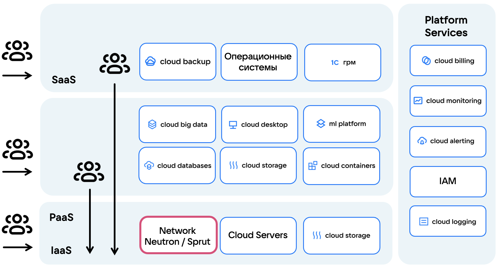
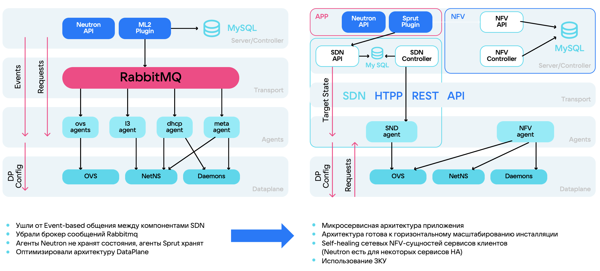

## Что такое SDN

SDN (Software Defined Network, [программно-определяемая сеть](https://ru.wikipedia.org/wiki/Программно-определяемая_сеть)) — это подход к управлению сетью, при котором уровень управления отделяется от уровня пересылки данных.

Если в традиционных сетях все устройства (коммутаторы, маршрутизаторы) при передаче данных используют свои собственные таблицы маршрутизации, то в SDN всей сетью управляет централизованный контроллер.

Такой подход имеет следующие преимущества:

- Проще управлять сетевым состоянием и инфраструктурой, масштабировать и создавать отказоустойчивые инфраструктуры.
- Легко адаптировать сеть под меняющиеся потребности, в том числе автоматизировать настройку и подстройку сети.
- Более гибкая настройка обработки трафика.
- Упрощение инвентаризации сетевых элементов. Например, можно автоматизировать удаление объектов при выходе из строя или настроить перебалансировку сетевого состояния.
- Использование независящих от поставщика решений для управления сетью.

SDN — инструмент управления overlay-сетями (виртуальная сеть поверх физической) и основа облачной инфраструктуры. SDN обеспечивает маршрутизацию, файервол и сетевую связность между сервисами.

Использование SDN позволяет быстро изменять конфигурацию и мигрировать ресурсы внутри инфраструктуры, что является обязательным условием организации распределенной инфраструктуры на 1000 и более серверов.

Сценарии использования SDN:

- Организация сетевой связности внутри проекта.
- Использование виртуальных маршрутизаторов, сетей и подсетей.
- Организация доступа в интернет и подключения к проекту из внешних сетей.
- Управление IP-адресами в проекте.
- Настройка правил маршрутизации.

{params[noBorder=true]}

Все сервисы и продукты в архитектуре облака связаны с SDN, поэтому для платформы важно иметь надежное, гибкое и отказоустойчивое SDN-решение.

VK Cloud использует SDN Neutron и Sprut.

## {heading(Neutron)[id=neutron]}

_Neutron_ — SDN, которая является частью платформы OpenStack и интегрирована с другими ее компонентами (ВМ, хранилище, идентификация).

Особенности архитектуры SDN Neutron:

- Взаимодействие между компонентами SDN происходит асинхронно и основано на событиях.
- События обрабатываются через RabbitMQ.
- Автоматизация и управление сетью производится через Neutron API.
- Использует плагины, которые отвечают за реализацию различных сетевых сервисов и поддержку разных технологий ([VLAN](https://ru.wikipedia.org/wiki/VLAN), [VXLAN](https://ru.wikipedia.org/wiki/Virtual_Extensible_LAN), [GRE](https://ru.wikipedia.org/wiki/GRE_(%D0%BF%D1%80%D0%BE%D1%82%D0%BE%D0%BA%D0%BE%D0%BB)), [geneve](https://www.protokols.ru/WP/wp-content/uploads/2020/11/rfc8926.pdf), [Flat](https://opg.optica.org/jocn/abstract.cfm?uri=jocn-9-3-b90)).
- Информация о сетевых объектах и конфигурации хранится в базе данных.
- Использует различные агенты для пересылки данных.

По умолчанию в SDN Neutron доступны сетевые сервисы:

- виртуальные маршрутизаторы;
- балансировщики нагрузки;
- VPN;
- DNS;
- группы безопасности.

На схеме предоставлена архитектура и схема работы SDN Neutron.

{params[noBorder=true]}

Долгое время в VK Cloud использовалась только SDN Neutron, это создавало следующие проблемы и ограничения:

- Архитектура Neutron трудно масштабируется и не позволяет эффективно наращивать инфраструктуру облака.
- Растет количество событий из-за переусложненного уровня передачи данных (dataplane).
- Из-за большого количества события теряются в очереди RabbitMQ.
- Сложно или невозможно добавлять новую функциональность.
- Множество агентов не хранят свое состояние и плохо синхронизируются.
- SDN Neutron плохо справляется с большими перестроениями сети (full-sync).

Из-за проблем с масштабируемостью и надежностью SDN Neutron было разработано собственное решение — SDN Sprut.

## {heading(Sprut)[id=sprut]}

_Sprut_ — SDN собственной разработки VK Cloud, полностью совместимая с Openstack Neutron API.

SDN Sprut обеспечивает стабильную работу сетей и сетевых функций поверх этих сетей на больших масштабах.

Отличительные особенности архитектуры SDN Sprut:

- Вместо очереди сообщений используется HTTP REST API, что обеспечивает синхронную коммуникацию между компонентами.
- Все агенты хранят свое текущее состояние. Агенты получают от SDN-контроллера целевое состояние, в котором они должны быть, и приводят свое состояние к требуемому.
- Реализована микросервисная архитектура. Каждый сервис отвечает за свою функциональность и может быть развернут независимо от других.
- Многоуровневая архитектура позволила оптимизировать уровень передачи данных (dataplane).
- Замкнутый контур управления позволяет системе автоматически подстраиваться для надежной работы облачной платформы.

На схеме представлено сравнение архитектуры SDN Neutron и SDN Sprut.

{params[noBorder=true]}

<info>

Sprut — основная SDN для всех новых проектов. В настройках можно [узнать, какая SDN используется на вашем проекте](ru/tools-for-using-services/account/service-management/project-settings/manage#sdn_view). Чтобы подключить другую SDN, [обратитесь в техническую поддержку](/ru/contacts).

</info>

Дополнительные материалы об SDN Sprut:
  
- доклад [Как выбрать SDN для высоких нагрузок](https://www.youtube.com/watch?v=iqSXRZ8b_bk);
- статья на Хабре [Как мы в VK Cloud SDN-ы писали](https://habr.com/ru/companies/vk/articles/763760/).
