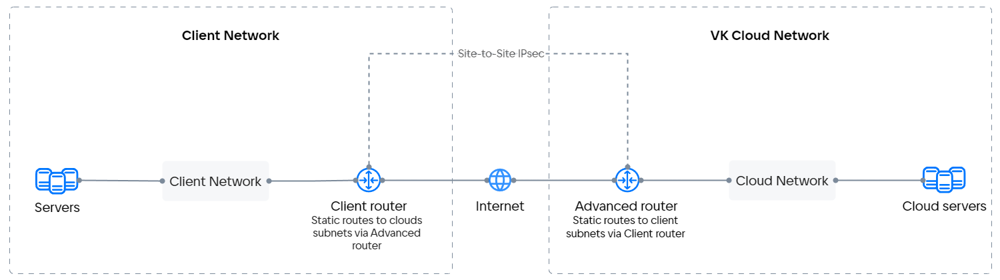
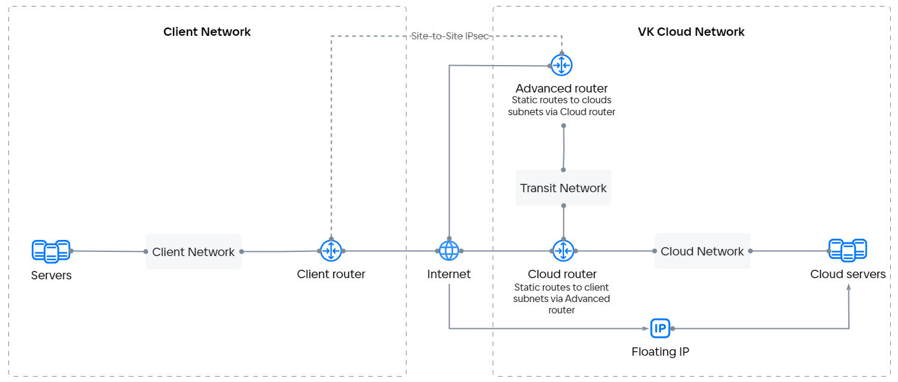

VPN позволяет организовать туннель между одной или несколькими подсетями VK Cloud и клиентскими подсетями, чтобы решить следующие задачи:

- Подключить сеть компании к сети VK Cloud (например, чтобы иметь доступ к инфраструктуре VK Cloud).
- Организовать защищенный канал для управления инфраструктурой VK Cloud (например, для использования telnet совместно с виртуальными машинами).

Сервис VPN основан на [StrongSwan](https://www.strongswan.org) и позволяет организовывать IPsec-туннели. Чтобы связать подсети VK Cloud с клиентскими подсетями:

1. Подключите к [маршрутизатору](../router) все подсети VK Cloud, к которым нужно организовать доступ через VPN. Сети в [SDN Sprut](../architecture#ispolzuemye_sdn) могут использовать только продвинутый маршрутизатор для организации VPN, а сети в [SDN Neutron](../architecture#ispolzuemye_sdn) — только стандартный.

1. Настройте для этого маршрутизатора доступ к [внешней сети](../net-types#vneshnyaya_set), чтобы появилась возможность использовать его интерфейсы `SNAT`.

1. Пропишите статические маршруты до нужных подсетей на удаленной площадке.

   Такие маршруты задаются в настройках подсетей VK Cloud, который должны быть доступны через VPN. Это необходимо, так как VPN VK Cloud получает доступ к клиентским подсетям через интерфейс `SNAT`:

   ```text
   <адрес клиентской подсети 1> - <адрес интерфейса SNAT в подсети VK Cloud>

   ...
   
   <адрес клиентской подсети N> - <адрес интерфейса SNAT в подсети VK Cloud>
   ```

1. Укажите при настройке VPN-подключения в VK Cloud маршрутизатор, за которым находятся подсети VK Cloud, к которым нужно организовать доступ через VPN.

1. Настройте VPN на стороне клиента, принимая во внимание конфигурацию сервера IPsec VPN VK Cloud, который:

   - работает в режиме `main`;
   - поддерживает только авторизацию по pre-shared key;
   - поддерживает ограниченный набор групп Диффи-Хеллмана.

Основная схема подключения сервиса VPN в SDN Sprut:



Продвинутый маршрутизатор не поддерживает возможность добавления [плавающих IP-адресов (DNAT)](../ips-and-inet#plavayushchiy_ip_adres). Чтобы использовать возможности плавающего IP-адреса для вашего сервиса при передаче данных между сетями, связанными VPN-туннелем в SDN Sprut, добавьте транзитную сеть и стандартный маршрутизатор между продвинутым маршрутизатором и остальной инфраструктурой в VK Cloud.

Схема организации VPN-подключения в SDN Sprut с использованием плавающего IP-адреса (DNAT):


