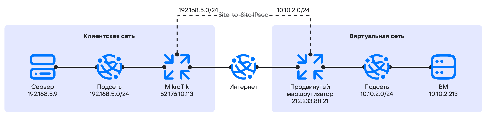

С помощью [продвинутого маршрутизатора](/ru/networks/vnet/how-to-guides/onpremise-connect/advanced-router) вы можете настроить VPN-туннель между сетью вашей локальной инфраструктуры и виртуальными сетями VK Cloud.

Чтобы показать настройку продвинутого маршрутизатора, будут связаны две независимые сети:

* Клиентская сеть — внутренняя сеть заказчика.
* Виртуальная сеть — находится в VK Cloud и подключена к платформенному маршрутизатору.

Для демонстрации настройки соединения в личном кабинете VK Cloud будут созданы:

* продвинутый маршрутизатор `vRouter01`;
* интерфейс маршрутизатора для доступа в интернет с адресом `212.233.88.21`;
* частная сеть `priv_net_demo`;
* частная подсеть `priv_subnet_demo` с адресом `10.10.2.0/24`;
* ВМ: `test-vm` с адресом `10.10.2.213`;
* группа безопасности `permit-remote-cidr-in`.

В клиентской сети будут использованы:

* маршрутизатор MikroTik с операционной системой RouterOS 7.19.3;
* сервер с ОС Debian 12; 
* IKEv2 для настройки IPsec;
* ключ совместного использования (PSK) для согласования фазы IKE.

Топология сети выглядит следующим образом:

{params[noBorder=true]}

## Подготовительные действия

1. Убедитесь, что клиент OpenStack [установлен](/ru/tools-for-using-services/cli/openstack-cli#1_ustanovite_klient_openstack), и [пройдите аутентификацию](/ru/tools-for-using-services/cli/openstack-cli#3_proydite_autentifikaciyu) в проекте.
1. [Перейдите](https://cloud.vk.com/app/) в личный кабинет VK Cloud.
1. Выберите проект.
1. [Создайте](/ru/networks/vnet/instructions/net#sozdanie_seti) сеть со следующими параметрами:

    - **Название сети**: `priv_net_demo`.
    - **SDN**: `Sprut`.
    - **Зона для приватного DNS**: `mcs.local`.
    - **Маршрутизатор**: `Не использовать`.
    - **Список подсетей**: отредактируйте единственную подсеть в списке. Задайте следующие параметры для подсети:

        - **Имя**: `priv_subnet_demo`.
        - **Адрес**: `10.10.2.0/24`.
        - **Шлюз**: `10.10.2.1`.
        - **Включить DHCP**: убедитесь, что эта опция выбрана.
        - **Пул DHCP IP-адресов**: `10.10.2.100 - 10.10.2.200`.
        - **Приватный DNS**: убедитесь, что эта опция выбрана.

1. [Создайте](/ru/networks/vnet/instructions/advanced-router/manage-advanced-routers#add) продвинутый маршрутизатор со следующими параметрами:

    - **Тип маршрутизатора**: `Продвинутый`.
    - **Название**: `vRouter01`.
    - **Зона доступности**: `Москва ME1`.
    - **SNAT**: включите опцию.

1. [Добавьте](/ru/networks/vnet/instructions/advanced-router/manage-interfaces#add) два интерфейса созданному маршрутизатору:

    - для подключения к приватной подсети;
    - для подключения к подсети с доступом в интернет.

    При создании интерфейса для подключения к приватной подсети задайте следующие параметры:

    - **Название**: `internal`.
    - **Подсеть**: `priv_subnet_demo`.
    - **Указать IP-адрес интерфейса**: включите опцию.
    - **IP-адрес интерфейса**: `10.10.2.1`.

1. [Создайте](/ru/computing/iaas/instructions/vm/vm-create#create_vm) виртуальную машину со следующими параметрами:

    - **Имя виртуальной машины**: `test-vm`.
    - **Сеть**: `priv_net_demo`.
   
    Запишите внутренний IP-адрес виртуальной машины. В примере будет использован `10.10.2.213`.

1. [Создайте](/ru/networks/vnet/instructions/secgroups#sozdanie_gruppy_bezopasnosti) группу безопасности `permit-remote-cidr-in`.

1. В группе безопасности `permit-remote-cidr-in` [добавьте](/ru/networks/vnet/instructions/secgroups#add_rule) правило для входящего трафика со следующими параметрами:

   - **Тип**: `Все протоколы и все порты`.
   - В блоке **Удаленный адрес** перейдите на вкладку **Диапазон IP адресов** и укажите CIDR приватной подсети: `192.168.5.0/24`.

1. [Примените](/ru/networks/vnet/instructions/secgroups#naznachenie_gruppy_na_instans) группу безопасности `permit-remote-cidr-in` к ВМ `test-vm`.

## 1. Настройте VPN-туннель на стороне облачной сети

1. Перейдите в раздел **Виртуальные сети** → **VPN**.
1. Нажмите кнопку **Добавить VPN** или **Добавить**.
1. Укажите параметры VPN:

   - **SDN**: `Sprut`.
   - **IKE-политика**: создайте IKE-политику с параметрами:

       - **Имя политики**: `Demo_IKEv2_Policy`.
       - **Время жизни ключа**: `28800`.
       - **Алгоритм авторизации**: `sha256`.
       - **Алгоритм шифрования**: `aes-256`.
       - **Версия IKE**: `v2`.
       - **Группа Диффи-Хеллмана**: `group14`.

1. Нажмите кнопку **Следующий шаг**.

1. Настройте IPsec-политику:

    - **Имя политики**: `Demo_IPSec_Policy`.
    - **Время жизни ключа**: `7200`.
    - **Алгоритм авторизации**: `sha256`.
    - **Алгоритм шифрования**: `aes-256`.
    - **Группа Диффи-Хеллмана**: `group14`.

1. Настройте endpoint-группы:

    - **Маршрутизатор**: `vRouter01`.
    - **Local Endpoint**: создайте локальную endpoint-группу с параметрами:

        - **Имя**: `my_local_demo_endpoint`.
        - **Адрес подсети**: `10.10.2.0/24`.

    - **Remote Endpoint**: создайте удаленную (remote) endpoint-группу с параметрами:

        - **Имя группы**: `my_remote_demo_endpoint`.
        - **Адрес подсети**: `192.168.5.0/24`.

1. Нажмите кнопку **Следующий шаг**.

1. Настройте VPN-туннель:

    - **Настройки**: `Расширенные`.
    - **Имя туннеля**: `demo_tun`.
    - **Публичный IPv4 адрес пира (Peer IP)**: `62.176.10.113`.
    - **Ключ совместного использования (PSK)**: сгенерируйте ключ, нажав соответствующую кнопку. Запишите значение ключа для настройки на стороне клиентской сети.
    - **Идентификатор маршрутизатора пира для аутентификации (Peer ID)**: `62.176.10.113`.
    - **Селектор потоков трафика**: `Разделить`.
    - **Состояние инициатора**: `bi-directional`
    - Настройки обнаружения недоступности удаленного пира (Dead Peer Detection, DPD):

        - **При обнаружении недоступности пира**: `restart`.
        - **Интервал обнаружения недоступности пира**: `15`.
        - **Время для обнаружения недоступности пира**: `60`.

1. Нажмите кнопку **Создать VPN-туннель**.

## 2. Настройте VPN-туннель на стороне клиентской сети

Настройте оборудование MikroTik с использованием WinBox 4 или CLI.

1. Подготовьте IPSec Profile:

   {tabs}

   {tab(WinBox)}

   1. Перейдите в раздел **IP** → **IPsec**.
   1. Перейдите на вкладку **Profile**.
   1. Нажмите кнопку **New**.
   1. Укажите значения параметров:

      - **Name**: `vk-dc-prof`.
      - **Hash Algorithms**: `sha256`.
      - **PRF Algorithms**: `auto`.
      - **Encryption Algorithms**: `aes-256`.
      - **DH Group**: `modp2048`.
      - **Proposal Check**: `obey`.
      - **Lifetime**: `28800`.
      - **NAT Traversal**: включите опцию.
      - **DPD Interval**: `15`.
      - **DPD Maximum Failures**: `4`.

   1. Нажмите кнопку **ОК**.

   {/tab}

   {tab(CLI)}

   Выполните команду:

   ```console
   /ip ipsec profile
   add dh-group=modp2048 enc-algorithm=aes-256 hash-algorithm=sha256 lifetime=8h name=vk-dc-prof
   ```

   {note:info}Для некоторых параметров используются значения по умолчанию. Они не задаются в строке запроса.{/note}

   {/tab}

   {/tabs}

1. Подготовьте IPSec Proposal:

   {tabs}

   {tab(WinBox)}

   1. Перейдите в раздел **IP** → **IPsec**.
   1. Перейдите на вкладку **Proposal**.
   1. Нажмите кнопку **New**.
   1. Укажите значения параметров:

      - **Name**: `vk-dc-prof`.
      - **Hash Algorithms**: `sha256`.
      - **Encryption Algorithms**: `aes-256-cbc`.
      - **Lifetime**: `7200`.
      - **PFS Group**: `modp2048`.

   1. Нажмите кнопку **ОК**.

   {/tab}

   {tab(CLI)}

   Выполните команду:

   ```console
   /ip ipsec proposal
   add auth-algorithms=sha256 enc-algorithms=aes-256-cbc lifetime=2h name=vk-dc-prop pfs-group=modp2048
   ```

   {note:info}Для некоторых параметров используются значения по умолчанию. Они не задаются в строке запроса.{/note}

   {/tab}

   {/tabs}

1. Настройте IPsec Peer:

   {tabs}

   {tab(WinBox)}

   1. Перейдите в раздел **IP** → **IPsec**.
   1. Перейдите на вкладку **Peer**.
   1. Нажмите кнопку **New**.
   1. Укажите значения параметров:

      - **Enabled**: включите опцию.
      - **Name**: `vk-dc-peer`.
      - **Address**: `212.233.88.21`.
      - **Local address**: `62.176.10.113`.
      - **Profile**: `vk-dc-prof` (был создан ранее).
      - **Exchange mode**: `IKE2`
      - **Send INITAL_CONTRACT**: включите опцию.

   1. Нажмите кнопку **ОК**.

   {/tab}

   {tab(CLI)}

   Выполните команду:

   ```console
   /ip ipsec peer
   add address=212.233.88.21/32 exchange-mode=ike2 local-address=62.176.10.113 name=vk-dc-peer profile=vk-dc-prof
   ```

   {/tab}

   {/tabs}

1. Настройте IPsec Identity:

   {tabs}

   {tab(WinBox)}

   1. Перейдите в раздел **IP** → **IPsec**.
   1. Перейдите на вкладку **Identities**.
   1. Нажмите кнопку **New**.
   1. Укажите значения параметров:

      - **Enabled**: включите опцию.
      - **Peer**: `vk-dc-peer`.
      - **Auth. Method**: `pre shared key`.
      - **Secret**: укажите значение параметра **Ключ совместного использования (PSK)**, заданное при настройке VPN-туннеля на стороне облачной сети.

   1. Нажмите кнопку **ОК**.

   {/tab}

   {tab(CLI)}

   Выполните команду:

   ```console
   /ip ipsec identity
   add peer=vk-dc-peer secret=<PSK>
   ```
   
   Здесь `<PSK>` — значение параметра **Ключ совместного использования (PSK)**, заданное при настройке VPN-туннеля на стороне облачной сети.

   {/tab}

   {/tabs}

1. Подготовьте IPSec Policy:

   {tabs}

   {tab(WinBox)}

   1. Перейдите в раздел **IP** → **IPsec**.
   1. Перейдите на вкладку **Policy**.
   1. Нажмите кнопку **New**.
   1. На вкладке **General** укажите значения параметров:

      - **Enabled**: включите опцию.
      - **Peer**: `vk-dc-peer`.
      - **Src. Address**: `192.168.5.0.24`.
      - **Dst. Address**: `10.10.2.0/24`.

   1. Перейдите на вкладку **Action** и укажите значения параметров:

      - **Action**: `encrypt`.
      - **Level**: `require`.
      - **IPsec Protocol**: `esp`.
      - **Proposal**: `vk-dc-prop`.

   1. Нажмите кнопку **ОК**.

   {/tab}

   {tab(CLI)}

   Выполните команду:

   ```console
   /ip ipsec policy
   add dst-address=10.10.2.0/24 peer=vk-dc-peer proposal=vk-dc-prop src-address=192.168.5.0/24 tunnel=yes
   ```
   
   {/tab}

   {/tabs}

1. Настройте исключения:

   1. Настройте NAT-исключения.

      Исключения из NAT-трансляции должны располагаться выше правила SNAT для вывода трафика в интернет (правил вида `action = masquerade` и `action = src-nat to address`).
   
      Выполните команду:

      ```console
      /ip firewall nat
      add action=accept chain=srcnat comment=srcnat_fix_for_vk_dc_router dst-address=10.10.2.0/24 src-address=192.168.5.0/24
      ```

   1. Настройте разрешение Firewall в цепочке Forward, чтобы разрешить прохождение трафика по направлению из сети VK Cloud в локальную сеть через IPsec VPN-туннель.

      Разрешающее правило должно располагаться выше правила, которое запрещает неизвестный трафик, поступающий на интерфейс.

      Выполните команду:

      ```console
      /ip firewall filter
      add action=accept chain=forward src-address=10.10.2.0/24 dst-address=192.168.5.0/24 ipsec-policy=in,ipsec in-interface=ether1
      ```

      Здесь `ether1` — имя физического интерфейса (порта) MikroTik, подключенного к интернету.

   1. Настройте Mangle-правила для оптимизации MSS Window:

      ```console
      /ip firewall mangle
      add action=change-mss chain=forward dst-address=192.168.5.0/24 new-mss=1360 protocol=tcp src-address=10.10.2.0/24 tcp-flags=syn tcp-mss=!0-1360
      add action=change-mss chain=forward dst-address=10.10.2.0/24 new-mss=1360 protocol=tcp src-address=192.168.5.0/24 tcp-flags=syn tcp-mss=!0-1360
      ```

## 3. Проверьте статус VPN-туннеля

1. Проверьте статус на стороне облачной сети:

   1. Выведите VPN-сервисы в проекте:

      ```console
      openstack vpn service list
      ```

      {cut(Пример вывода команды)}
      ```console
      +--------------------------------------+------+--------------------------------------+--------+--------+-------+--------+
      | ID                                   | Name | Router                               | Subnet | Flavor | State | Status |
      +--------------------------------------+------+--------------------------------------+--------+--------+-------+--------+
      | 7a60f4c3-5684-43d8-b5d7-a0********** |      | 9556d397-97e7-4daf-8ee4-f9********** | None   |        | True  | ACTIVE |
      +--------------------------------------+------+--------------------------------------+--------+--------+-------+--------+
      ```
      {/cut}

   1. Выведите детальную информацию о сервисе:

      ```console
      openstack vpn service show 7a60f4c3-5684-43d8-b5d7-a0**********
      ```

      {cut(Пример вывода команды)}
      ```console
      +--------------+--------------------------------------+
      | Field        | Value                                |
      +--------------+--------------------------------------+
      | Description  |                                      |
      | Ext v4 IP    | 212.233.88.21                        |
      | Ext v6 IP    | None                                 |
      | Flavor       |                                      |
      | ID           | 7a60f4c3-5684-43d8-b5d7-a0********** |
      | Name         |                                      |
      | Project      | 366fdd4249984226a023f1**********     |
      | Router       | 9556d397-97e7-4daf-8ee4-f9********** |
      | State        | True                                 |
      | Status       | ACTIVE                               |
      | Subnet       | None                                 |
      | created_at   | 2024-12-27T18:36:27                  |
      | interface_id | 6bcaacdb-54e0-452a-9f1a-3f********** |
      | sdn          | sprut                                |
      | updated_at   | 2024-12-27T18:36:27                  |
      +--------------+--------------------------------------+
      ```
      {/cut}

      Состояние `Active` означает, что сервис активен и трафик может передаваться между удаленными площадками.

1. Проверьте статус на стороне клиентской сети:

   {tabs}

   {tab(WinBox)}

   1. Перейдите в раздел **IP** → **IPsec**.
   1. Перейдите на вкладку **Policy**.
   1. Проверьте статус настроенной политики: в столбце **PH2 State** должно отображаться `established`.

   {/tab}

   {tab(CLI)}

   Выполните команду:

   ```console
   ip ipsec policy print detail where peer=vk-dc-peer
   ```

   {cut(Пример вывода команды)}
   ```console
   Flags: T - template; B - backup; X - disabled, D - dynamic, I - invalid, A - active; * - default
   0   A  peer=vk-dc-peer tunnel=yes src-address=192.168.5.0/24 src-port=any dst-address=10.10.2.0/24 dst-port=any protocol=all action=encrypt level=require ipsec-protocols=esp
   sa-src-address=62.176.10.113 sa-dst-address=212.233.88.21 proposal=vk-dc-prop ph2-count=1 ph2-state=established
   ```
   {/cut}

   {/tab}

   {/tabs}

1. Проверьте связность между подсетями `192.168.5.0/24` и `10.10.2.0/24`, используя ICMP Ping:

   1. Откройте сессию терминала ВМ или сервера в клиентской сети с адресом `192.168.5.9`.
   1. Выполните пинг внутреннего IP-адреса машины в облачной сети `10.10.2.213`.

      ```console
      ping 10.10.2.213 -c 3
      ```

      {cut(Пример вывода команды)}
      ```console
      PING 10.10.2.213 (10.10.2.213) 56(84) bytes of data.
      64 bytes from 10.10.2.213: icmp_seq=1 ttl=64 time=4.715 ms
      64 bytes from 10.10.2.213: icmp_seq=2 ttl=64 time=4.249 ms
      64 bytes from 10.10.2.213: icmp_seq=3 ttl=64 time=4.282 ms

      --- 10.10.2.213 ping statistics ---
      3 packets transmitted, 3 received, 0% packet loss, time 2026ms
      rtt min/avg/max/mdev = 4.249/4.415/4.715/0.212 ms
      ```
      {/cut}

      IP-адрес должен отвечать на пинг.

{note:info}
Если подключение установлено и его статус `established`, но трафик между узлами в подсетях не передается:

- в личном кабинете VK Cloud проверьте настройки NAT и групп безопасности;
- в клиентской сети проверьте настройки физического или виртуального оборудования, которое используется для организации IPsec VPN.
{/note}

## Удалите неиспользуемые ресурсы

Если созданные ресурсы вам больше не нужны, удалите их:

1. [Удалите](/ru/computing/iaas/instructions/vm/vm-manage#delete_vm) виртуальную машину.
1. [Удалите](/ru/networks/vnet/instructions/router#udalenie_marshrutizatora) маршрутизатор.
1. Удалите [подсеть](/ru/networks/vnet/instructions/net#udalenie_podseti) и [сеть](/ru/networks/vnet/instructions/net#udalenie_seti), в которой была размещена ВМ.
