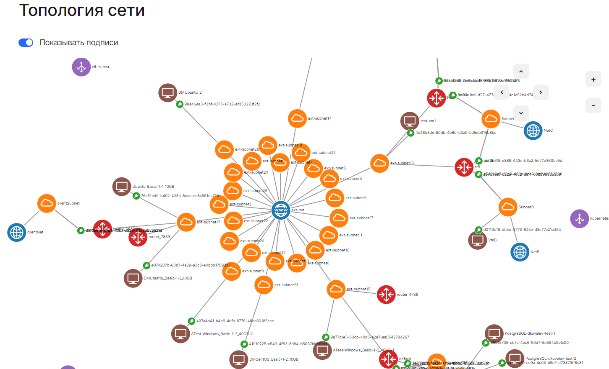

# {heading(Просмотр топологии)[id=vnet-topology]}

Топология сети — это схема сетевой связности виртуальных машин. На ней видны следующие элементы, а также все связи между ними:

- сети;
- подсети;
- маршрутизаторы;
- виртуальные машины.

Чтобы посмотреть топологию сети отдельного проекта:

1. {ifdef(public)}[Перейдите](https://msk.cloud.vk.com/app/){/ifdef}{ifdef(private,private-pg,private-cert,private-pdf,private-pg-pdf)}{linkto(../../../../tools-for-using-services/account/instructions/lk-entry#tools-account-lk-entry)[text=Перейдите]}{/ifdef} в личный кабинет {var(cloud)}.
1. Выберите проект.
1. Перейдите в раздел **Виртуальные сети** → **Топология сети**.

{ifdef(private-cert,private-pdf,private-pg-pdf)}
{caption(Рисунок {counter(pic)[id=numb_pic_view_topology]} — Страница топологии сети)[align=center;position=under;id=pic_vnet_view_topology;number={const(numb_pic_view_topology)}]}
{/ifdef}

{ifdef(private-cert,private-pdf,private-pg-pdf)}
{/caption}
{/ifdef}

## {heading(Управление топологией)[id=vnet-topology-manage]}

Доступные операции с топологией сети:

- *Перемещение*. Используйте стрелки в правом верхнем углу или удерживайте левую кнопку мыши и передвигайте схему в нужном направлении.
- *Масштабирование*. Используйте **+** и **-** в правом верхнем углу схемы или прокручивайте колесико мыши.
- *Скрытие или отображение подписей*. Используйте переключатель **Показывать подписи** в левом верхнем углу схемы.
- *Просмотр подробной информации об элементе*. Нажмите на элемент схемы левой кнопкой мыши. Будут отображены параметры:

  - **Название** — наименование выбранного элемента.
  - **ID** — идентификатор элемента в системе.
  - **Тип** — тип выбранного элемента:

    - `network` — сеть;
    - `subnet` — подсеть;
    - `instance` — инстанс;
    - `router` — маршрутизатор;
    - `balancer` — балансировщик нагрузки;
    - `port` — порт.

  - **Статус** — состояние выбранного элемента. Не отображается для подсети. <!-- todo заполнить возможные статусы-->
  - Дополнительные параметры в зависимости от типа элемента.
  - Ссылка для перехода на элемент в личном кабинете. Не отображается для портов.
