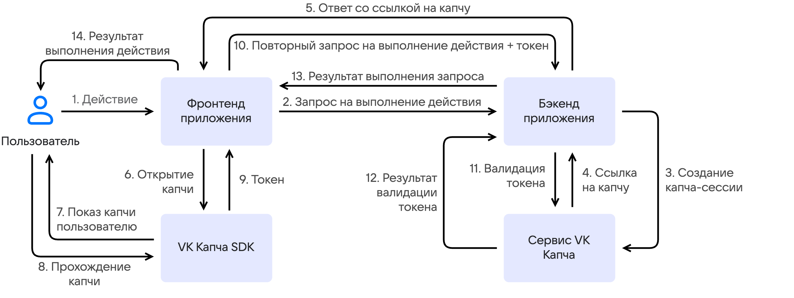

# {heading(О сервисе)[id=captcha-concepts-about]}

VK Капча — сервис, который в реальном времени определяет, является ли пользователь приложения человеком. Сервис защищает ключевые точки взаимодействия с пользователями — авторизацию, регистрацию, API-эндпоинты — от автоматизированных атак. К таким атакам относятся:

- массовая регистрация фейковых аккаунтов;
- полный перебор паролей (brute force);
- автоматическая отправка сообщений через веб-формы;
- сбор контента (scraping);
- DDoS-атаки на прикладном уровне.

Сервис отсеивает ботов и точно верифицирует легитимных пользователей при минимальном участии с их стороны. Инфраструктура сервиса включает SDK для веб-приложений, iOS и Android, а также API для бэкенда.

## {heading(Принцип работы сервиса)[id=captcha-about-how-it-works]}

{params[noBorder=true]}

1. Пользователь выполняет действие в приложении.

1. Фронтенд приложения отправляет запрос на выполнение этого действия бэкенду.

1. Бэкенд приложения проверяет, нужно ли для этого запроса показать капчу. Если да, то бэкенд обращается к {linkto(../../../../tools-for-using-services/api/api-spec/captcha-api#api-spec-captcha)[text=API VK Капча]}, чтобы создать капча-сессию.

1. Сервис VK Капча возвращает ссылку для запуска виджета капчи на фронтенде приложения.

1. Бэкенд приложения отправляет полученную ссылку фронтенду.

1. Фронтенд приложения передает ссылку в {linkto(../reference-sdk#captcha-concepts-reference-sdk)[text=VK Капча SDK]}, чтобы отобразить виджет капчи пользователю.

1. {linkto(../reference-sdk#captcha-concepts-reference-sdk)[text=VK Капча SDK]} отображает виджет капчи пользователю.

1. Пользователь проходит проверку. Во время прохождения капчи сервис анализирует его поведение и оценивает {linkto(#captcha-about-trust-score)[text=уровень доверия к пользователю]} (trust score).

1. После успешного прохождения капчи {linkto(../reference-sdk#captcha-concepts-reference-sdk)[text=VK Капча SDK]} возвращает фронтенду `success-token` — криптографически защищенный токен, подтверждающий, что пользователь прошел проверку. Если пользователь не прошел капчу, вместо токена возвращается ошибка.

1. Фронтенд приложения отправляет бэкенду повторный запрос на выполнение действия пользователя, содержащий `success-token`.

1. Бэкенд приложения отправляет `success-token` в {linkto(../../../../tools-for-using-services/api/api-spec/captcha-api#api-spec-captcha)[text=API VK Капча]} для верификации.

1. Сервис VK Капча подтверждает валидность токена.

1. Бэкенд приложения обрабатывает исходное действие пользователя и отправляет результат фронтенду.

1. Пользователю отображается результат выполнения действия.

## {heading(Типы капчи)[id=captcha-about-types]}

В сервисе VK Капча доступно три типа капчи:

- Флажок (checkbox) — подтверждение одним нажатием. Минимальное взаимодействие, подходит для большинства сценариев.
- Ползунок (slider) — визуальная задача на сетке изображений, требующая человеческого восприятия и логики.
- Аудио (sound) — аудиозадание: прослушать звуковую дорожку и ввести распознанное слово.

Тип капчи можно задать при создании капча-сессии или он может выбираться автоматически на основе оценки уровня доверия к пользователю.

При автоматическом выборе капчи, если сервис оценивает пользователя как доверенного, будет предложена капча-флажок. В противном случае сервис эскалирует сложность и предлагает капчу-ползунок или аудиокапчу.

## {heading(Уровень доверия к пользователю)[id=captcha-about-trust-score]}

Сервис VK Капча определяет уровень доверия к пользователю в реальном времени, объединяя несколько групп сигналов:

- Поведенческие сигналы.

  ML-модели анализируют поведение пользователя: траектории курсора, паттерны кликов, скорость реакции, хронологию и последовательность действий. На основе этих данных формируется цифровой профиль пользователя (fingerprint), который сохраняется между сессиями. Боты, имитирующие человека, оставляют характерные атрибуты, которые ML-модель распознает.

- Сигналы интенсивности и окружения.

  Сервис исследует интенсивность передачи пользовательских запросов и среду исполнения на стороне пользователя: характеристики устройства, конфигурацию браузера, доступные API. Анализируя полученные данные, сервис выявляет автоматизированное окружение: headless-браузеры, эмуляторы, фермы виртуальных машин.

Итоговая оценка уровня доверия определяет {linkto(#captcha-about-types)[text=тип капчи]}, которую нужно пройти пользователю.

## {heading(Системные требования)[id=captcha-about-requirements]}

{include(../../../../_includes/_captcha-requirements.md)[tags=captcha-req-browser]}

iOS:

{include(../../../../_includes/_captcha-requirements.md)[tags=captcha-req-ios]}

Android:

{include(../../../../_includes/_captcha-requirements.md)[tags=captcha-req-android]}