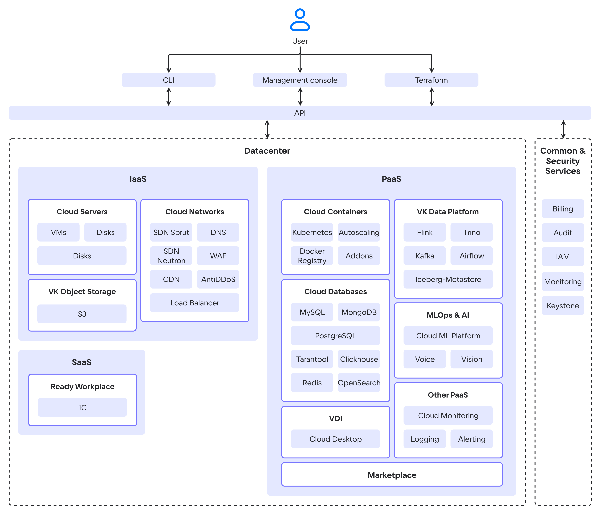

VK Cloud — облачная платформа, которая предоставляет сетевой доступ к вычислительным ресурсам (виртуальным машинам, базам данных, хранилищам и другим сервисам) по принципу «pay as you go»: плата взимается только за потребляемые ресурсы.

Вы арендуете виртуальные ресурсы, размещенные в [дата-центрах](#az) VK. Это позволяет не тратиться на покупку и обслуживание собственных физических серверов, а также дает вам доступ к технической поддержке VK Cloud.

## Модели развертывания

VK Cloud предлагает следующие модели развертывания:

- **Публичное облако (Public Cloud)** — модель развертывания облака в виде многопользовательской платформы с общими ресурсами (серверы, хранилища, сети). Данные пользователей изолированы друг от друга через механизм виртуализации, но физически могут находиться на одних и тех же серверах. VK Cloud управляет инфраструктурой, включая обслуживание дата-центров, закупку оборудования, обеспечение отказоустойчивости и сетевое управление. 

   Преимущества: масштабируемость, оплата по факту использования, доступ к новым технологиям.

- **Частное облако (Private Cloud)** — модель развертывания, при которой ресурсы выделяются отдельно для каждого клиента (как правило, это организации). Сотрудники одной организации могут совместно использовать ее инфраструктуру, но совместное использование физических и виртуальных ресурсов разными организациями исключается. В частном облаке именно клиент (организация) контролирует и обслуживает базовую инфраструктуру.

   Преимущества: полная изоляция и контроль данных, повышенная безопасность. Подробнее о Private Cloud от VK смотрите на портале [Частные инсталяции](/ru/on-premises).

[cols="1,1,1", options="header"]
|===
| Характеристика
| Public Cloud
| Private Cloud

| Развертывание
| Автоматическое
| Ручная настройка под ваши конкретные нужды

| Обслуживание инфраструктуры
| VK Cloud
| Вы

| Ресурсы
| Масштабируемые
| Ограниченные

| Стоимость
| По факту использования
| Абонентская плата

| Инвестиции
| Минимальные
| Высокие

| Доступ к данным
| У вас и у VK Cloud
| Только у вас

| Безопасность
| [Обеспечивается](https://cloud.vk.com/cloud-platform/certificates/) VK Cloud
| Вы сами настраиваете необходимый уровень безопасности на базе сертифицированных продуктов VK Cloud
|===

## Модели предоставления облачных услуг

В VK Cloud могут быть развернуты сервисы виртуализации, мониторинга, контейнеров, хранилищ данных. Архитектура базируется на четырех группах сервисов:

- **Infrastructure as a Service (IaaS)**. IaaS-сервисы построены на базе [OpenStack](https://www.openstack.org/software) и компонентов собственной разработки. Управляют динамическим выделением ресурсов, масштабированием, отказоустойчивостью. Размещены в одном облачном дата-центре с PaaS-сервисами. IaaS предоставляет базовые компоненты: виртуальные серверы, сеть, хранилища данных, доступ к выделенному оборудованию.

   {cut(Список IaaS-сервисов)}

  - [Cloud Servers](/ru/computing/iaas) — предоставляет виртуальные машины с возможностью использования публичных IP и каналом связи на 1 ГБит/с с безлимитным трафиком (также доступны виртуальные машины с NVIDIA GPU). Отвечает за виртуализацию и интеграцию ресурсов, использует гипервизор KVM.
  - [VK Object Storage](/ru/storage/s3) — предоставляет S3-совместимое объектное хранилище. Рабочая нагрузка на хранилище распределяется между всеми узлами хранения. Можно развернуть хранилище с настраиваемой архитектурой.
  - [Cloud Networks](/ru/networks/vnet) — обеспечивает сетевое взаимодействие в рамках выбранного [проекта](/ru/tools-for-using-services/account/concepts/projects) с помощью технологии SDN (Software Defined Network). Функционирует на базе OpenStack Neutron и на базе ПО собственной разработки — Sprut. Включает в себя компоненты:

    - [DNS](/ru/networks/dns) — поддерживает публичный и приватный DNS, обеспечивающий разрешение имен для сервисов платформы VK Cloud.
    - [CDN](/ru/networks/cdn) — организует передачу контента от ваших серверов к пользователям с минимальной задержкой.
    - [Load Balancer](/ru/networks/balancing/concepts/load-balancer) — распределяет нагрузку на инфраструктуру, обеспечивая отказоустойчивость и гибкое масштабирование приложений.
    - [AntiDDoS](/ru/security/firewall-and-protection-ddos#antiddos) — фильтрует трафик, приходящий к развернутым в проекте ресурсам VK Cloud для блокирования DDoS-атак.
    - [WAF](/ru/security/firewall-and-protection-ddos#waf) (Web Application Firewall) — настраивает правила фильтрации входящего и исходящего трафика для обнаружения и блокирования сетевых атак.

  {/cut}

- **Platform as a Service (PaaS)**. Включают в себя решения с открытым исходным кодом (Kubernetes) и решения технологических партнеров. Поддерживается встроенный мониторинг сервисов и отдельных сущностей VK Cloud. Модель PaaS надстраивается над IaaS. Она не требует управления базовой инфраструктурой, включающей оборудование и операционные системы, и позволяет посвятить все усилия разработке и управлению приложениями. 

  {cut(Список PaaS-сервисов)}

  - [Cloud Containers](/ru/kubernetes/k8s) — позволяет создавать и управлять кластерами Kubernetes, в которых можно запускать сервисы и приложения.
  - [Cloud Databases](/ru/dbs/dbaas) — предоставляет масштабируемые СУБД: MySQL, PostgreSQL, Postgres Pro, ClickHouse, MongoDB, Redis, Tarantool, OpenSearch, Arenadata DB на базе Greenplum.
  - [Cloud Big Data](/ru/data-platform/bigdata) — применяется для анализа больших данных на базе Arenadata Hadoop, поддерживает масштабирование.
  - [Cloud Spark](/ru/ml/spark-to-k8s) — обладает распределенной пакетной и потоковой обработки данных, работы с Machine Learning и аналитикой.
  - [Cloud ML Platform](/ru/ml/mlplatform) — поддерживает сервисы для полного цикла ML-разработки.
  - [Cloud Voice](/ru/ml/cloud-voice) — предоставляет REST API для распознавания и синтеза речи на базе машинного обучения.
  - [Vision](/ru/ml/vision) — предоставляет REST API для распознавания лиц и объектов на базе машинного обучения.
  - [Cloud Alerting](/ru/monitoring-services/alerting) —  настраивает уведомления об изменении ключевых метрик сервисов VK Cloud.
  - [Cloud Logging](/ru/monitoring-services/logging) — агрегирует и анализирует логи сервисов в VK Cloud.
  - [Cloud Monitoring](/ru/monitoring-services/monitoring) — обеспечивает мониторинг метрик, специфичных для PaaS-сервисов, например, аналитика по подам K8s-контейнеров, статистика транзакций СУБД PostgreSQL.
  - [Cloud Desktop](/ru/computing/cloud-desktops/concepts/about) — управляемые виртуальные рабочие места, доступные из любой точки мира.
  - [Cloud Kafka](/ru/data-platform/kafka/concepts/about) — обеспечивает обмен данными между разными модулями ИТ-систем в режиме реального времени.
  - [Cloud Flink](/ru/data-platform/flink/concepts/about) — потоковая обработка и передача данных из источников в целевые системы.
  - [Cloud Trino](/ru/data-platform/trino/concepts/about) — SQL-движок для обработки больших данных из удаленных источников.
  - [Marketplace](/ru/applications-and-services/marketplace) — позволяет быстро разворачивать среды веб-разработки и администрирования на базе виртуальных машин. Включает такие приложения, как: OpenVPN, VK Testers, Redash, Grafana, Milvus, Nexus, Joomla, WordPress и другие.

  {/cut}

- **Software as a Service (SaaS)**. Готовое ПО, доступное по подписке через интернет. Не требует управления инфраструктурой или платформой. Примером SaaS-сервиса в VK Cloud является [1С:Готовое рабочее место](/ru/applications-and-services/1cgrm). Сервис предоставляет ресурсы и ПО для развертывания [сервисов 1С](/ru/applications-and-services/1cgrm/about#description).

- **Common&Security-сервисы** обеспечивают безопасную работу пользователей и поддерживают ролевую модель при использовании ресурсов VK Cloud.

  {cut(Список Common&Security-сервисов)}

  - [Billing](/ru/intro/billing) — ведет учет использования ресурсов и контроль расходов, формирует финансовые отчеты, обеспечивает взаимодействие с платежными системами при оплате сервисов.
  - [Cloud Audit](/ru/monitoring-services/event-log) — формирует журнал аудита действий пользователей в VK Cloud.
  - IAM — управляет аутентификацией и авторизацией пользователей и сервисов в совокупности с Keystone.
  - Monitoring — обеспечивает мониторинг облачных сервисов и пользовательских приложений.
  - Keystone — обеспечивает аутентификацию клиента по API, обнаружение служб и распределенную мультитенантную авторизацию.

  {/cut}

Общая схема компонентов и сервисов VK Cloud показана ниже.

{params[noBorder=true]}

## Способы управления сервисами VK Cloud

Управление облачными сервисами выполняется с помощью API. Пользователи взаимодействуют с API через один или несколько [инструментов](/ru/tools-for-using-services):

  - личный кабинет VK Cloud;
  - OpenStack CLI;
  - Terraform с отдельным провайдером.

VK Cloud предоставляет [техническую поддержку](/ru/start/support/support-info) для своих сервисов. Партнерские решения (например, AntiDDoS, WAF) поддерживаются совместно с партнером.

## Отказоустойчивость

Физическая отказоустойчивость реализована размещением VK Cloud в трех дата-центрах уровня надежности Tier III в РФ. При таком размещении гарантируется поддержание SLA ЦОДов более 98% с общим [SLA](/ru/start/support/sla) 99.95%.

Сетевая отказоустойчивость обеспечивается связью дата-центров трассами с пропускной способностью 200 ГБ/с. Связь каждого сервера с магистральными провайдерами идет по двум независимым каналам, через два маршрутизатора.

Логическая отказоустойчивость реализована с помощью зон доступности (availability zone), которые объединяются в [регионы](/ru/tools-for-using-services/account/concepts/regions).

{note:info}

Статус зон доступности, сервисов и инфраструктуры VK Cloud можно проверить на странице [Статус работы сервисов](https://status.msk.cloud.vk.com).

{/note}

### {heading(Зоны доступности)[id=az]}

В каждой зоне доступности находится один или несколько центров обработки данных (ЦОДов), где физически размещены объекты облачной инфраструктуры. В VK Cloud зона доступности соответствует отдельному ЦОД уровня Tier III. VK Cloud предоставляет зоны доступности:

[cols="1,1,2", options="header"]
|===
| Регион
| Зона доступности
| Дата-центр

.4+|Москва
|`GZ1`
|[Goznak](https://tech.goznak.ru/dc-goznak-moscow)

|`MS1`
|DataLine NORD4

|`ME1`
|«Медведково» Ростелеком-ЦОД

|`PA2`
|«Пахра»

|Казахстан
|`QAZ`
|[QazCloud](https://qazcloud.kz)

|===

Каждый дата-центр оснащен независимыми системами электропитания и охлаждения.

Зоны доступности одного региона соединены с помощью резервированной выделенной оптоволоконной сети высокой пропускной способности и с низким уровнем задержек для высокой скорости передачи данных между зонами.

## Безопасность

Безопасность VK Cloud обеспечивается постоянным мониторингом сервисов VK Cloud, проведением внешних аудитов. VK Cloud участвует в программе аудита безопасности [HackerOne](https://www.hackerone.com). Информационная система VK Cloud [аттестована](https://cloud.vk.com/cloud-platform/certificates) по требованиям 21 Приказа ФСТЭК России для работы с персональными данными.

Инфраструктура зон доступности всех регионов VK Cloud [защищена](/ru/intro/it-security/compliance-152fz) в соответствии с ФЗ РФ «О персональных данных» №152-ФЗ.

Подробная информация приведена в разделе [Безопасность платформы](/ru/intro/it-security).

## Миграция в VK Cloud

VK Cloud поддерживает миграцию с использованием [стороннего ПО](/ru/intro/migration) или [средствами платформы](/ru/intro/migration/migrate-hystax-mr). Перенос виртуальных ресурсов обходится дешевле за счет реализации сервисов на базе OSS-решений (Open Source Solutions).
