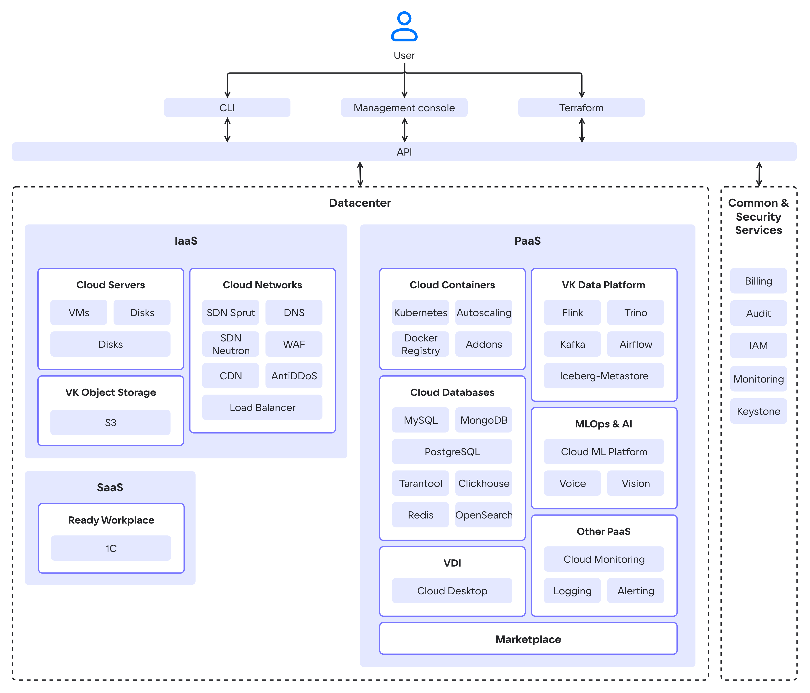

# {heading(Архитектура {var(cloud)})[id=architecture]}

{var(cloud)} — облачная платформа, которая предоставляет сетевой доступ к вычислительным ресурсам (виртуальным машинам, базам данных, хранилищам и другим сервисам) по принципу «pay as you go»: плата взимается только за потребляемые ресурсы.

Вы арендуете виртуальные ресурсы, размещенные в {linkto(#architecture-az)[text=дата-центрах]} VK. Это позволяет не тратиться на покупку и обслуживание собственных физических серверов, а также дает вам доступ к технической поддержке {var(cloud)}.

## {heading(Модели развертывания)[id=architecture-deployment-models]}

{var(cloud)} предлагает следующие модели развертывания:

- **Публичное облако (Public Cloud)** — модель развертывания облака в виде многопользовательской платформы с общими ресурсами (серверы, хранилища, сети). Данные пользователей изолированы друг от друга через механизм виртуализации, но физически могут находиться на одних и тех же серверах. {var(cloud)} управляет инфраструктурой, включая обслуживание дата-центров, закупку оборудования, обеспечение отказоустойчивости и сетевое управление. 

   Преимущества: масштабируемость, оплата по факту использования, доступ к новым технологиям.

- **Частное облако (Private Cloud)** — модель развертывания, при которой ресурсы выделяются отдельно для каждого клиента (как правило, это организации). Сотрудники одной организации могут совместно использовать ее инфраструктуру, но совместное использование физических и виртуальных ресурсов разными организациями исключается. В частном облаке именно клиент (организация) контролирует и обслуживает базовую инфраструктуру.

   Преимущества: полная изоляция и контроль данных, повышенная безопасность. Подробнее о Private Cloud от VK смотрите на портале [Частные инсталяции](/ru/on-premises).

[cols="1,1,1", options="header"]
|===
| Характеристика
| Public Cloud
| Private Cloud

| Развертывание
| Автоматическое
| Ручная настройка под ваши конкретные нужды

| Обслуживание инфраструктуры
| {var(cloud)}
| Вы

| Ресурсы
| Масштабируемые
| Ограниченные

| Стоимость
| По факту использования
| Абонентская плата

| Инвестиции
| Минимальные
| Высокие

| Доступ к данным
| У вас и у {var(cloud)}
| Только у вас

| Безопасность
| [Обеспечивается](https://cloud.vk.com/cloud-platform/certificates/) {var(cloud)}
| Вы сами настраиваете необходимый уровень безопасности на базе сертифицированных продуктов {var(cloud)}
|===

## {heading(Модели предоставления облачных услуг)[id=architecture-delivery-models]}

В {var(cloud)} могут быть развернуты сервисы виртуализации, мониторинга, контейнеров, хранилищ данных. Архитектура базируется на четырех группах сервисов:

- **Infrastructure as a Service (IaaS)**. IaaS-сервисы построены на базе [OpenStack](https://www.openstack.org/software) и компонентов собственной разработки. Управляют динамическим выделением ресурсов, масштабированием, отказоустойчивостью. Размещены в одном облачном дата-центре с PaaS-сервисами. IaaS предоставляет базовые компоненты: виртуальные серверы, сеть, хранилища данных, доступ к выделенному оборудованию.

   {cut(Список IaaS-сервисов)}

  - {linkto(../../../computing/iaas#iaas)[text=Cloud Servers]} — предоставляет виртуальные машины с возможностью использования публичных IP и каналом связи на 1 ГБит/с с безлимитным трафиком (также доступны виртуальные машины с NVIDIA GPU). Отвечает за виртуализацию и интеграцию ресурсов, использует гипервизор KVM.
  - {linkto(../../../storage/s3#s3-main)[text=VK Object Storage]} — предоставляет S3-совместимое объектное хранилище. Рабочая нагрузка на хранилище распределяется между всеми узлами хранения. Можно развернуть хранилище с настраиваемой архитектурой.
  - {linkto(../../../networks/vnet#vnet)[text=Cloud Networks]} — обеспечивает сетевое взаимодействие в рамках выбранного {linkto(../../../tools-for-using-services/account/concepts/projects#tools-account-concepts-projects)[text=проекта]} с помощью технологии SDN (Software Defined Network). Функционирует на базе OpenStack Neutron и на базе ПО собственной разработки — Sprut. Включает в себя компоненты:

    - {linkto(../../../networks/dns#dns)[text=DNS]} — поддерживает публичный и приватный DNS, обеспечивающий разрешение имен для сервисов платформы {var(cloud)}.
    - {linkto(../../../networks/cdn#cdn)[text=CDN]} — организует передачу контента от ваших серверов к пользователям с минимальной задержкой.
    - {linkto(../../../networks/balancing/concepts/about#balancing-load-balancer)[text=Load Balancer]} — распределяет нагрузку на инфраструктуру, обеспечивая отказоустойчивость и гибкое масштабирование приложений.
    - {linkto(../../../security/firewall-and-protection-ddos#firewall-and-protection-ddos-antiddos)[text=AntiDDoS]} — фильтрует трафик, приходящий к развернутым в проекте ресурсам {var(cloud)} для блокирования DDoS-атак.
    - {linkto(../../../security/firewall-and-protection-ddos#firewall-and-protection-ddos-waf)[text=WAF]} (Web Application Firewall) — настраивает правила фильтрации входящего и исходящего трафика для обнаружения и блокирования сетевых атак.

  {/cut}

- **Platform as a Service (PaaS)**. Включают в себя решения с открытым исходным кодом (Kubernetes) и решения технологических партнеров. Поддерживается встроенный мониторинг сервисов и отдельных сущностей {var(cloud)}. Модель PaaS надстраивается над IaaS. Она не требует управления базовой инфраструктурой, включающей оборудование и операционные системы, и позволяет посвятить все усилия разработке и управлению приложениями. 

  {cut(Список PaaS-сервисов)}

  - {linkto(../../../kubernetes/k8s#k8s-k8s)[text=Cloud Containers]} — позволяет создавать и управлять кластерами Kubernetes, в которых можно запускать сервисы и приложения.
  - {linkto(../../../dbs/dbaas#dbaas-dbaas)[text=Cloud Databases]} — предоставляет масштабируемые СУБД: MySQL, PostgreSQL, ClickHouse, MongoDB, Redis, Tarantool, OpenSearch, Arenadata DB на базе Greenplum.
  - {linkto(../../../ml/spark-to-k8s#mlspark)[text=Cloud Spark]} — обладает распределенной пакетной и потоковой обработки данных, работы с Machine Learning и аналитикой.
  - {linkto(../../../ml/mlplatform#mlplatform)[text=Cloud ML Platform]} — поддерживает сервисы для полного цикла ML-разработки.
  - {linkto(../../../ml/cloud-voice#cloud_voice)[text=Cloud Voice]} — предоставляет REST API для распознавания и синтеза речи на базе машинного обучения.
  - {linkto(../../../ml/vision#vision)[text=Vision]} — предоставляет REST API для распознавания лиц и объектов на базе машинного обучения.
  - {linkto(../../../monitoring-services/alerting#alerting)[text=Cloud Alerting]} —  настраивает уведомления об изменении ключевых метрик сервисов {var(cloud)}.
  - {linkto(../../../monitoring-services/logging#logging)[text=Cloud Logging]} — агрегирует и анализирует логи сервисов в {var(cloud)}.
  - {linkto(../../../monitoring-services/monitoring#monitoring)[text=Cloud Monitoring]} — обеспечивает мониторинг метрик, специфичных для PaaS-сервисов, например, аналитика по подам K8s-контейнеров, статистика транзакций СУБД PostgreSQL.
  - {linkto(../../../computing/cloud-desktops#cloud-desktops)[text=Cloud Desktop]} — управляемые виртуальные рабочие места, доступные из любой точки мира.
  - {linkto(../../../data-platform/kafka#kafka)[text=Cloud Kafka]} — обеспечивает обмен данными между разными модулями ИТ-систем в режиме реального времени.
  - {linkto(../../../data-platform/flink#flink)[text=Cloud Flink]} — потоковая обработка и передача данных из источников в целевые системы.
  - {linkto(../../../data-platform/trino#trino)[text=Cloud Trino]} — SQL-движок для обработки больших данных из удаленных источников.
  - [Marketplace](../../../applications-and-services/marketplace) — позволяет быстро разворачивать среды веб-разработки и администрирования на базе виртуальных машин. Включает такие приложения, как: OpenVPN, VK Testers, Redash, Grafana, Milvus, Nexus, Joomla, WordPress и другие.

  {/cut}

- **Software as a Service (SaaS)**. Готовое ПО, доступное по подписке через интернет. Не требует управления инфраструктурой или платформой. Примером SaaS-сервиса в {var(cloud)} является {linkto(../../../applications-and-services/1cgrm#1cgrm)[text=1С:Готовое рабочее место]}. Сервис предоставляет ресурсы и ПО для развертывания {linkto(../../../applications-and-services/1cgrm/concepts/about#1cgrm-description)[text=сервисов 1С]}.

- **Common&Security-сервисы** обеспечивают безопасную работу пользователей и поддерживают ролевую модель при использовании ресурсов {var(cloud)}.

  {cut(Список Common&Security-сервисов)}

  - {linkto(../../../intro/billing#billing)[text=Billing]} — ведет учет использования ресурсов и контроль расходов, формирует финансовые отчеты, обеспечивает взаимодействие с платежными системами при оплате сервисов.
  - {linkto(../../../monitoring-services/event-log#event-log)[text=Cloud Audit]} — формирует журнал аудита действий пользователей в {var(cloud)}.
  - IAM — управляет аутентификацией и авторизацией пользователей и сервисов в совокупности с Keystone.
  - Monitoring — обеспечивает мониторинг облачных сервисов и пользовательских приложений.
  - Keystone — обеспечивает аутентификацию клиента по API, обнаружение служб и распределенную мультитенантную авторизацию.

  {/cut}

Общая схема компонентов и сервисов {var(cloud)} показана ниже.

{params[noBorder=true]}

## {heading(Способы управления сервисами {var(cloud)})[id=architecture-control-methods]}

Управление облачными сервисами выполняется с помощью API. Пользователи взаимодействуют с API через один или несколько {linkto(../../../tools-for-using-services#tools-for-using-services)[text=инструментов]}:

  - личный кабинет {var(cloud)};
  - OpenStack CLI;
  - Terraform с отдельным провайдером.

{var(cloud)} предоставляет {linkto(../../support/support-info#support-info)[text=техническую поддержку]} для своих сервисов. Партнерские решения (например, AntiDDoS, WAF) поддерживаются совместно с партнером.

## {heading(Отказоустойчивость)[id=architecture-fault-tolerance]}

Физическая отказоустойчивость реализована размещением {var(cloud)} в трех дата-центрах уровня надежности Tier III в РФ. При таком размещении гарантируется поддержание SLA ЦОДов более 98% с общим {linkto(../../support/sla#support-sla)[text=SLA]} 99.95%.

Сетевая отказоустойчивость обеспечивается связью дата-центров трассами с пропускной способностью 200 ГБ/с. Связь каждого сервера с магистральными провайдерами идет по двум независимым каналам, через два маршрутизатора.

Логическая отказоустойчивость реализована с помощью зон доступности (availability zone), которые объединяются в {linkto(../../../tools-for-using-services/account/concepts/regions#tools-account-concepts-regions)[text=регионы]}.

{note:info}

Статус зон доступности, сервисов и инфраструктуры {var(cloud)} можно проверить на странице [Статус работы сервисов](https://status.msk.cloud.vk.com).

{/note}

### {heading(Зоны доступности)[id=architecture-az]}

В каждой зоне доступности находится один или несколько центров обработки данных (ЦОДов), где физически размещены объекты облачной инфраструктуры. В {var(cloud)} зона доступности соответствует отдельному ЦОД уровня Tier III. {var(cloud)} предоставляет зоны доступности:

[cols="1,1,2", options="header"]
|===
| Регион
| Зона доступности
| Дата-центр

.4+|Москва
|`GZ1`
|[Goznak](https://tech.goznak.ru/dc-goznak-moscow)

|`MS1`
|DataLine NORD4

|`ME1`
|«Медведково» Ростелеком-ЦОД

|`PA2`
|«Пахра»

.2+|Казахстан
|`QAZ`
.2+.^|[QazCloud](https://qazcloud.kz)

|`KTP`

|===

Каждый дата-центр оснащен независимыми системами электропитания и охлаждения.

Зоны доступности одного региона соединены с помощью резервированной выделенной оптоволоконной сети высокой пропускной способности и с низким уровнем задержек для высокой скорости передачи данных между зонами.

## {heading(Безопасность)[id=architecture-security]}

Безопасность {var(cloud)} обеспечивается постоянным мониторингом сервисов {var(cloud)}, проведением внешних аудитов. Информационная система {var(cloud)} [аттестована](https://cloud.vk.com/cloud-platform/certificates) по требованиям 21 Приказа ФСТЭК России для работы с персональными данными.

Инфраструктура зон доступности всех регионов {var(cloud)} {linkto(../../../intro/it-security/compliance-152fz#it-security-compliance-152fz)[text=защищена]} в соответствии с ФЗ РФ «О персональных данных» №152-ФЗ.

Подробная информация приведена в разделе {linkto(../../../intro/it-security#it-security)[text=Безопасность платформы]}.

## {heading(Миграция в {var(cloud)})[id=architecture-migration]}

{var(cloud)} поддерживает миграцию с использованием {linkto(../../../intro/migration#migration)[text=стороннего ПО]} или {linkto(../../../intro/migration/migrate-hystax-mr#migration-migrate-hystax-mr)[text=средствами платформы]}. Перенос виртуальных ресурсов обходится дешевле за счет реализации сервисов на базе OSS-решений (Open Source Solutions).
