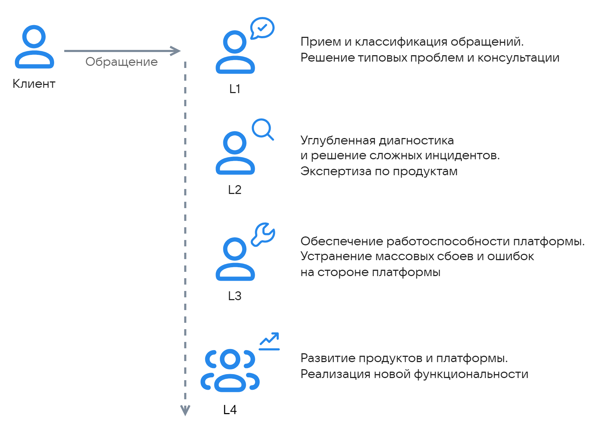

Для решения обращений на платформе VK Cloud используется многоуровневая модель технической поддержки:

{params[noBorder=true; width=60%; printWidth=60%]}

Гарантированное время ответа на обращения определяется [соглашением об уровне обслуживания (SLA)](../sla).

## Первая линия поддержки (L1)

Инженеры L1 выполняют первичную обработку всех входящих обращений.

Зона ответственности L1:

- Прием, регистрация и классификация обращений.
- Первичная диагностика, сбор необходимой информации.
- Решение типовых технических проблем.
- Консультирование по работе и настройке сервисов.
- Консультирование по вопросам настройки способов оплаты, проверки баланса и списаний.
- Восстановление доступа в личный кабинет.
- Изменение квот и конфигурации ВМ по запросу.
- Реагирование на технические сбои и оповещение клиентов.
- Взаимодействие с вендорами по продуктам из Marketplace.

## Вторая линия поддержки (L2)

На вторую линию передаются сложные вопросы, требующие углубленной технической экспертизы. Инженеры L2 обладают специальными знаниями по техническим особенностям сервисов и продуктовых направлений.

Зона ответственности L2:

- Решение нетиповых и сложных вопросов.
- Проведение детальной диагностики проблем.
- Проактивный мониторинг состояния сервисов и реакция на оповещения.

## Третья линия поддержки (L3)

Эксперты третьей линии отвечают за эксплуатацию и стабильность инфраструктуры платформы.

Зона ответственности L3:

- Решение массовых сбоев на стороне провайдера.
- Устранение программных ошибок, выявление уязвимостей.
- Взаимодействие с продуктовыми командами для информирования о точках роста сервисов.

## Продуктовая команда (L4)

Продуктовая команда отвечает за развитие и жизненный цикл конкретного сервиса или платформы.

Зона ответственности L4:

- Выпуск обновленных версий ПО, включающих исправление массовых проблем.
- Повышение производительности, отказоустойчивости и удобства использования сервисов.
- Разработка и реализация новой функциональности.