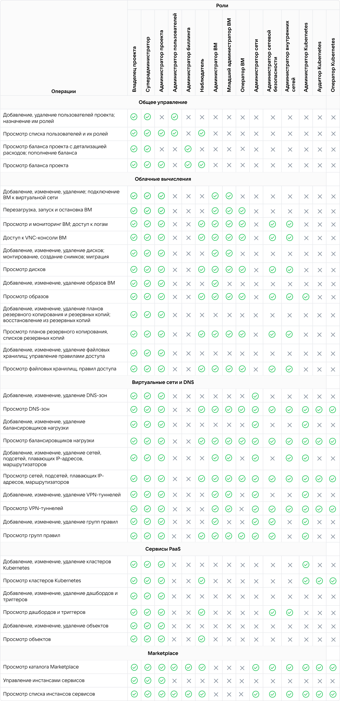

Сразу после создания [проекта](../projects) в нем присутствует только один пользователь — его владелец. Владелец может пригласить в проект других участников, назначив им роли. Роль определяет список доступных [прав](#roles_permissions) при работе с функциональностью личного кабинета и с облачными сервисами.

Один и тот же пользователь может быть участником нескольких проектов и иметь в них разные роли. Одному участнику может быть назначено несколько ролей в одном проекте, в этом случае права ролей суммируются.

Список участников проекта и назначенных им ролей можно [посмотреть](../../service-management/project-settings/access-manage) на странице **Управление доступами** личного кабинета.

## Роли для общего управления проектом

[cols="1,3", options="header"]
|===

| Роль
| Описание

| Владелец проекта
| Пользователь с максимально широким набором прав.

Владельцем становится пользователь, который создал проект, либо для которого проект был создан платформой при регистрации аккаунта.

В проекте может быть только один владелец. Эту роль нельзя назначить или пригласить на нее.

| Суперадминистратор
| Пользователь с тем же набором прав, что владелец, включая привязку карты и пополнение баланса.

| Администратор проекта
| Пользователь с полным набором прав на создание и редактирование объектов во всех сервисах.

Администратор не может:

- активировать сервисы;
- пополнять баланс проекта (ему доступен только просмотр баланса);
- приглашать пользователей.

| Администратор пользователей (IAM)
| Роль, предназначенная для [работы с участниками проекта](../../service-management/project-settings/access-manage) на странице управления доступами.

Администратор пользователей (IAM) может приглашать участников в проект и удалять их из проекта, редактировать назначенные участникам роли.

Сервисы и информация о балансе проекта этой роли недоступны.

| Администратор биллинга
| Роль, предназначенная для управления балансом проекта.

Администратор биллинга может:

- [привязать](/ru/intro/billing/service-management/add-card) к проекту карту оплаты, если она еще не привязана;
- [пополнить](/ru/intro/billing/service-management/payment) баланс проекта или настроить автопополнение.

Сервисы и список участников проекта этой роли недоступны.

| Наблюдатель
| Пользователь, который имеет полные разрешения на просмотр информации в проекте, включая список участников, данные всех сервисов, баланс проекта и детализацию расходов.

Наблюдатель не может создавать какие-либо объекты и не может ничего редактировать, кроме настроек своего аккаунта.

|===

## Специализированные роли

Каждая из ролей ниже предназначены для работы с одним из сервисов платформы. Этим ролям доступны:

- разрешения в их целевом сервисе;
- ряд разрешений в сопутствующих сервисах, без которых невозможна полноценная работа с целевым сервисом.

У всех этих ролей отсутствует доступ к списку участников проекта и к информации о балансе.

Подробные сведения о разрешениях этих ролей в разделе [Права для всех ролей](#roles_permissions).

Все операции, доступные специализированным ролям, доступны также владельцу проекта, суперадминистратору и администратору проекта.

[cols="1,3", options="header"]
|===

| Роль
| Описание

| Администратор виртуальных машин
| Пользователь с этой ролью может выполнять основные операции в сервисе Cloud Servers.

При этом ему доступен только просмотр для:

- планов резервного копирования;
- файловых хранилищ.

В сервисе виртуальных сетей он может создавать и редактировать группы правил (firewall).

| Оператор виртуальных машин
| Пользователь с этой ролью может работать на виртуальной машине, но не может управлять ее настройками.

Оператор ВМ может:

- запустить или остановить ВМ;
- работать в ВМ через [VNC-консоль](/ru/computing/iaas/service-management/vm/vm-console);
- подключаться к ВМ через [SSH](/ru/computing/iaas/service-management/vm/vm-connect/vm-connect-nix) или [RDP](/ru/computing/iaas/service-management/vm/vm-connect/vm-connect-win);
- просматривать конфигурацию и сетевые настройки ВМ.

Оператор ВМ не может создавать резервные копии.

| Администратор сети
| Пользователь с этой ролью может выполнять полный набор операций в сервисах виртуальных сетей и DNS.

| Администратор сетевой безопасности
| Пользователь с этой ролью может просматривать все данные в сервисах виртуальных сетей и DNS.

Создавать и редактировать он может только группы правил (firewall).

| Администратор внутренних сетей
| Пользователь с этой ролью может:

- просматривать все данные в сервисах виртуальных сетей и DNS;
- создавать и редактировать виртуальные сети и подсети, маршрутизаторы;
- добавлять в проект плавающие IP.

| Администратор, оператор, аудитор Kubernetes

| Подробная информация об этих ролях в разделе [Разрешения ролей сервиса Cloud Containers](#roles_permissions_kubernetes).

|===

## {heading(Права для всех ролей)[id=roles_permissions]}

Каждой роли соответствует определенный набор прав на выполнение операций.

{params[noBorder=true]}

## {heading(Права в сервисе Cloud Logging)[id=roles_logging]}

[cols="2,1,1,1", options="header"]
|===
|Роли
|Просмотр логов и конфигурации сервиса
|Изменение настроек логов
|Создание сервисных пользователей и названий сервисов

|Владелец проекта
| 
| 
| 

|Суперадминистратор
| 
| 
| 

|Администратор проекта
| 
| 
| 

|Администратор пользователей (IAM)
| 
| 
| 

|Администратор биллинга
| 
| 
| 

|Наблюдатель
| 
| 
| 

|Администратор, оператор ВМ
| 
| 
| 

|Администратор сети
| 
| 
| 

|Администратор сетевой безопасности
| 
| 
| 

|Администратор внутренних сетей
| 
| 
| 

|Администратор, оператор, аудитор Kubernetes
| 
| 
| 
|===

## {heading(Права в сервисе Cloud Monitoring)[id=roles_monitoring]}

[cols="2,1,1,1,1", options="header"]
|===
|Роли
|Просмотр дашбордов
|Просмотр метрик Prometheus
|Запись в систему мониторинга
|Создание и редактирование дашбордов

|Владелец проекта
| 
| 
| 
| 

|Суперадминистратор
| 
| 
| 
| 

|Администратор проекта
| 
| 
| 
| 

|Администратор пользователей (IAM)
| 
| 
| 
| 

|Администратор биллинга
| 
| 
| 
| 

|Наблюдатель
| 
| 
| 
| 

|Администратор, оператор ВМ
| 
| 
| 
| 

|Оператор ВМ
| 
| 
| 
| 

|Администратор сети
| 
| 
| 
| 

|Администратор сетевой безопасности
| 
| 
| 
| 

|Администратор внутренних сетей
| 
| 
| 
| 

|Администратор, оператор, аудитор Kubernetes
| 
| 
| 
| 
|===

## {heading(Права в сервисе Cloud Audit)[id=roles_audit]}

[cols="2,2,1,1", options="header"]
|===
|Роли
|Просмотр событий
|Выгрузка данных
|Настройка сервиса

|Владелец проекта
| Все события проекта
| 
| 

|Суперадминистратор
| Все события проекта
| 
| 

|Администратор проекта
| Все события проекта
| 
| 

|Администратор пользователей (IAM)
| Все события сервиса IAM и все свои действия
| 
| 

|Администратор биллинга
| Все события сервиса Billing и все свои действия
| 
| 

|Наблюдатель
| Все события проекта
| 
| 

|Администратор, оператор ВМ
| 
| 
| 

|Администратор сети
| Все события сервиса Cloud Network и все свои действия
| 
| 

|Администратор сетевой безопасности
| 
| 
| 

|Администратор внутренних сетей
| 
| 
| 

|Администратор, оператор, аудитор Kubernetes
| Все события сервиса Cloud Containers и все свои действия
| 
| 
|===

## {heading(Права для ролей сервиса Cloud Containers)[id=roles_permissions_kubernetes]}

В личном кабинете доступны специализированные роли для работы с [сервисом Cloud Containers](/ru/kubernetes/k8s):

- администратор Kubernetes,
- оператор Kubernetes,
- аудитор Kubernetes.

Операции, доступные администратору Kubernetes, доступны также владельцу проекта, суперадминистратору и администратору проекта.

Для остальных ролей эти операции недоступны.

Для кластеров Kubernetes версии 1.23 и выше роль администратора, оператора или аудитора Kubernetes также определяет доступную пользователю внутреннюю [роль Kubernetes](/ru/kubernetes/k8s/concepts/access-management#vzaimosvyaz_roley_lichnogo_kabineta_i_kubernetes).

<info>

Некоторые действия доступны только в определенном состоянии кластера. Например, установка и удаление аддонов возможны, только если кластер запущен.

</info>

[cols="2,1,1,1,1"]
|===
.2+| Операции
4+| Роли

| Администратор Kubernetes
| Оператор Kubernetes
| Аудитор Kubernetes
| Наблюдатель

| Создать кластер
| 
| 
| 
| 

| Удалить кластер
| 
| 
| 
| 

| Запустить кластер
| 
| 
| 
| 

| Остановить кластер
| 
| 
| 
| 

| Отобразить информацию о кластере, нод-группах
| 
| 
| 
| 

| Получить kubeconfig
| 
| 
| 
| 

| Получить секрет для доступа в Kubernetes Dashboard
| 
| 
| 
| 

| Обновить версию
| 
| 
| 
| 

| Изменить тип виртуальной машины
| 
| 
| 
| 

| Изменить размер диска Prometheus
| 
| 
| 
| 

| Добавить группу узлов
| 
| 
| 
| 

| Удалить группу узлов
| 
| 
| 
| 

| Изменить настройки масштабирования
| 
| 
| 
| 

| Изменить Labels и Taints
| 
| 
| 
| 

| Установить и удалить аддон
| 
| 
| 
| 
|===
