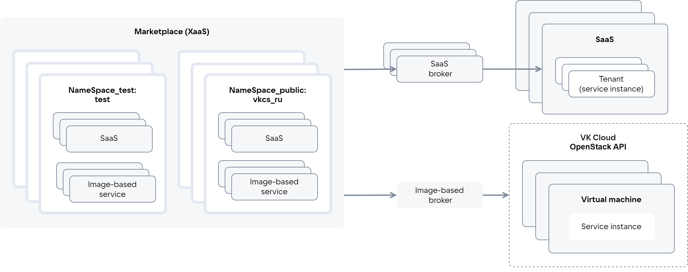
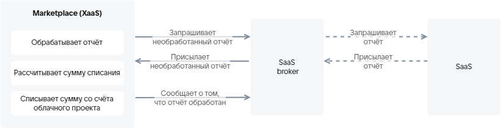
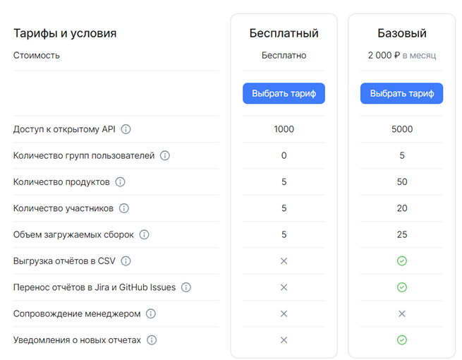
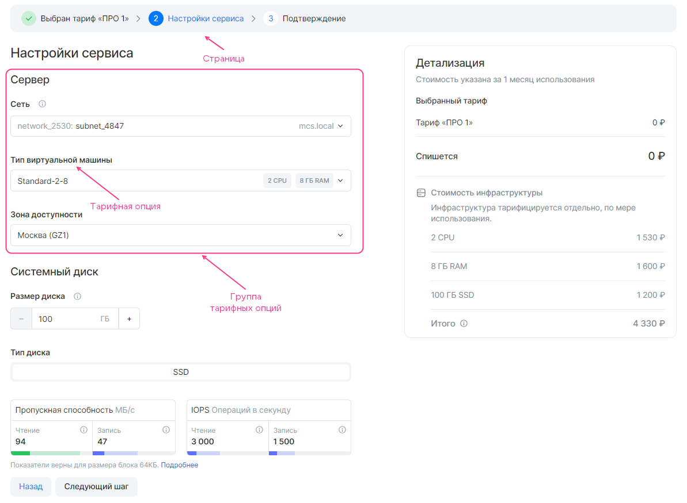

# {heading(Общая информация)[id=index]}

Полное наименование системы, на которой размещаются сервисы: {var(system)} (XaaS).

Краткое наименование системы: {var(sys1)}.

{var(sys1)} интегрирован с облачной платформой VK Cloud. {var(sys1)} обеспечивает доступ пользователей облачной платформы к сервисам, размещенным в нем.

<info>

Сервисы, добавленные в {var(sys1)}, отображаются в разделе **Магазин приложений** в ЛК облачной платформы.

</info>

Роли пользователей, взаимодействующих с {var(sys5)}:

* Поставщик — добавляет сервис в {var(sys1)}. Доступны тестовые и открытые пространства имен {var(sys2)}.
* Потребитель — использует сервис, размещенный в {var(sys6)}. Доступны только открытые пространства имен {var(sys2)}.

Настоящий документ предназначен для поставщиков.

Настоящий документ описывает порядок добавления сервисов в {var(sys1)}.

## {heading(Типы сервисов)[id=xaas_vendor_index_type_services]}

{var(sys1)} позволяет размещать следующие типы сервисов:

* SaaS-приложение — централизованно установленный мультитенантный продукт. Инфраструктура для работы сервиса предоставляется поставщиком. Поставщик развертывает сервис либо на сторонней инфраструктуре, либо на инфраструктуре облачной платформы в своем проекте. Пользователю предоставляется доступ к инстансу сервиса через отдельный тенант/аккаунт.
* Image-based приложение — продукт, который развертывается на основе образов виртуальных машин в облачном проекте пользователя. Для работы сервиса может использоваться дополнительная инфраструктура облачной платформы: виртуальные сети, балансировщики нагрузки, кластеры DBaaS, S3, резервное копирование. Инфраструктура для работы сервиса предоставляется облачной платформой. Инстансы сервиса развертываются в проекте пользователя.

   {var(sys1)} позволяет размещать image-based приложения, которые развертываются как на одной ВМ, так и в кластере.

Услуги, предоставляемые сервисом, описываются с помощью тарифных планов и опций. Тарифная опция — это конкретный параметр плана.

Взаимодействие {var(sys2)} с сервисами осуществляется по протоколу VK OSB с помощью брокеров ({linkto(#pic_xaas)[text=рисунок %number]}). Брокер обеспечивает доставку конфигурации сервиса в {var(sys1)}: {var(sys1)} периодически опрашивает брокера о текущей конфигурации сервиса.

{caption(Рисунок {counter(pic)[id=numb_pic_xaas]} — Взаимодействие {var(sys2)} с сервисами)[align=center;position=under;id=pic_xaas;number={const(numb_pic_xaas)} ]}
{params[noBorder=true]}
{/caption}

SaaS-брокер обеспечивает взаимодействие конкретного SaaS-приложения с {var(sys5)}. Image-based брокер обеспечивает взаимодействие image-based приложений с {var(sys5)}. Image-based брокер внутри себя имеет тенанты, объединяющие image-based приложения одного поставщика.

<warn>

Поставщик SaaS-приложения разрабатывает SaaS-брокер.

Поставщик image-based приложения разрабатывает сервисный пакет для image-based брокера.

Брокер для image-based приложений разработан VK.

</warn>

{var(sys1)} включает в себя:

* Тестовые пространства имен (`NameSpace_test`), в которых проверяется конфигурация сервиса перед публикацией. Доступны все ревизии сервиса.
* Открытые пространства имен (`NameSpace_public`), в которых сервис публикуется. Доступна только последняя опубликованная ревизия сервиса.

Доступ к тестовым пространствам имен выдается только поставщикам. Если у пользователя есть доступ к нескольким пространствам имен, то в каталоге {var(sys2)} он будет видеть все сервисы и их ревизии, размещенные хотя бы в одном пространстве имен, к которому у пользователя есть доступ.

Тестовые и открытые пространства имен для image-based приложения задаются в сервисном ключе и image-based брокере, для SaaS-приложения — в SaaS-брокере при регистрации брокера в Marketplace.

Сущности, связанные с сервисом и используемые при интеграции с {var(sys5)}, приведены в {linkto(#tab_entities)[text=таблице %number]}.

{caption(Таблица {counter(table)[id=numb_tab_entities]} — Сущности, связанные с сервисом)[align=right;position=above;id=tab_entities;number={const(numb_tab_entities)}]}
[cols="2,5", options="header"]
|===
|Имя
|Описание

|Инстанс сервиса (Service instance)
|
Экземпляр сервиса, развернутый у пользователя

|Сервисная привязка (Service binding)
|
Сущность, которая создается после развертывания инстанса сервиса на основании запроса от облачной платформы к брокеру и связывается с инстансом сервиса.

Наиболее часто сервисная привязка используется, чтобы передать пользователю чувствительную информацию для доступа к сервису. Если сервис умеет отправлять данные для доступа без участия {var(sys2)}, то для этой задачи использовать сервисную привязку не требуется. Задачи, для которых используются сервисные привязки, зависят от конкретного сервиса
|===
{/caption}

<info>

Инстанс сервиса SaaS-приложения — это тенант/аккаунт SaaS-приложения. Например, инстанс SaaS-приложения VK Testers соответствует одной компании в VK Testers.

</info>

## {heading(Типы тарифных опций)[id=xaas_option_types]}

Поддерживаются типы тарифных опций, приведенные в {linkto(#tab_tariff_options_types)[text=таблице %number]}.

{caption(Таблица {counter(table)[id=numb_tab_tariff_options_types]} — Типы тарифных опций)[align=right;position=above;id=tab_tariff_options_types;number={const(numb_tab_tariff_options_types)}]}
[cols="4,2,2", options="header"]
|===
|Тип тарифной опции
|SaaS-приложение
|Image-based приложение

|Числовой (integer, number)
|&#10003;
|&#10003;

|Строковый (string)
|&#10003;
|&#10003;

|Логический (boolean)
|&#10003;
|&#10003;

|Datasource
|—
|&#10003;
|===
{/caption}

Тип опции `datasource` используется для описания опций, связанных с сущностями облачной платформы. Такой тип позволяет использовать данные облачной платформы в режиме реального времени. На основании этих данных формируются возможные значения опции во время подключения сервиса или обновления тарифного плана.

Поддерживаемые типы `datasource`:

* Типы ВМ, доступные в проекте пользователя облачной платформы.
* Зоны доступности облачной платформы.
* Виртуальные сети, доступные в проекте облачной платформы.
* Тип диска.

## {heading(Тарификация)[id=xaas_billing]}

Тарифные планы могут быть платными или бесплатными.

Тарифные планы могут иметь платные тарифные опции. Поддерживаются платные опции следующих типов:

* Числовой.
* Логический.

Стоимость тарифных планов и опций описывается в конфигурации сервиса.

Описание типов тарификации (способов оплаты) приведено в {linkto(#tab_tariff_types)[text=таблице %number]}.

{caption(Таблица {counter(table)[id=numb_tab_tariff_types]} — Типы тарификации)[align=right;position=above;id=tab_tariff_types;number={const(numb_tab_tariff_types)}]}
[cols="2,5", options="header"]
|===
|Имя
|Описание

|Бесплатный (Free)
|
Оплаты за использование сервиса нет.

Для image-based приложения оплачивается инфраструктура облачной платформы

|Предоплатный (Upfront Commitment)
|
Оплата за сервис списывается раз в отчетный период в дату подключения сервиса или дату смены тарифного плана. Длительность отчетного периода и дата списания настраиваются в конфигурации сервиса (подробнее — в разделах {linkto(/ru/tools-for-using-services/vendor-account/manage-apps/ibservice_add/ibservice_configure/ibplan/#ibplan)[text=%text]}, {linkto(/ru/tools-for-using-services/vendor-account/manage-apps/saas_add/saas_configure/saas_plan/#saas_plan_param)[text=%text]}).

Стоимость фиксированная.

Если в момент списания на счете проекта недостаточно средств, то пользователь будет принудительно переведен на бесплатный тарифный план.

Если у сервиса нет бесплатного тарифного плана, то инстанс сервиса будет деактивирован, пользователь потеряет доступ к нему

|Постоплатный (Usage Based)
|
Оплата за сервис рассчитывается исходя из фактически использованного количества ресурсов сервиса за отчетный период (например, используемого объема хранилища).

Оплата использованных ресурсов сервиса (тарифных опций) производится по факту использования на основании метрик, полученных {var(sys5)}. Способы получения метрик:

* Pull-модель.
* Push-модель.

Тарифные опции, по которым {var(sys1)} получает метрики, должны быть описаны в конфигурации сервиса.

Периодичность списаний зависит от периодичности получения метрик. Например, если {var(sys1)} получает метрики раз в месяц, оплата будет списываться раз в месяц.

Если в момент списания на счете проекта недостаточно денежных средств, то начинается soft-период:

* Пользователю высылается email-уведомление о необходимости пополнить счет, иначе после окончания soft-периода инстанс сервиса будет деактивирован (приостановлен).
* В течение soft-периода ежедневно проверяется баланс счета проекта. При достаточном количестве денежных средств будет произведено списание.

Если до окончания soft-периода счет не был пополнен на необходимую сумму, то начинается hard-период:

* Денежные средства принудительно списываются со счета проекта, проект замораживается.
* Инстанс сервиса деактивируется, пользователь потеряет доступ к нему.
* Пользователю высылается email-уведомление о необходимости пополнить счет, иначе после окончания hard-периода инстанс сервиса будет удален.

<err>

Если до окончания hard-периода баланс счета проекта не будет пополнен до положительного значения, то инстанс сервиса будет удален.

</err>

<warn>

Постоплатный способ списания применяется только для тарифных опций в бесплатном тарифном плане.

</warn>

|BYOL (Bring Your Own License)
|
Использование сторонних лицензий для сервисов. Инстанс сервиса развертывается без лицензии
|===
{/caption}

<warn>

В проектах, где сервисы облачной платформы предоставляются на условиях постоплаты, деактивация инстансов сервисов не применяется.

</warn>

### {heading(Pull-модель постоплатной тарификации)[id=billing_pull]}

<warn>

Pull-модель постоплатной тарификации поддерживается только для SaaS-приложений.

</warn>

Pull-модель — способ получения метрик по фактически использованным ресурсам на основании отчета, полученного от сервиса. Со стороны {var(sys2)} с установленной периодичностью направляется запрос брокеру о наличии необработанных отчетов ({linkto(#pic_xaas_saas_broker_resource_usage)[text=рисунок %number]}):

1. Если в брокере есть необработанные отчеты, брокер передает их {var(sys3)}.
1. Если в брокере нет необработанных отчетов, выполняются следующие действия:

   1. Брокер запрашивает отчет у сервиса.
   1. По запросу брокера сервис передает ему отчет по всем существующим инстансам сервиса.
   1. Брокер присваивает отчету идентификатор `batch_id`.
   1. Брокер в ответ на запрос {var(sys2)} передает ему необработанный отчет.

1. {var(sys1)} рассчитывает стоимость использованных ресурсов на основании полученного отчета.
1. После обработки отчета (списание денежных средств по этому отчету произошло или запланировано) {var(sys1)} сообщает брокеру `batch_id` этого отчета. В дальнейшем обработанные отчеты брокер не будет передавать {var(sys3)}.

Периодичность, с которой запросы от {var(sys2)} направляются брокеру, настраивается в параметре `billing_cycle_step` в конфигурации сервиса (подробнее — в разделе {linkto(/ru/tools-for-using-services/vendor-account/manage-apps/saas_add/saas_configure/saas_plan/#saas_plan_param)[text=%text]}).

{caption(Рисунок {counter(pic)[id=numb_pic_xaas_saas_broker_resource_usage]} — Передача отчета между {var(sys5)} и брокером)[align=center;position=under;id=pic_xaas_saas_broker_resource_usage;number={const(numb_pic_xaas_saas_broker_resource_usage)} ]}
{params[noBorder=true]}
{/caption}

В SaaS-брокере должны быть реализованы методы, передающие отчет {var(sys3)}. Формат отчета приведен в разделе {linkto(/ru/tools-for-using-services/vendor-account/manage-apps/saas_add/saas_broker/#saas_broker)[text=%text]}.

### {heading(Push-модель постоплатной тарификации)[id=billing_push]}

Push-модель — способ получения метрик по фактически использованным ресурсам с помощью API-запроса, отправляемого сервисом. Параметры API-запроса приведены в {linkto(#tab_metrics_request)[text=таблице %number]}.

{caption(Таблица {counter(table)[id=numb_tab_metrics_request]} — Параметры запроса на передачу метрик {var(sys3)})[align=right;position=above;id=tab_metrics_request;number={const(numb_tab_metrics_request)}]}
[cols="2,5", options="header"]
|===
|Параметр
|Значение

|
Метод запроса
|
`POST`

|
Путь запроса
|
`https://<CLOUD_HOST>/marketplace/api/infra-api/api/v1-public/usages`

Здесь `<CLOUD_HOST>` — доменное имя облачной платформы `https://cloud.vk.com`

|
`Content-Type`
|
`application/json`

|
Тело запроса (`--data`)
|
В теле запроса передаются метрики по инстансам сервиса. Укажите следующие параметры:

* `base_date` — дата отправки метрик в формате RFC3339.

   Если дата не указана, будут применены текущие дата и время выполнения API-запроса.
* `broker_id` — ID брокера, с которым он зарегистрирован в {var(sys6)}. Чтобы получить ID брокера, отправьте письмо на [marketplace@cloud.vk.com](mailto:marketplace@cloud.vk.com) со следующей информацией:

   * Имя компании.
   * Имя сервиса.

   Не указывайте этот параметр, если у компании есть только один SaaS-брокер или только один тенант в image-based брокере.
* `usages` — метрики по использованным ресурсам сервиса.

   * `usages.instance_uuid` — ID инстанса сервиса.
   * `usages.param` — имя тарифной опции. Для SaaS-приложения имя должно соответствовать имени, указанному в JSON-файле, для image-based приложения — имени YAML-файла опции.
   * `usages.value` — потребленное количество тарифной опции

|
`x-service-token`
|
`<SERVICE_TOKEN_USAGES>` — сервисный ключ для отправки метрик. Чтобы получить сервисный ключ для метрик, отправьте письмо на [marketplace@cloud.vk.com](mailto:marketplace@cloud.vk.com) со следующей информацией:

* Имя компании.
* Email пользователя, который будет назначен владельцем сервисного ключа для отправки метрик.

По умолчанию срок действия сервисного ключа для метрик — 1 год.

<warn>

С помощью сервисного ключа, использующегося при загрузке сервисного пакета image-based приложения, нельзя передать метрики {var(sys3)}.

</warn>
|===
{/caption}

{caption(Пример запроса на передачу метрик {var(sys3)})[align=left;position=above]}
```bash
$ curl -v -X POST https://cloud.vk.com/marketplace/api/infra-api/api/v1-public/usages \
-H "Content-Type: application/json" \
-H 'x-service-token: <SERVICE_TOKEN_USAGES>' \
--data '{
      "broker_id": "7",
      "usages: [
        {
        "instance_uuid": "078621f1-ebe3-4f16-b998-503c487e4bfc",
        "param": "storage", // Имя опции в JSON-файле или имя YAML-файла
        "value": 2.55786
        }
      ]
}'
```
{/caption}

HTTP-коды ответа приведены в {linkto(#tab_http_response_codes)[text=таблице %number]}.

{caption(Таблица {counter(table)[id=numb_tab_http_response_codes]} — HTTP-коды ответа)[align=right;position=above;id=tab_http_response_codes;number={const(numb_tab_http_response_codes)}]}
[cols="2,5", options="header"]
|===
|Код
|Описание

|200
|Метрики переданы

|400, 500
|Ошибка выполнения запроса

|401
|Ошибка авторизации
|===
{/caption}

## {heading(Матрица тарифных планов)[id=xaas_tariff_matrix]}

Матрица тарифных планов ({linkto(#pic_preview)[text=рисунок %number]}) отображается на странице тарифов при просмотре информации о сервисе. На основании матрицы пользователь может сравнить тарифы сервиса между собой: какие опции в какой тарифный план входят.

{caption(Рисунок {counter(pic)[id=numb_pic_preview]} — Матрица тарифных планов)[align=center;position=under;id=pic_preview;number={const(numb_pic_preview)} ]}

{/caption}

Матрица тарифных планов описывается в конфигурации сервиса. В ней указываются тарифные опции сервиса, на основании которых пользователь будет выбирать тарифный план.

## {heading(Мастер конфигурации тарифного плана)[id=xaas_wizard]}

При подключении сервиса и при обновлении тарифного плана пользователю отображается мастер конфигурации тарифного плана.

Мастер конфигурации тарифного плана позволяет пользователю настроить тарифные опции для конкретного тарифного плана.

В интерфейсе {var(sys2)} мастер конфигурации тарифного плана разбит на отдельные страницы ({linkto(#pic_xaas_wizard)[text=рисунок %number]}). Каждая страница описывает конкретный этап настройки тарифного плана. На странице отображаются тарифные опции, настраиваемые на этом этапе. Опции объединены в группы.

{caption(Рисунок {counter(pic)[id=numb_pic_xaas_wizard]} — Мастер конфигурации тарифного плана)[align=center;position=under;id=pic_xaas_wizard;number={const(numb_pic_xaas_wizard)} ]}

{/caption}

Первая и последняя страницы мастера конфигурации тарифного плана добавляются автоматически. Остальные страницы описываются в конфигурации сервиса.

В мастере конфигурации тарифного плана отображается стоимость тарифного плана и платных тарифных опций. Для image-based приложений дополнительно отображается стоимость инфраструктуры облачной платформы, которая рассчитывается автоматически в соответствии с тарифами облачной платформы. Параметры для расчета описываются в конфигурации image-based приложения.
