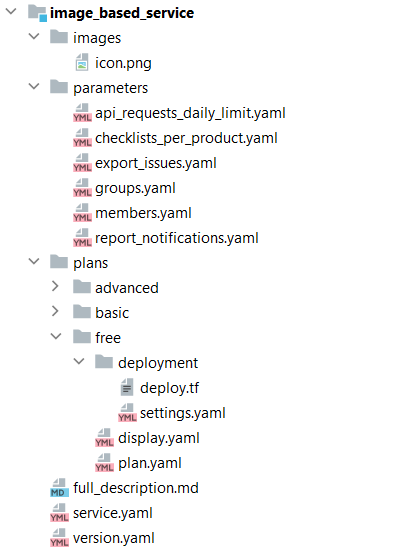

# {heading(Структура сервисного пакета)[id=ib_structure]}

Структура файлов сервисного пакета определяется версией генератора JSON-файла. Генератор преобразует файлы из сервисного пакета в JSON-файл, который необходим брокеру для интеграции image-based приложения с {var(sys5)}. Версия генератора указывается в файле `version.yaml`.

## {heading(Генератор JSON-файла 0.0.1)[id=ib_structure_file]}

Чтобы создать файловую структуру для генератора JSON-файла 0.0.1 ({linkto(#pic_structure)[text=рисунок %number]}):

1. Создайте директорию сервиса `<SERVICE_NAME>`.
1. В директории сервиса создайте файл `version.yaml`. Внутри файла в параметре `version` укажите версию генератора `0.0.1`:

   ```yaml
   version: 0.0.1
   ```

1. В директории сервиса создайте следующие директории и файлы:

   * Файл `full_description.md` — содержит полное описание сервиса.
   * Файл `service.yaml` — описывает параметры сервиса и его тарифные планы.
   * Директория `images` — содержит файл с изображением иконки сервиса в {var(sys6)}.

      * Файл с расширением `png` или `svg`, использующийся как иконка сервиса (подробнее — в разделе {linkto(../../service_description/#service_description_icon)[text=%text]}). Имя файла используется в параметре `icon` при заполнении файла `service.yaml`.

         Размер файла должен не должен превышать 1 МБ. Размер изображения должен быть не менее 62×62 пикселя.

   * Директория `parameters` — содержит файлы, описывающие опции всех тарифных планов сервиса:

      * Файлы `<OPTION_NAME>.yaml` — описывают опции тарифных планов. Каждый отдельный файл соответствует одной опции. Эти опции будут использоваться при формировании файла, описывающего конкретный тарифный план (файл `plan.yaml` в директории конкретного плана).

   * Директория `plans` — содержит все тарифные планы сервиса. Внутри находятся отдельные директории для каждого плана:

      * Отдельные директории для каждого плана `<PLAN_NAME>` — содержат файлы, описывающие конкретный тарифный план. Одна директория соответствует одному плану:

         * Файл `plan.yaml` — описывает параметры конкретного тарифного плана.
         * Файл `display.yaml` — описывает мастер конфигурации тарифного плана. Мастер конфигурации тарифного плана будет отображаться в {var(sys6)} при подключении сервиса и обновлении тарифного плана.
         * Директория `deployment` — содержит манифест Terraform.

            * Файл `deploy.tf` — манифест, описывающий инфраструктуру и процесс развертывания конкретного тарифного плана сервиса в облачной платформе.
            * Файл `settings.yaml` (опционально) — настройки выполнения манифеста.

<warn>

Для имен файлов и директорий используйте латинские буквы и знаки нижнего подчеркивания в качестве разделителей. В именах не рекомендуется использовать пробелы.

</warn>

{caption(Рисунок {counter(pic)[id=numb_pic_structure]} — Структура файлов сервисного пакета для генератора JSON-файла 0.0.1)[align=center;position=under;id=pic_structure;number={const(numb_pic_structure)} ]}
{params[width=40%]}
{/caption}

<info>

Настройки Terraform, размещаемые в директории `deployment`, вместо одного файла `deploy.tf` могут быть описаны в нескольких манифестах `.tf`.

</info>

{caption(Пример содержимого директории `deployment` с несколькими манифестами `.tf`)[align=left;position=above]}
```text
image_based_service/plans/free/deployment
│
├── common.tf
├── compute.tf
├── network.tf
├── output.tf
├── secgroup.tf
└── variables.tf
```
{/caption}
