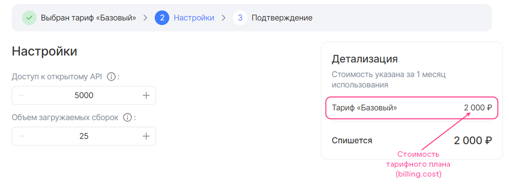

# {heading(Файл plan.yaml)[id=ibplan]}

В файле `plans/<PLAN_NAME>/plan.yaml` описываются параметры конкретного тарифного плана. После загрузки сервисного пакета и публикации сервиса тарифный план будет доступен в открытых пространствах имен магазина (`namespace_public`), указанных в сервисном ключе (подробнее — в разделе [Загрузка image-based приложения в магазин](../../ibservice_upload)).

В файле `plans/<PLAN_NAME>/plan.yaml` укажите параметры и секции, приведенные в {linkto(#tab_plan_param)[text=таблице %number]}.

{caption(Таблица {counter(table)[id=numb_tab_plan_param]} — Параметры файла plans/<PLAN_NAME>/plan.yaml)[align=right;position=above;id=tab_plan_param;number={const(numb_tab_plan_param)}]}
[cols="2,5,2,2", options="header"]
|===
| Имя
| Описание
| Формат
| Обязательный

| id
| Идентификатор тарифного плана UUID4 (ID), сформированный с помощью генератора UUID4
| string (UUID4)
| 

| revision
| Ревизия тарифного плана. Сочетание ревизии и ID тарифного плана определяет его уникальность в сервисе. Остальные параметры описывают характеристики конкретной ревизии тарифного плана
| string, до 255 символов
| 

| name
| Техническое имя тарифного плана, которое не отображается в интерфейсе магазина. Должно быть указано латинскими буквами с использованием знака нижнего подчеркивания вместо пробелов
| string, до 255 символов
| 

| description
| Имя тарифного плана, которое отображается в интерфейсе магазина
| string, до 255 символов
| 

| free
| Определяет, бесплатный этот тарифный план или нет
| boolean
| 

| billing
| Определяет стоимость тарифного плана без учета платных тарифных опций (подробнее — в разделе {linkto(#plan_billing)[text=%text]})
| 
| 

| parameters_patch
| Позволяет переопределить параметры тарифных опций для конкретного плана (подробнее — в разделе {linkto(#plan_options)[text=%text]})
| 
| 

| resource_usages
| Содержит список постоплатных тарифных опций
| Массив
| Да — для плана с постоплатными опциями
|===
{/caption}

<err>

Сочетание ID и ревизии тарифного плана должно быть уникальным в рамках сервиса. Если план с такими же идентификатором и ревизией уже существует в этом сервисе, то тарифный план не будет обновлен.

</err>

<warn>

В рамках одного тарифного плана допускаются опции одного типа тарификации: тарифный план с предоплатными опциями или тарифный план с постоплатными опциями.

</warn>

Примеры файлов `plans/<PLAN_NAME>/plan.yaml` приведены в разделе {linkto(#ibexample_plan)[text=%text]}.

## {heading(Секция billing тарифного плана)[id=plan_billing]}

Для стоимости тарифного плана поддерживается только предоплатный тип тарификации (подробнее — в разделе {linkto(/ru/tools-for-using-services/vendor-account/manage-apps/concepts/about/#xaas_billing)[text=%text]}).

Чтобы описать стоимость тарифного плана ({linkto(#pic_plan_billing)[text=рисунок %number]}), в файле `plans/<PLAN_NAME>/plan.yaml` укажите секцию `billing` и задайте параметры, приведенные в {linkto(#tab_plan_billing)[text=таблице %number]}.

{caption(Таблица {counter(table)[id=numb_tab_plan_billing]} — Параметры секции billing)[align=right;position=above;id=tab_plan_billing;number={const(numb_tab_plan_billing)}]}
[cols="3,5,2,1,2", options="header"]
|===
|Имя
|Описание
|Формат
|Обязательный
|Значение по умолчанию

|cost
|
Определяет стоимость тарифного плана за отчетный период без учета платных тарифных опций.

Если план бесплатный, укажите `0`. Стоимость задается в валюте страны, где развернут магазин
|float
| 
|
—

|refundable
|
Определяет, возвращать или нет на бонусный счет проекта денежные средства за оставшиеся дни расчетного периода, если пользователь изменил тарифный план или удалил инстанс сервиса.

Параметр влияет на дату списания оплаты за сервис, когда пользователь изменяет тарифный план (редактирует тарифные опции или переходит на новый):

* Если значение равно `true`, дата не изменяется.
* Если значение равно `false`, дата обновляется до даты изменения тарифного плана

|boolean
| 
|
`true`

|billing_cycle_flat
|
Определяет длительность отчетного периода для тарификации.

Формат записи: `<КОЛИЧЕСТВО_МЕСЯЦЕВ> mons <КОЛИЧЕСТВО_ДНЕЙ> days`. Например, `1 mons 15 days`, `30 days`.

<info>

Количество дней в месяце `mons` рассчитывается на основе календарного значения. Поэтому периоды `1 mons 0 days` и `0 mons 31 days` не равны между собой.

</info>
|string
| 
|
`1 mons 0 days`
|===
{/caption}

{caption(Пример заполнения секции `billing`)[align=left;position=above]}
```yaml
billing:
  cost: 2000
  refundable: true
  billing_cycle_flat: 1 mons 0 days
```
{/caption}

{caption(Рисунок {counter(pic)[id=numb_pic_plan_billing]} — Стоимость тарифного плана)[align=center;position=under;id=pic_plan_billing;number={const(numb_pic_plan_billing)} ]}

{/caption}

<warn>

Стоимость использования вычислительных ресурсов облачной платформы в стоимость тарифного плана сервиса не входит.

</warn>

К стоимости плана можно добавить платные тарифные опции. Для этого опишите их стоимость в YAML-файлах (подробнее — в разделе {linkto(../ibopt_fill_in/#IB_option_fill_in)[text=%text]}).

<info>

Чтобы эффективно использовать бонусы, выдаваемые для тестирования и отладки сервиса в магазине (подробнее — в разделе {linkto(../../ibservice_upload/ibservice_upload_package/#ibservice_upload_package)[text=%text]}), укажите тестовую стоимость тарифного плана и его опций.

</info>

## {heading(Секция parameters_patch)[id=plan_options]}

Чтобы для конкретного тарифного плана переопределить параметры тарифных опций или добавить новые, не заданные в YAML-файлах:

1. В файле `plans/<PLAN_NAME>/plan.yaml` укажите:

   * Секцию `parameters_patch`.
   * Внутри `parameters_patch` — имена YAML-файлов тарифных опций.

1. Задайте значения параметров тарифных опций. Имена параметров укажите с путем до корневой секции. Имя параметра и имена его родительских секций разделите между собой точкой.

   Возможные параметры в зависимости от типа тарифной опции приведены в разделе [YAML-файл тарифной опции](../iboption).

   {caption(Пример переопределения параметров тарифных опций)[align=left;position=above]}
   ```yaml
   parameters_patch:
     users:
       schema.const: 5000
     volume_data_size:
       schema.default: 550
       schema.minimum: 550
   ```
   {/caption}

   Значения параметров, указанные в YAML-файле тарифной опции, не будут применяться в тарифном плане.

Чтобы переопределить секцию тарифной опции полностью:

1. В файле `plans/<PLAN_NAME>/plan.yaml` укажите:

   * Секцию `parameters_patch`.
   * Внутри `parameters_patch` — секцию тарифной опции. Например, `billing`.

1. Задайте параметры секции (подробнее — в разделе [YAML-файл тарифной опции](../iboption)).

   {caption(Пример переопределения секции `billing` тарифной опции)[align=left;position=above]}
   ```yaml
   parameters_patch:
     assemblies_size:
       billing:
         base: 25
         cost: 0
         unit:
           size: 100
   ```
   {/caption}

   Параметры, указанные для этой секции в YAML-файле тарифной опции, не будут применяться в тарифном плане.

<warn>

Одновременное переопределение секции полностью и отдельного параметра из этой секции запрещено.

</warn>

<info>

Если в тарифных планах используются опции, которые сильно отличаются друг от друга, то рекомендуется описать каждую опцию отдельным YAML-файлом в директории `parameters`. Не рекомендуется описывать одну опцию и переопределять большинство ее параметров в рамках тарифных планов.

</info>

## {heading(Примеры файлов plan.yaml)[id=ibexample_plan]}

{caption(Пример тарифного плана с переопределением параметров тарифных опций)[align=left;position=above]}
```yaml
id: b2b42648-XXXX-b4cddbf010b2
revision: v. 1.0
name: basic
description: Базовый
free: false

billing:
  cost: 2000
  refundable: true
  billing_cycle_flat: 1 mons

parameters_patch:
  users:
    schema.const: 5000
  volume_data_size:
    schema.default: 550
    schema.minimum: 550
```
{/caption}

{caption(Пример тарифного плана с постоплатной тарифной опцией)[align=left;position=above]}
```yaml
id: 3aa541d8-XXXX-6dbf542b3f90
revision: v. 1.1
name: postpaid
description: Постоплатный
free: true

billing:
  cost: 0

resource_usages:
  - storage
```
{/caption}
