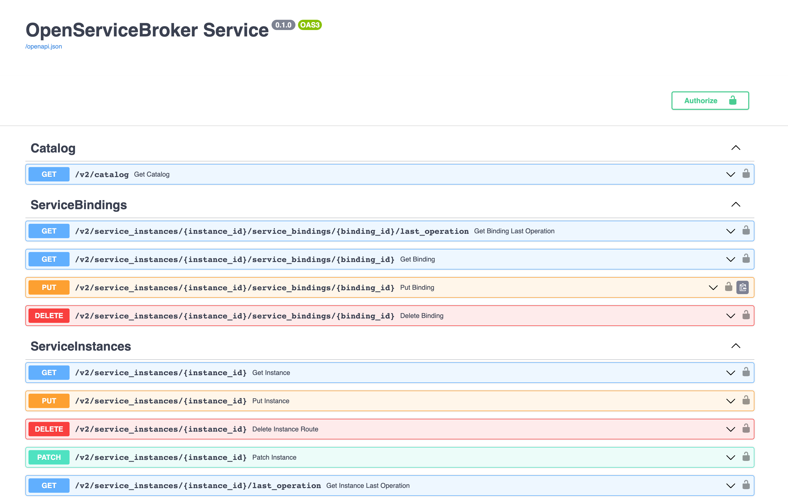
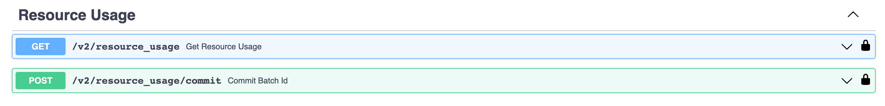

# {heading(Локальное тестирование брокера)[id=saas_upload_localtest]}

Протестируйте брокер локально.

Чтобы локально протестировать брокер, разработанный на основе шаблона, выполните следующие действия:

1. В файле `.env` в директории брокера опишите переменные окружения:

   * `BROKER_PROVIDER_CLIENT_ID` — имя брокера для доступа к SaaS-приложению.
   * `BROKER_PROVIDER_SECRET` — пароль для доступа брокера к SaaS-приложению.
   * `BROKER_PROVIDER_URL` — URL SaaS-приложения.
   * `BROKER_USERNAME` — имя {var(sys2)} для межсервисного взаимодействия c брокером.
   * `BROKER_PASSWORD` — пароль {var(sys2)} для межсервисного взаимодействия с брокером.

   <err>

   Значение переменной `BROKER_USERNAME` должно совпадать со значением `username`, значение `BROKER_PASSWORD` — с `password`, указанными в заявке о регистрации брокера.

   </err>
1. В файле `.env` в директории брокера укажите значения переменных для доступа к БД брокера.
1. Чтобы установить Python-библиотеки, выполните команду:

   ```bash
   $ pip install -r requirements/prod.txt
   ```

1. Чтобы запустить брокер, выполните команду:

   ```bash
   $ gunicorn app.main:app --log-file - --workers ${UVICORN_WORKERS:-1} --worker-class uvicorn.workers.UvicornWorker --bind 0.0.0.0:${BROKER_PORT:-8000} --timeout ${WORKER_TIMEOUT:-90}
   ```

   {caption(Пример ответа на команду запуска брокера)[align=left;position=above]}
   ```bash
   INFO:     Started server process [34934]
   INFO:     Waiting for application startup.
   INFO:     Application startup complete.
   INFO:     Uvicorn running on http://0.0.0.0:8000 (Press CTRL+C to quit)
   ```
   {/caption}

   После установки брокера по адресу `http://0.0.0.0:8000/docs` будет доступен API в редакторе swagger UI ({linkto(#pic_saas_swagger_broker)[text=рисунок %number]}, {linkto(#pic_saas_swagger_resourceusage)[text=рисунок %number]}).

   {caption(Рисунок {counter(pic)[id=numb_pic_saas_swagger_broker]} — Пример API swagger UI)[align=center;position=under;id=pic_saas_swagger_broker;number={const(numb_pic_saas_swagger_broker)} ]}
   
   {/caption}

   {caption(Рисунок {counter(pic)[id=numb_pic_saas_swagger_resourceusage]} — Пример API swagger UI, содержащий запросы для постоплатных тарифных опций)[align=center;position=under;id=pic_saas_swagger_resourceusage;number={const(numb_pic_saas_swagger_resourceusage)} ]}
   
   {/caption}
1. Выполните запросы, описанные в API swagger UI.

   В запросах используйте:

   * Значение версии протокола VK OSB `x-broker-api-version` (например, `"0.1"`).
   * Значение `BROKER_USERNAME` из файла `.env`.
   * Значение `BROKER_PASSWORD` из файла `.env`.

