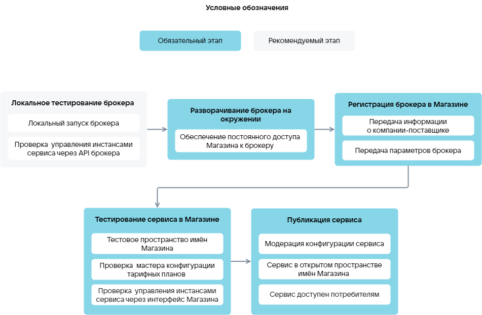

# {heading(Этапы загрузки сервиса)[id=saas_upload_phases]}

У пользователя, загружающего сервис в {var(sys1)}, должна быть учетная запись (личный кабинет) в облачной платформе. Инструкция по регистрации приведена в разделе [Регистрация в VK Cloud](/ru/intro/start/account-registration).

Этапы загрузки SaaS-приложения в {var(sys1)} ({linkto(#pic_saas_upload)[text=рисунок %number]}):

1. {linkto(../saas_upload_localtest/#saas_upload_localtest)[text=%text]}.
1. {linkto(../saas_upload_env/#saas_upload_env)[text=%text]}.
1. {linkto(../saas_upload_registration/#saas_upload_registration)[text=%text]}.
1. {linkto(../saas_upload_testmarketplace/#saas_upload_testmarketplace)[text=%text]}.
1. {linkto(../saas_upload_publish/#saas_upload_publish)[text=%text]}.

{caption(Рисунок {counter(pic)[id=numb_pic_saas_upload]} — Загрузка SaaS-приложения)[align=center;position=under;id=pic_saas_upload;number={const(numb_pic_saas_upload)} ]}
{params[noBorder=true]}
{/caption}
