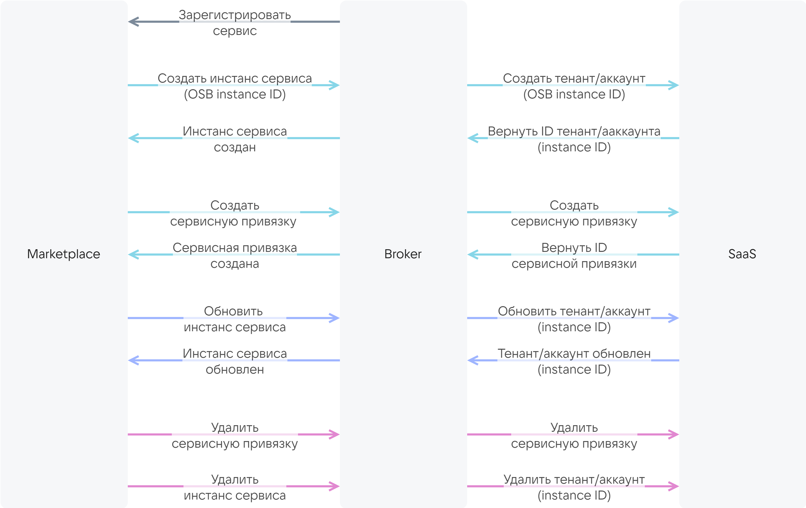

Сервис Marketplace и SaaS-приложение взаимодействуют между собой через [SaaS-брокер](/ru/tools-for-using-services/vendor-account/manage-apps/concepts/about#xaas_vendor_index_type_services) по протоколу VK OSB. Протокол предоставляется платформой VK Cloud.
 
Требования к SaaS-брокеру:

* Брокер должен реализовывать методы, которые описывают жизненный цикл инстансов сервиса. Методы представлены на схеме.

    {cut(Схема взаимодействия брокера с магазином и SaaS-приложением)}

    {params[noBorder=true]}

    {/cut}

* В брокере должна быть настроена аутентификация по безопасному протоколу HTTPS c сертификатом, выданным доверенным центром сертификации.

    {note:err}

    Использование самоподписанных сертификатов запрещено.

    {/note}

Поставщик SaaS-приложения разрабатывает SaaS-брокер полностью самостоятельно либо на основе шаблона, который предоставляется платформой VK Cloud. В шаблоне уже реализовано взаимодействие между магазином и брокером. Его необходимо дополнить описанием взаимодействия брокера с конкретным SaaS-приложением. Шаблон разработан на языке Python на основе фреймворка [FastAPI](https://fastapi.tiangolo.com/tutorial/first-steps).

Эта инструкция предназначена для случая разработки SaaS-брокера на основе шаблона от VK Cloud.

## Подготовительные шаги

1. Отправьте письмо на [marketplace@cloud.vk.com](mailto:marketplace@cloud.vk.com). В письме запросите:
   * протокол VK OSB;
   * шаблон для разработки SaaS-брокера;
   * имена тестовых и открытых пространств имен Marketplace и доступ к ним.

1. [Зарегистрируйтесь](/ru/intro/onboarding/account) на VK Cloud. Учетная запись VK Cloud необходима для тестирования приложения в магазине.

## {heading(1. Опишите конфигурацию сервиса (тарифные планы, опции))[id=service_config]}

1. Создайте файл `catalog_<ИМЯ_СЕРВИСА>.json`.
1. В JSON-файле опишите конфигурацию сервиса, используя следующую структуру:

    {include(/ru/_includes/_saas_add_update.md)[tags=service_config]}

## {heading(2. Разработайте SaaS-брокер)[id=saas_broker]}

1. Разработайте клиент для взаимодействия с API вашего сервиса.
1. Разработайте сервисный менеджер, описывающий взаимодействие брокера и сервиса. Для этого реализуйте следующие методы:

   [cols="1,3", options="header"]
   |===
   |Метод
   |Входные данные

   |Создание тенанта или аккаунта
   |
   * OSB ID инстанса сервиса, который формируется магазином при подключении сервиса. OSB ID передается в SaaS-приложение, чтобы SaaS-приложение сформировало ID инстанса сервиса. ID инстанса сервиса используется в методах, описанных ниже в таблице.
   * ID тарифного плана.
   * Тарифные опции плана, описанные в JSON-файле конфигурации сервиса в [секции plans.schemas.service_instance.create](../../reference/saas-apps-reference/schemas-section).
   * (Опционально) Контекст, содержащий информацию о пользователе: электронная почта, [уникальный идентификатор проекта (PID)](/ru/tools-for-using-services/account/instructions/project-settings/manage#poluchenie_identifikatora_proekta)

   |Обновление тенанта или аккаунта
   |
   * ID инстанса сервиса.
   * ID тарифного плана.
   * Тарифные опции плана, описанные в JSON-файле конфигурации сервиса в [секции plans.schemas.service_instance.update](../../reference/saas-apps-reference/schemas-section)

   |Получение и удаление тенанта или аккаунта
   |ID инстанса сервиса

   |Создание сервисных привязок (bindings)
   |
   * ID инстанса сервиса.
   * Параметры сервисных привязок, описанные в JSON-файле конфигурации сервиса в [секции plans.schemas.service_binding.create](../../reference/saas-apps-reference/schemas-section).
   * (Опционально) Контекст, содержащий информацию о пользователе: электронная почта, [уникальный идентификатор проекта (PID)](/ru/tools-for-using-services/account/instructions/project-settings/manage#poluchenie_identifikatora_proekta)

   |Получение и удаление сервисных привязок
   |
   * ID инстанса сервиса.
   * ID сервисной привязки
   |===

1. Интегрируйте клиент в сервисный менеджер.
1. Настройте аутентификацию в брокере.

1. Если в SaaS-приложении есть постоплатные тарифные опции и метрики по ним собираются по [pull-модели](/ru/tools-for-using-services/vendor-account/manage-apps/concepts/about#billing_pull), выполните дополнительные действия:

    1. В сервисном менеджере реализуйте метод для получения отчета по фактически использованным ресурсам SaaS-приложения. В ответе на запрос брокер должен передать магазину отчет.

        {cut(Пример отчета о фактически использованных ресурсах SaaS-приложения)}

        ```json
        {
            "batch_id": 35,
            "data": [
                {
                "kind": "vms",
                "type": "cb",
                "unit": "month",
                "price": 600.0,
                "value": 1.0,
                "plan_uuid": "2f070fe3-3e31-4482-bad4-a4d0c36bab31",
                "instance_uuid": "d1dff97c-df6c-45a7-95e1-b539a8d77721"
            },
            {
                "kind": "storage",
                "type": "cb",
                "unit": "GB-month",
                "price": 3.3,
                "value": 2.4474525451660156,
                "plan_uuid": "2f070fe3-3e31-4482-bad4-a4d0c36bab31",
                "instance_uuid": "d1dff97c-df6c-45a7-95e1-b539a8d77721"
            },
            {
                "kind": "vms",
                "type": "cb",
                "unit": "month",
                "price": 600.0,
                "value": 0.0,
                "plan_uuid": "354df2fa-5ec3-45e1-b99b-7d45840cf3df",
                "instance_uuid": "3910e993-63f0-4a90-95d7-5eea35785c29"
            },
            {
                "kind": "storage",
                "type": "cb",
                "unit": "GB-month",
                "price": 3.3,
                "value": 0.0,
                "plan_uuid": "354df2fa-5ec3-45e1-b99b-7d45840cf3df",
                "instance_uuid": "3910e993-63f0-4a90-95d7-5eea35785c29"
            },
            {
                "kind": "storage",
                "type": "cb",
                "unit": "GB-month",
                "price": 7.0,
                "value": 0.0,
                "plan_uuid": "d719f348-3497-4341-8465-a438bfcc2d96",
                "instance_uuid": "f10e67be-dfd7-4dcd-917c-4bfd3cd64ce2"
            }
            ]
        }
        ```
  
        Здесь:

        * `batch_id` — ID отчета, сформированный брокером.
        * `kind` — имя тарифной опции. Должно соответствовать имени, используемому в файле с конфигурацией сервиса.
        * `type` — имя сервиса. Должно соответствовать параметру `ИМЯ_СЕРВИСА`, указанному в имени файла с конфигурацией сервиса (`catalog_<ИМЯ_СЕРВИСА>.json`).
        * `unit` — единица измерения опции.
        * `price` — стоимость единицы опции в месяц. Должна соответствовать значению `plans.billing.options.cost` конкретной опции, указанному в файле с конфигурацией сервиса.
        * `value` — сколько единиц опции было фактически использовано за месяц. Значение формируется SaaS-приложением.
        * `plan_uuid` — ID тарифного плана.
        * `instance_uuid` — ID инстанса (тенанта/аккаунта) сервиса.

        {/cut}

    1. В сервисном менеджере реализуйте метод для сообщения брокеру о том, что отчет обработан (списание денежных средств по отчету произошло или запланировано).

## {heading(3. Загрузите конфигурацию сервиса в брокер)[id=saas_load_configuration_to_broker]}

1. Перейдите в директорию с брокером.
1. Поместите файл с конфигурацией сервиса `catalog_<ИМЯ_СЕРВИСА>.json` в поддиректорию `resources`.
1. В файле `resources/plan_mapping.json` укажите:

   * `<ИМЯ_СЕРВИСА>` — имя сервиса.
   * `<ID_ПЛАНА>` — ID тарифных планов, указанных в файле `catalog_<ИМЯ_СЕРВИСА>.json`.
   * `<SAAS_ID_ПЛАНА>` (формат `string`) — ID тарифных планов на стороне сервиса, соответствующих ID тарифных планов `<ID_ПЛАНА>`.

      ```json
      {
        "<ИМЯ_СЕРВИСА>": {
          "<ID_ПЛАНА>": <SAAS_ID_ПЛАНА>,
          "<ID_ПЛАНА>": <SAAS_ID_ПЛАНА>
        }
      }
      ```

   Пример содержимого файла `plan_mapping.json`:

   ```json
   {
     "VKT": {
       "0dc54b75-XXXX-89d5a47eef71": 1,
       "312b628e-XXXX-080ab4ca3acb": 2,
       "e2ae1588-XXXX-3f5081a799a9": 3,
       "b54e7247-XXXX-7a9dccc22e7b": 4
     }
   }
   ```

1. В директории с брокером переименуйте файл `.env.example` в `.env`.
1. В файле `.env` укажите имя сервиса в `BROKER_MODE`:

   ```json
   BROKER_MODE=<ИМЯ_СЕРВИСА>
   ```

## 4. (Опционально) Протестируйте брокер локально

1. В файле `.env` в директории брокера опишите переменные окружения:

   * `BROKER_PROVIDER_CLIENT_ID` — имя брокера для доступа к SaaS-приложению.
   * `BROKER_PROVIDER_SECRET` — пароль для доступа брокера к SaaS-приложению.
   * `BROKER_PROVIDER_URL` — URL SaaS-приложения.
   * `BROKER_USERNAME` — имя магазина для межсервисного взаимодействия c брокером.
   * `BROKER_PASSWORD` — пароль магазина для межсервисного взаимодействия с брокером.

1. В файле `.env` в директории брокера укажите значения переменных для доступа к БД брокера.
1. Установите Python-библиотеки, выполнив команду:

   {tabs}

   {tab(Linux)}

   ```console
   pip install -r requirements/prod.txt
   ```

   {/tab}

   {/tabs}

1. Запустите брокер, выполнив команду:

   {tabs}

   {tab(Linux)}

   ```console
   gunicorn app.main:app --log-file - --workers ${UVICORN_WORKERS:-1} --worker-class uvicorn.workers.UvicornWorker --bind 0.0.0.0:${BROKER_PORT:-8000} --timeout ${WORKER_TIMEOUT:-90}
   ```

   {/tab}

   {/tabs}

   Пример ответа на команду запуска брокера:

   ```console
   INFO:     Started server process [34934]
   INFO:     Waiting for application startup.
   INFO:     Application startup complete.
   INFO:     Uvicorn running on http://0.0.0.0:8000 (Press CTRL+C to quit)
   ```

1. После установки брокера откройте в браузере страницу [http://0.0.0.0:8000/docs](http://0.0.0.0:8000/docs).

   Страница содержит описание API брокера в редакторе Swagger.

1. Выполните запросы API, используя следующие параметры:

   * Значение версии протокола VK OSB `x-broker-api-version` (например, `"0.1"`).
   * Значение `BROKER_USERNAME` из файла `.env`.
   * Значение `BROKER_PASSWORD` из файла `.env`.

## 5. Разверните образ с брокером в окружении

Чтобы собрать образ, воспользуйтесь файлом `Dockerfile` в директории шаблона брокера.

{note:warn}

Чтобы Marketplace мог взаимодействовать с брокером и SaaS-приложением, брокер должен быть доступен круглосуточно.

{/note}

## 6. Зарегистрируйте брокер

Отправьте письмо на [marketplace@cloud.vk.com](mailto:marketplace@cloud.vk.com). В письме укажите:

* Информацию о компании:

  * имя компании,
  * контактное лицо,
  * телефон.

* Электронную почту пользователя, которому будут приходить уведомления об ошибках при создании инстансов сервиса.
* Параметры брокера, приведенные в таблице.

[cols="2,5,2,2", options="header"]
|===
|Имя
|Описание
|Формат
|Обязательный

|`name`
|Имя брокера
|string
| 

|`url`
|URL, на который будут отправляться запросы от магазина
|string
| 

|`description`
|Описание брокера
|string
| 

|`osb_version`
|Версия протокола VK OSB
|string
| 

|`username`
|Имя магазина для межсервисного взаимодействия c брокером.

{note:err}

Должно совпадать со значением переменной окружения `BROKER_USERNAME` в файле `.env` директории брокера

{/note}

|string
| 

|`password`
|Пароль магазина для межсервисного взаимодействия с брокером.

{note:err}

Должен совпадать со значением переменной окружения `BROKER_PASSWORD` в файле `.env` директории брокера

{/note}
|string
| 
|===

После регистрации брокера SaaS-приложение будет доступно в тестовом пространстве имен магазина. В открытом пространстве имен магазина сервис будет доступен только после публикации.

## {heading(7. Протестируйте сервис в магазине)[id=saas_test_marketplace]}

Чтобы проверить, как сервис будет функционировать в VK Cloud, протестируйте его в тестовом пространстве имен магазина:

1. Отправьте письмо на [marketplace@cloud.vk.com](mailto:marketplace@cloud.vk.com), чтобы получить бонусы, которые выдаются для тестирования сервиса. Средства будут зачислены на бонусный счет вашего проекта в VK Cloud.
1. Если у вас нет доступа к тестовым пространствам имен, указанным в конфигурации сервиса, отправьте письмо на [marketplace@cloud.vk.com](mailto:marketplace@cloud.vk.com). В письме укажите:

   * Имена тестовых пространств имен Marketplace, заданных в параметре `metadata` в [JSON-файле конфигурации сервиса](../../reference/saas-apps-reference/saas-param).
   * Электронную почту пользователя, которому необходим доступ в тестовые пространства имен Marketplace.

{include(/ru/_includes/_saas_add_update.md)[tags=test_service]}

1. При необходимости внесите изменения в конфигурацию сервиса:

   1. Перейдите в поддиректорию `resources` директории с брокером.
   1. Отредактируйте файлы `catalog_<ИМЯ_СЕРВИСА>.json` и `plan_mapping.json`.
   1. Повторите тестирование еще раз.

1. Если вы указали тестовые значения стоимости в конфигурации сервиса на время тестирования и отладки, отредактируйте файл `catalog_<ИМЯ_СЕРВИСА>.json`, указав в нем реальные значения.

## {heading(8. Опубликуйте сервис)[id=saas_publish_service]}

Отправьте письмо на [marketplace@cloud.vk.com](mailto:marketplace@cloud.vk.com). В письме укажите ID сервиса и его ревизию.

Будет проведено модерирование конфигурации сервиса. После этого сервис будет опубликован в магазине.

Публикуемая ревизия сервиса переместится из тестового пространства имен магазина в открытое, указанное в параметре `metadata` [JSON-файле конфигурации сервиса](../../reference/saas-apps-reference/saas-param). Сервис будет доступен всем пользователям, имеющим доступ в это открытое пространство имен.

{note:warn}

В открытых пространствах имен доступна только последняя опубликованная ревизия сервиса.

{/note}
