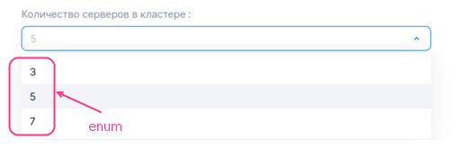
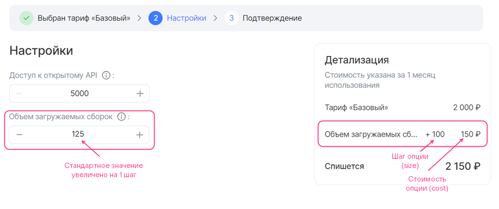
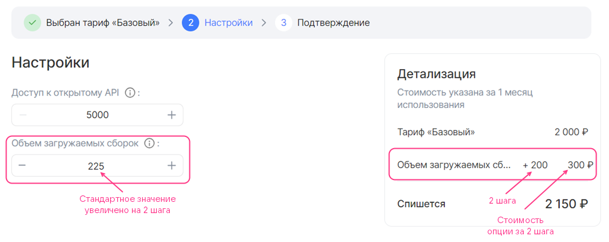
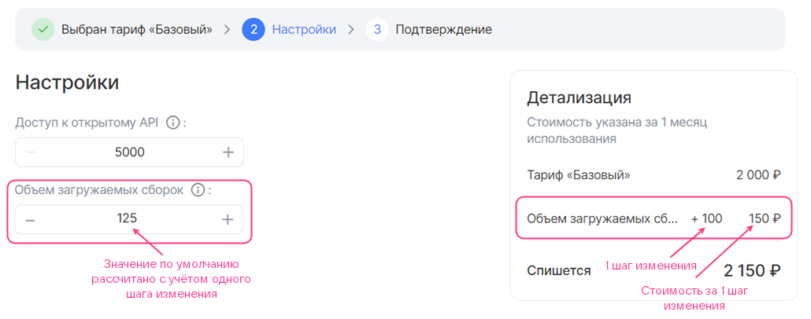
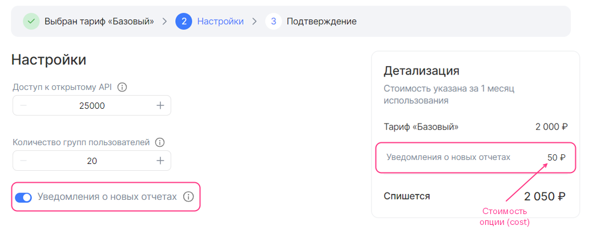
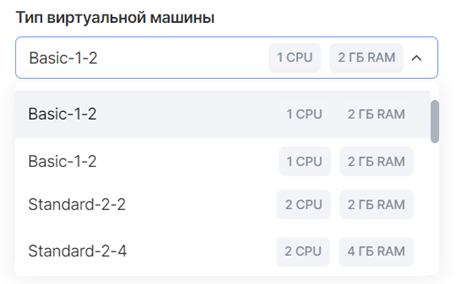
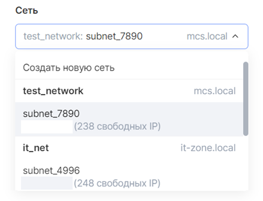
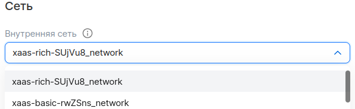

# {heading(Примеры тарифных опций)[id=tariff-examples]}

## {heading(Бесплатные)[id=free-options]}

### {heading(Неизменяемая опция типа integer)[id=integer_const]}

{params[width=40%]}

```yaml
actions:
- create
- update

schema:
  description: Размер системного диска
  hint: В ГБ
  type: integer
  const: 20
```

Здесь:

- `actions` — массив из двух значений `create` и `update`. Позволяет пользователю выбрать тарифную опцию как при подключении сервиса, так и при обновлении тарифного плана.
- `schema` — последовательность из значений:

    - `description` — имя тарифной опции.
    - `hint` — описание тарифной опции (опционально).
    - `type` — тип тарифной опции. Укажите `integer`.
    - `const` — значение тарифной опции.

### {heading(Опция типа integer с выбором значения из списка)[id=integer_list]}

{params[width=60%]}

```yaml
actions:
- create
- update

schema:
  description: Количество серверов в кластере
  type: integer
  enum: [3, 5, 7]
  default: 5
```

Здесь:

- `actions` — массив из двух значений `create` и `update`. Позволяет пользователю выбрать тарифную опцию как при подключении сервиса, так и при обновлении тарифного плана.
- `schema` — последовательность из значений:

    - `description` — имя тарифной опции.
    - `hint` — описание тарифной опции (опционально).
    - `type` — тип тарифной опции. Укажите `integer`.
    - `enum` — возможные значения тарифной опции.
    - `default` — значение по умолчанию.

### {heading(Опция типа integer с шагом изменения 1)[id=integer_step_1]}

До изменения значения:


После увеличения значения на 1 пункт:


```yaml
actions:
- create
- update

schema:
  description: Количество участников
  hint: Количество сотрудников компании заказчика, которые могут использовать инфраструктуру тестирования и обрабатывать отчеты от тестировщиков VK Testers.
  type: integer
  default: 20
  minimum: 20
```

Здесь:

- `actions` — массив из двух значений `create` и `update`. Позволяет пользователю выбрать тарифную опцию как при подключении сервиса, так и при обновлении тарифного плана.
- `schema` — последовательность из значений:

    - `description` — имя тарифной опции.
    - `hint` — описание тарифной опции (опционально).
    - `type` — тип тарифной опции. Укажите `integer`.
    - `default` — значение по умолчанию (опционально).

    Если параметр не задан, то значение по умолчанию будет равно `0`.
    - `minimum` и `maximum` — максимальное и минимальное значения тарифной опции (опционально).

### {heading(Опция типа integer с пользовательским шагом изменения)[id=integer_users_step]}

```yaml
actions:
- create
- update

billing:
  base: 25
  cost: 0
  unit:
    size: 100

schema:
  description: Объем загружаемых сборок
  hint: На платформу можно загружать тестовые сборки приложений для раздачи сотрудникам заказчика и тестировщикам VK Testers. Чем больше хранилище, тем больше версий ваших продуктов можно сохранять на платформе тестирования. Поддерживаемые платформы: iOS, Android, Windows, MacOS, Linux.
  type: integer
  default: 0
```

Здесь:

- `actions` — массив из двух значений `create` и `update`. Позволяет пользователю выбрать тарифную опцию как при подключении сервиса, так и при обновлении тарифного плана.
- `billing` — последовательность из значений:

    - `base` — стандартное значение.
    - `cost` — стоимость шага изменения. Укажите `0`.
    - `unit.size` — размер шага изменения.
    - `unit.measurement` — единицы измерения тарифной опции (опционально).

- `schema` — последовательность из значений:

    - `description` — имя тарифной опции.
    - `hint` — описание тарифной опции (опционально).
    - `type` — тип тарифной опции. Укажите `integer`.
    - `default` — значение по умолчанию (опционально). Задается относительно стандартного значения опции:

      - Не указывайте параметр `default` или укажите `0`, чтобы значение по умолчанию было равно стандартному значению.
      - Укажите целое значение `n`, чтобы значение по умолчанию рассчитывалось по формуле на основе стандартного значения и введенного значения `n`:

         ```txt
         billing.base + n * billing.unit.size
         ```

    - `minimum` и `maximum` — максимальное и минимальное значения тарифной опции (опционально). Задается так же, как это было сделано для значения по умолчанию.

Ниже показано, как выбор параметра `default` влияет на отображение опции в мастере конфигурации тарифного плана.

Бесплатная тарифная опция типа integer с пользовательским шагом изменения (billing.base = 25, schema.default = 0, billing.unit.size = 100):


Бесплатная тарифная опция типа integer с пользовательским шагом изменения (billing.base = 25, schema.default = 1, billing.unit.size = 100):


Бесплатная тарифная опция типа integer с пользовательским шагом изменения (billing.base = 25, schema.default = 2, billing.unit.size = 100):


### {heading(Бесплатная тарифная опция-константа типа string)[id=string_const]}

{params[width=60%]}

```yaml
actions:
- create
- update

schema:
  description: Логин администратора
  type: string
  const: admin@example.ru
```

Здесь:

- `actions` — массив из двух значений `create` и `update`. Позволяет пользователю выбрать тарифную опцию как при подключении сервиса, так и при обновлении тарифного плана.
- `schema` — последовательность из значений:

    - `description` — имя тарифной опции.
    - `hint` — описание тарифной опции (опционально).
    - `type` — тип тарифной опции. Укажите `string`.
    - `const` — значение тарифной опции.

### {heading(Бесплатная тарифная опция типа string с вводом значения)[id=string_input]}

{params[width=40%]}

```yaml
actions:
- create
- update

schema:
  description: Email администратора
  hint: Email для выпуска SSL-сертификата
  type: string
```

Здесь:

- `actions` — массив из двух значений `create` и `update`. Позволяет пользователю выбрать тарифную опцию как при подключении сервиса, так и при обновлении тарифного плана.
- `schema` — последовательность из значений:

    - `description` — имя тарифной опции.
    - `hint` — описание тарифной опции (опционально).
    - `type` — тип тарифной опции. Укажите `string`.
    - `default` — значение по умолчанию.
    - Дополнительные параметры, приведенные в [справочнике](../../../manage-apps/ibservice_add/ibservice_configure/iboption#iboption_option_string) (опционально).

### {heading(Бесплатная тарифная опция типа string с выбором значения из списка)[id=string_list]}

{params[width=55%]}

```yaml
actions:
- create
- update

schema:
  description: OS тип
  hint: Операционная система
  type: string
  enum: ["Ubuntu 20.4", "Windows 8.1", "Windows 10"]
  default: Windows 8.1
```

Здесь:

- `actions` — массив из двух значений `create` и `update`. Позволяет пользователю выбрать тарифную опцию как при подключении сервиса, так и при обновлении тарифного плана.
- `schema` — последовательность из значений:

    - `description` — имя тарифной опции.
    - `hint` — описание тарифной опции (опционально).
    - `type` — тип тарифной опции. Укажите `string`.
    - `enum` — возможные значения тарифной опции.
    - `default` — значение по умолчанию.

Ниже показано, как опция из этого примера будет отображаться в мастере конфигурации тарифного плана.

### {heading(Бесплатная тарифная опция-константа типа boolean)[id=boolean_const]}

{params[width=40%]}

```yaml
actions:
- create
- update

schema:
  description: Premium поддержка
  hint: Техническая поддержка 24/7
  type: boolean
  const: false
```

Здесь:

- `actions` — массив из двух значений `create` и `update`. Позволяет пользователю выбрать тарифную опцию как при подключении сервиса, так и при обновлении тарифного плана.
- `schema` — последовательность из значений:

    - `description` — имя тарифной опции.
    - `hint` — описание тарифной опции (опционально).
    - `type` — тип тарифной опции. Укажите `boolean`.
    - `const` — значение тарифной опции.

### {heading(Бесплатная тарифная опция-переключатель boolean)[id=boolean_switch]}

{params[width=50%]}

```yaml
actions:
- create
- update

schema:
  description: Уведомления об обновлениях
  hint: Получать ли на почту уведомления о новых версиях сервиса.
  type: boolean
  default: true
```

Здесь:

- `actions` — массив из двух значений `create` и `update`. Позволяет пользователю выбрать тарифную опцию как при подключении сервиса, так и при обновлении тарифного плана.
- `schema` — последовательность из значений:

    - `description` — имя тарифной опции.
    - `hint` — описание тарифной опции (опционально).
    - `type` — тип тарифной опции. Укажите `boolean`.
    - `default` — значение по умолчанию (опционально).

    Если параметр `default` не задан, значение по умолчанию будет равно `false`.

Ниже показано, как опция из этого примера будет отображаться в мастере конфигурации тарифного плана.

## {heading(Предоплатные тарифные опции)[id=prepaid]}

### {heading(Предоплатная тарифная опция integer с шагом изменения)[id=prepaid-int]}

Здесь:

- `actions` — массив из двух значений `create` и `update`. Позволяет пользователю выбрать тарифную опцию как при подключении сервиса, так и при обновлении тарифного плана.
- `billing` — последовательность из значений:

    - `base` — стандартное значение. Стандартное значение входит в стоимость тарифного плана.
    - `cost` — стоимость шага изменения.
    - `unit.size` — размер шага изменения.
    - `unit.measurement` — единицы измерения тарифной опции (опционально).

    Пример заполнения секции `billing`:

    ```yaml
    billing:
      base: 25
      cost: 150
      unit:
        size: 100
    ```

    В этом примере каждые 100 единиц опции, дополнительные к стандартному значению, стоят 150 денежных единиц. Ниже показано, как в мастере конфигурации тарифного плана будет отображаться эта опция по мере увеличения значения пользователем.

    Платная тарифная опция типа integer c шагом изменения (billing.base = 25, billing.cost = 150, billing.unit.size = 100):

    

    Платная тарифная опция типа integer c шагом изменения, значение увеличено на 1 шаг (billing.base = 25, billing.cost = 150, billing.unit.size = 100):

    

    Платная тарифная опция типа integer c шагом изменения, значение увеличено на 2 шага (billing.base = 25, billing.cost = 150, billing.unit.size = 100):

    

1. Заполните секцию `schema` таким же образом, как для бесплатной тарифной опции с пользовательским шагом изменения.

    Если для тарифной опции значение по умолчанию не равно стандартному значению (`schema.default ≠ 0`), то, когда пользователь переходит в мастер конфигурации тарифного плана, для такой тарифной опции будет отображаться ее стоимость (см. рисунок ниже). Пользователь может уменьшить значение опции до стандартного, которое входит в стоимость тарифного плана.

    Платная тарифная опция типа integer c шагом изменения (billing.base = 25, billing.cost = 150, billing.unit.size = 100, schema.default = 1):

    

### {heading(Предоплатная тарифная опция-переключатель boolean)[id=prepaid_boolean]}

{params[width=90%]}

```yaml
actions:
- create
- update

schema:
  description: Уведомления о новых отчетах
  hint: Получать ли на почту уведомления о новых отчетах
  type: boolean
  default: true

billing:
  cost: 50
```

Здесь:

- `actions` — массив из двух значений `create` и `update`. Позволяет пользователю выбрать тарифную опцию как при подключении сервиса, так и при обновлении тарифного плана.
- `schema` — последовательность из значений:

    - `description` — имя тарифной опции.
    - `hint` — описание тарифной опции (опционально).
    - `type` — тип тарифной опции. Укажите `boolean`.
    - `default` — значение по умолчанию (опционально).

    Если параметр `default` не задан, значение по умолчанию будет равно `false`.

- `billing` — последовательность из одного значения типа integer `cost` — стоимость опции, когда переключатель находится в активном положении.

## {heading(Постоплатная тарифная опция типа integer или number)[id=postpaid_integer_or_number]}

{note:warn}

Для [постоплатной тарифной опции](/ru/tools-for-using-services/vendor-account/manage-apps/concepts/about#billing_push) имя YAML-файла должно соответствовать значению `param` в API-запросе на передачу метрик по фактически использованным ресурсам, которые ваш сервис будет отправлять в Marketplace.

{/note}

{params[width=75%]}

```yaml
actions:
- resource_usages

billing:
  cost: 7
  unit:
    size: 1
    measurement: ГБ

schema:
  description: Хранение в ДЦ Киберпротект для продуктов Бэкап Облачный
  type: number
```

Здесь:

- `actions` — массив из одного значения `resource_usages`.
- `billing` — последовательность из значений:

    - `cost` — стоимость единицы тарифной опции.
    - `unit.size` — шаг тарификации. Укажите `1`.
    - `unit.measurement` — единицы измерения тарифной опции (опционально).

- `schema` — последовательность из значений:

    - `description` — имя тарифной опции.
    - `hint` — описание тарифной опции (опционально).
    - `type` — тип тарифной опции. Укажите `integer` или `number`.

## {heading(Тарифные опции типа datasource)[id=datasource]}

### {heading(Тип ВМ)[id=datasource_vm]}

{params[width=45%]}

```yaml
actions:
- create
- update

schema:
  description: Тип виртуальной машины
  type: string
  datasource:
    type: flavor
```

Здесь:

- `actions` — массив из двух значений `create` и `update`. Позволяет пользователю выбрать тарифную опцию как при подключении сервиса, так и при обновлении тарифного плана.
- `schema` — последовательность из значений:

    - `description` — имя тарифной опции.
    - `hint` — описание тарифной опции (опционально).
    - `type` — тип тарифной опции. Укажите `string`.
    - `datasource.type` — тип сущности облачной платформы. Укажите `flavor`.
    - `datasource.filter` — фильтры (опционально). Возможные фильтры приведены в [справочнике](../tariff-options#iboption_datasource).

Ниже показано, как опция из этого примера будет отображаться в мастере конфигурации тарифного плана.

### {heading(Зона доступности)[id=datasource_az]}

{params[width=45%]}

```yaml
actions:
- create
- update

schema:
  description: Зона доступности
  type: string
  default: gz1
  datasource:
    type: az
```

Здесь:

- `actions` — массив из двух значений `create` и `update`. Позволяет пользователю выбрать тарифную опцию как при подключении сервиса, так и при обновлении тарифного плана.
- `schema` — последовательность из значений:

    - `description` — имя тарифной опции.
    - `hint` — описание тарифной опции (опционально).
    - `type` — тип тарифной опции. Укажите `string`.
    - `default` — значение по умолчанию (опционально). Возможные значения приведены в [справочнике](../tariff-options#iboption_datasource).
    - `datasource.type` — тип сущности облачной платформы. Укажите `az`.

Ниже показано, как опция из этого примера будет отображаться в мастере конфигурации тарифного плана.

### {heading(Подсеть)[id=datasource_subnet]}

```yaml
actions:
- create
- update

schema:
  description: Сеть
  type: string
  datasource:
    type: subnet
```

Здесь:

- `actions` — массив из двух значений `create` и `update`. Позволяет пользователю выбрать тарифную опцию как при подключении сервиса, так и при обновлении тарифного плана.
- `schema` — последовательность из значений:

    - `description` — имя тарифной опции.
    - `hint` — описание тарифной опции (опционально).
    - `type` — тип тарифной опции. Укажите `string`.
    - `datasource.type` — тип сущности облачной платформы. Укажите `subnet`.

Ниже показано, как опция из этого примера будет отображаться в мастере конфигурации тарифного плана.

{params[width=40%]}

### {heading(Сеть)[id=datasource_net]}

{params[width=55%]}

```yaml
actions:
- create
- update

schema:
  description: Внутренняя сеть
  hint: Внутренняя сеть
  type: string
  datasource:
    type: network
    value_is: name
    filter:
      kind: private
      shared: false
```

Здесь:

- `actions` — массив из двух значений `create` и `update`. Позволяет пользователю выбрать тарифную опцию как при подключении сервиса, так и при обновлении тарифного плана.
- `schema` — последовательность из значений:

    - `description` — имя тарифной опции.
    - `hint` — описание тарифной опции (опционально).
    - `type` — тип тарифной опции. Укажите `string`.
    - `datasource.type` — тип сущности облачной платформы. Укажите `network`.
    - `datasource.value_is` — тип вывода информации. Доступны значения:
    - `uuid` — отображать UUID сети.
    - `name` — отображать имя сети.
    - `datasource.filter` — фильтры (опционально). Возможные фильтры приведены в [справочнике](../tariff-options#iboption_datasource).


Ниже показано, как опция из этого примера будет отображаться в мастере конфигурации тарифного плана.

### {heading(Диск)[id=disk]}

{params[width=40%]}

Диск описывается двумя тарифными опциями (двумя отдельными YAML-файлами):

- Тип диска — с помощью тарифной опции типа `datasource`.
- Размер диска — с помощью тарифной опции типа `integer` с шагом изменения 1.

Чтобы описать диск:

1. Опишите тарифную опцию типа `datasource`, получающую данные облачной платформы о типах дисков, в файле `parameters/<ИМЯ_ОПЦИИ>.yaml`:

    1. Укажите параметр `actions`.
    1. В секции `schema` задайте следующие параметры:

    - `description` — имя тарифной опции.
    - `hint` — описание тарифной опции (опционально).
    - `type` — тип тарифной опции. Укажите `string`.
    - `default` — значение по умолчанию (опционально). Возможные значения приведены в [справочнике](../tariff-options#iboption_datasource).
    - `tag` — тег. Тег связывает опцию, описывающую тип диска, с опцией, описывающей размер диска.
    - `datasource.type` — тип сущности облачной платформы. Укажите `volume_type`.
    - `datasource.filter` — фильтры (опционально). Возможные фильтры приведены в [справочнике](../tariff-options#iboption_datasource).

        Если фильтры не указаны, то будут отображаться все типы дисков, поддерживаемые облачной платформой.

    Пример описания опции `datasource` для типа диска, формат `YAML`:

    ```yaml
    actions:
    - create
    - update

    schema:
      description: Тип диска
      type: string
      default: ceph-ssd
      tag: disk1
      datasource:
        type: volume_type
        filter:
          disk_class:
          enum: ["ssd", "hdd"]
    ```

1. В отдельном файле `parameters/<ИМЯ_ОПЦИИ>.yaml` опишите размер диска с помощью тарифной опции типа `integer` с шагом изменения 1:

    1. Укажите параметр `actions`.
    1. В секции `schema` задайте следующие параметры:

    - `description` — имя тарифной опции.
    - `hint` — описание тарифной опции (опционально).
    - `type` — тип тарифной опции. Укажите `integer`.
    - `default` — значение по умолчанию (опционально).
    - `maximum` и `minimum` — максимальное и минимальное значения (опционально).
    - `tag` — тег. Значение должно быть такое же, как в файле, описывающем тип диска.

    {note:info}

    Размер диска измеряется в ГБ.

    {/note}

    Пример описания размера диска через тарифную опцию типа `integer` с шагом изменения 1, формат `YAML`:

    ```yaml
    actions:
    - create
    - update

    schema:
      description: Размер диска
      type: integer
      default: 100
      minimum: 100
      tag: disk1
    ```

{note:warn}

Стоимость диска определяется тарифами облачной платформы, поэтому ее нельзя задать в описании тарифной опции.

{/note}
