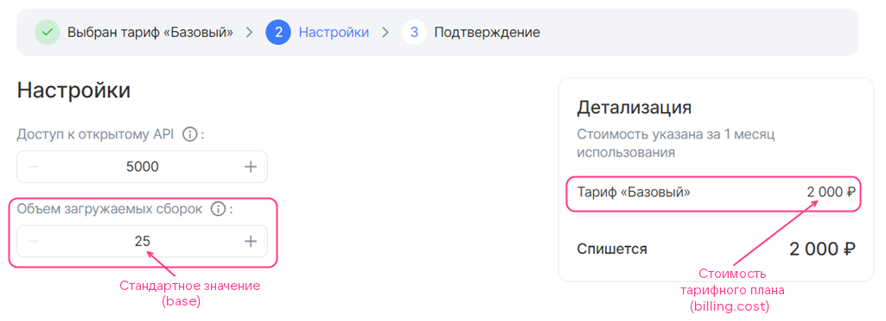
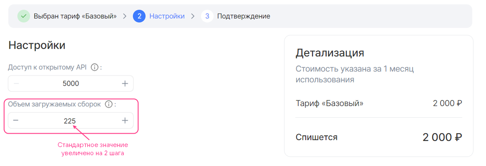
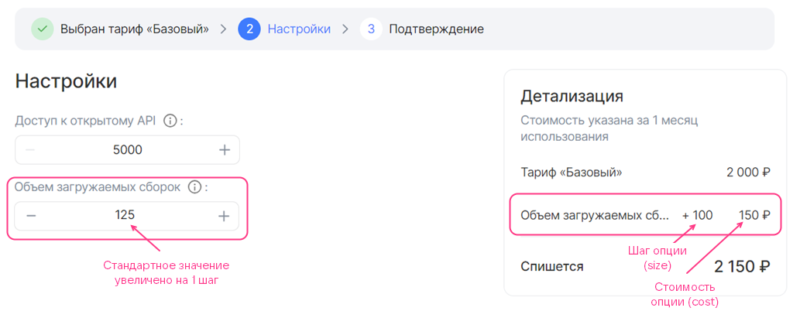
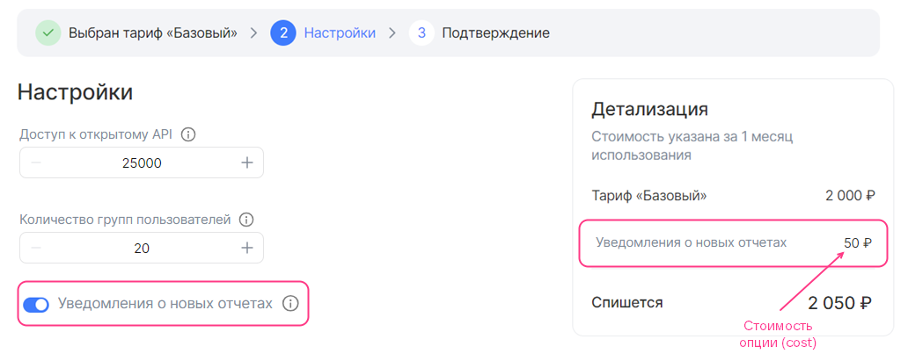
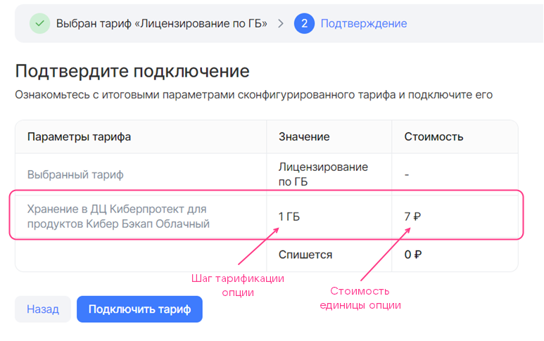

Секция  `billing` в [JSON-файле конфигурации сервиса](../../../manage-saas-apps/saas-add/#service_config) содержит следующую информацию:

* Стоимость тарифного плана. Поддерживается предоплатная тарификация.
* Шаг изменения для тарифных опций типа `integer`.
* Стоимость тарифных опций плана. Поддерживаются следующие типы платных тарифных опций:

  * Числовой (`integer`, `number`). Поддерживается предоплатная и постоплатная тарификация.
  * Логический (`boolean`). Поддерживается предоплатная тарификация.

Подробнее о типах тарификации — в разделе [Тарификация](/ru/tools-for-using-services/vendor-account/manage-apps/concepts/about/#xaas_billing).

<warn>

В тарифном плане нельзя одновременно использовать и предоплатные, и постоплатные опции. Постоплатные тарифные опции могут быть только в бесплатном тарифном плане.

</warn>

Применяемый тип тарификации зависит от того, где в [секции schemas](../schemas-section) описаны тарифные опции:

* Если опции описаны в секциях `service_instance.create` и `service_instance.update`, применяется предоплатная тарификация.
* Если опции описаны в секции `service_instance.resource_usages`, применяется постоплатная тарификация.

Секция `billing` имеет следующую структуру:

```json
"billing": {
            "cost": <СТОИМОСТЬ>,
            "options": {
              "<ИМЯ_ОПЦИИ>": {
                <БИЛЛИНГ_ОПЦИИ>
                },
              ...
              }
            }
```

Здесь:

* Значение `<СТОИМОСТЬ>` параметра `cost` определяет стоимость плана за отчетный период без учета платных тарифных опций. Задается в валюте страны, где развернут Marketplace. Если план бесплатный, указывается значение `0`.

   <info>

   Длительность отчетного периода настраивается в [параметре тарифного плана](../saas-plan) `plans.billing_cycle_flat`.

   </info>

* (Опционально) Секция `options` описывает стоимость платных тарифных опций.
  * `<ИМЯ_ОПЦИИ>` — имя тарифной опции в JSON-файле конфигурации сервиса.
  * `<БИЛЛИНГ_ОПЦИИ>` — стоимость тарифной опции и параметры шага изменения для опции типа `integer`. Сама тарифная опция (тип, настройки значения) описывается в [секции schemas](../schemas-section).

Параметры секции `<БИЛЛИНГ_ОПЦИИ>` зависят от типа опции:

[cols="2,5,2,2", options="header"]
|===
|Имя
|Описание
|Формат
|Обязательный

4+^|**Предоплатная опция типа `integer` с шагом изменения**

|`base`
|Определяет стандартное значение тарифной опции, входящее в стоимость тарифного плана.

Стандартное значение — это минимальное значение, которое может задать пользователь.

Если параметр не задан, стандартное значение равно `0`
|integer
| 

|`cost`
|Определяет стоимость шага, на который можно изменить значение тарифной опции. Если указан `0`, изменение опции бесплатно

|float64, >= 0
| 

|`unit`
|Определяет параметры шага изменения опции
| 
| 

4+|Параметры секции `unit`

|`unit.size`
|Определяет размер шага, на который можно изменить значение тарифной опции
|integer, > 0
| 

|`unit.measurement`
|Определяет единицы измерения шага, заданного в параметре `unit.size`
|string, до 255 символов
| 

4+^|**Предоплатная опция-переключатель `boolean`**

|`cost`
|
Определяет стоимость опции
|float64, >= 0
| 

4+^|**Постоплатная опция типа `integer` или `number`**

|`cost`
|Определяет стоимость единицы тарифной опции.

<warn>

Если сбор метрик происходит по [pull-модели](../../../manage-apps/concepts/about#billing_pull), стоимость должна соответствовать значению `price`, [указанному в методе брокера](../../../manage-saas-apps/saas-add/#saas_broker) для передачи отчета в Marketplace.

</warn>
|float64, >= 0
| 

|`unit`
|Определяет параметры шага изменения опции
| 
| 

4+|Параметры секции `unit`

|`unit.size`
|Определяет размер шага изменения опции. Значение должно быть равно `1`
|integer
| 

|`unit.measurement`
|Определяет единицы измерения опции
|string, до 255 символов
| 
|===

<info>

Чтобы эффективно использовать [бонусы](../../../manage-saas-apps/saas-add#saas_test_marketplace), выдаваемые для тестирования и отладки сервиса в Marketplace, до публикации сервиса указывайте тестовую стоимость тарифного плана и его опций.

</info>

### Примеры описания секции billing

<details>
<summary>Пример секции billing с бесплатной тарифной опцией типа integer с шагом изменения</summary>

```json
"billing": {
  "cost": 2000,  // Стоимость тарифного плана
  "options": {
    "quantity": { // Имя опции в JSON-файле
      "base": 25, // Стандартное значение опции
      "cost": 0, // Стоимость шага изменения опции
      "unit": {
        "size": 100 // Шаг изменения опции
      }
    }
  }
}
```

Ниже показано, как стоимость тарифного плана и опция из этого примера отображаются в мастере конфигурации тарифного плана. Название опции, отображаемое в мастере, задается параметром `<ИМЯ_ОПЦИИ>.description` в секции `schemas`. В этом примере `quantity.description` имеет значение `Объем загружаемых сборок`.

* В настройках тарифного плана для опции выбрано стандартное значение:

  {params[width=90%]}

* В настройках тарифного плана значение опции увеличено на 2 шага по сравнению со стандартным:

  {params[width=90%]}

  Стоимость плана не изменилась, так как опция бесплатная.

</details>

<details>
<summary>Пример секции billing с предоплатной тарифной опцией типа integer с шагом изменения</summary>

```json
"billing": {
  "cost": 2000, // Стоимость тарифного плана
  "options": {
    "quantity": { // Имя опции в JSON-файле
      "base": 25, // Стандартное значение опции
      "cost": 150, // Стоимость шага изменения опции
      "unit": {
        "size": 100 // Шаг изменения опции
      }
    }
  }
}
```

Ниже показано, как стоимость тарифного плана и опция из этого примера отображаются в мастере конфигурации тарифного плана. Название опции, отображаемое в мастере, задается параметром `<ИМЯ_ОПЦИИ>.description` в секции `schemas`. В этом примере `quantity.description` имеет значение `Объем загружаемых сборок`.

* В настройках тарифного плана для опции выбрано стандартное значение:

  {params[width=90%]}

* В настройках тарифного плана значение предоплатной опции увеличено на 1 шаг по сравнению со стандартным:

  {params[width=90%]}

  Стоимость плана увеличилась на цену шага предоплатной опции.

</details>

<details>
<summary>Пример секции billing с предоплатной тарифной опцией-переключателем boolean</summary>

```json
"billing": {
  "cost": 2000, // Стоимость тарифного плана
  "options": {
    "notifications": { // Имя опции в JSON-файле
      "cost": 50 // Стоимость опции
    }
  }
}
```

Ниже показано, как стоимость тарифного плана и опция из этого примера отображаются в мастере конфигурации тарифного плана. Название опции, отображаемое в мастере, задается параметром `<ИМЯ_ОПЦИИ>.description` в секции `schemas`. В этом примере `notifications.description` имеет значение `Уведомления о новых отчетах`.

{params[width=90%]}

</details>

<details>
<summary>Пример секции billing с постоплатной числовой тарифной опцией</summary>

```json
"billing": {
  "cost": 0, // Стоимость тарифного плана
  "options": {
    "storage": { // Имя опции в JSON-файле
      "cost": 7,
      "unit": {
      "size": 1,
      "measurement": "ГБ"
      }
    }
  }
}
```

В приведенном примере тарифный план бесплатный, единица постоплатной тарифной опции `storage` составляет 1 ГБ и стоит 7 денежных единиц.

Вид мастера конфигурации тарифного плана приведен на рисунке. Название опции, отображаемое в мастере, задается параметром `<ИМЯ_ОПЦИИ>.description` в секции `schemas`. В этом примере `storage.description` имеет значение `Хранение в ДЦ Киберпротект для продуктов Кибер Бэкап Облачный`.

{params[width=70%]}

</details>
