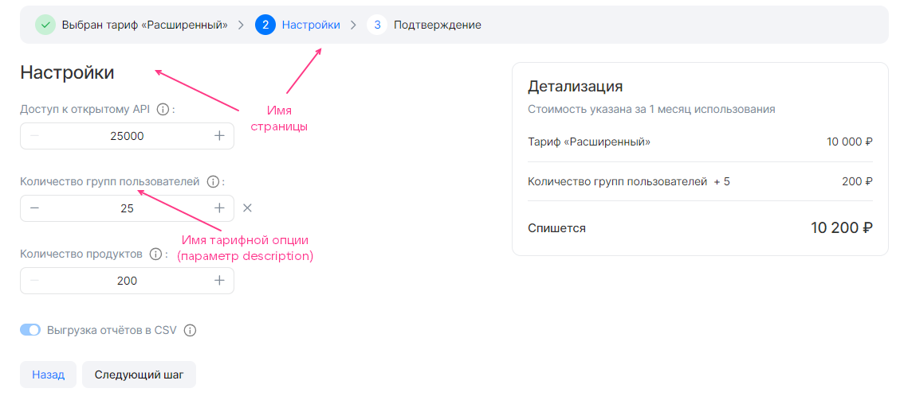

Секция `display` в [JSON-файле конфигурации сервиса](../../../manage-saas-apps/saas-add/#service_config) описывает [мастер конфигурации тарифного плана](/ru/tools-for-using-services/vendor-account/manage-apps/concepts/about/#xaas_wizard). Секция имеет следующую структуру:

```json
"display": {
  "pages": [
    {
      <ПАРАМЕТРЫ_СТРАНИЦЫ>,
      "groups": [
        {
          <ПАРАМЕТРЫ_ГРУППЫ>,
          "parameters": [
            {
              <ПАРАМЕТРЫ_ОПЦИИ>
            },
            ...
          ]
        }
        ...
      ]
    },
  ...
  ]
}
```

Здесь:

* `pages` — секция, описывающая страницы мастера конфигурации тарифного плана. Может быть пустой.
* `<ПАРАМЕТРЫ_СТРАНИЦЫ>` — параметры одной страницы.
* `groups` — секция, описывающая группы тарифных опций в рамках одной страницы.
* `<ПАРАМЕТРЫ_ГРУППЫ>` — параметры группы тарифных опций.
* `parameters` — секция, описывающая тарифные опции в рамках одной группы.

   <warn>

   Одна и та же тарифная опция может быть указана только в одной группе.

   </warn>
* `<ПАРАМЕТРЫ_ОПЦИИ>` — параметры тарифных опций.

В секции `display` описываются все страницы мастера конфигурации тарифного плана, кроме первой и последней. Максимальное количество страниц — 5.

Параметры страниц, групп и тарифных опций в группах одинаковые и приведены в таблице.

[cols="2,5,4,2", options="header"]
|===
|Имя
|Описание
|Формат
|Обязательный

|`name`
|
Имя страницы, группы или тарифной опции в JSON-файле.

<warn>

В интерфейсе магазина тарифные опции будут отображаться с именами, заданными в параметре `description` этих опций в [секции schemas](../schemas-section).

</warn>
|
string.

Имя страницы — до 32 символов.

Имя группы — до 255 символов
| 

|`index`
|
Порядковый номер страницы, группы на странице или тарифной опции в группе
|
integer
| 
|===

{cut(Пример секции display)}

```json
"display": {
  "pages": [
    {
      "name": "Настройки", // Имя страницы
      "index": 0,
      "groups": [
        {
          "name": "", // Имя группы
          "index": 0,
          "parameters": [
            {
              "name": "api_requests_daily_limit", // Имя тарифной опции в JSON-файле
              "index": 0,
            },
            {
              "name": "groups",
              "index": 1,
            },
            {
              "name": "products",
              "index": 2,
            },
            {
              "name": "reports",
              "index": 3
            }
          ]
        }
      ]
    }
  ]
}
```

Этому содержимому секции `display` соответствует мастер конфигурации тарифного плана, приведенный на рисунке:



{/cut}

По умолчанию в мастере конфигурации тарифного плана отображаются и настраиваются все группы тарифных опций `groups`. Чтобы группа отображалась только при определенных условиях, используйте [конструкцию when](/ru/tools-for-using-services/vendor-account/manage-apps/ibservice_add/ibservice_configure/ib_display/#IBdisplay_when).

<warn>

Брокер должен поддерживать создание инстанса сервиса с учетом условий, заданных в конструкциях `when`.

</warn>

Структура `when` в формате JSON:

```json
{
  "when": {
    "in": { // Или "not_in"
      "key": {
        "param": "<ИМЯ_ОПЦИИ>" // Или "const": "<ЗНАЧЕНИЕ>"
      },
      "values": [
        {
          "const": "<ЗНАЧЕНИЕ>"
        },
        {
          "param": "<ИМЯ_ОПЦИИ>"
        },
      ...
      ]
    }
  },
  "parameters": [
  ...
  ]
}
```

Здесь:

* `<ИМЯ_ОПЦИИ>` — имя тарифной опции в JSON-файле конфигурации сервиса.
* `<ЗНАЧЕНИЕ>` — значение константы.

Конструкция [when в секции pages](/ru/tools-for-using-services/vendor-account/manage-apps/ibservice_add/ibservice_configure/ib_display/#IBdisplay_when_in_pages) используется таким же образом, как и в image-based приложениях.

{cut(Пример использования конструкции when в секции pages)}

```json
{
  "pages": [
    {
      "name": "Настройки бекапа", // Имя страницы
      "groups": [
        {
          "name": "High-frequency бекап", // Имя группы тарифных опций
          "parameters": [
            {
              "name": "frequency_per_day" // Имя тарифной опции в JSON-файле
            }
          ],
          "when": {
            "in": {
              "key": {
                "param": "backup_method" // Имя тарифной опции в JSON-файле
              },
              "values": [
                {
                  "const": "high-frequency"
                }
              ]
            }
          }
        }
      ]
    }
  ]
}
```

В этом примере настраивается частота создания бекапов. Если значение тарифной опции `backup_method` равно `high-frequency`, в мастере конфигурации тарифного плана будет отображаться группа `High-frequency бекап` с тарифной опцией `frequency_per_day`.

Тарифная опция `backup_method`:

* Может использоваться в конструкции `when` в других группах.
* Должна быть задана в `parameters` в другой группе.

Тарифная опция `frequency_per_day` не может использоваться в других группах:

* В конструкции `when` — потому что поддерживается один уровень иерархии зависимостей.
* В `parameters` — потому что одна тарифная опция может быть указана только в одной группе.

{/cut}
