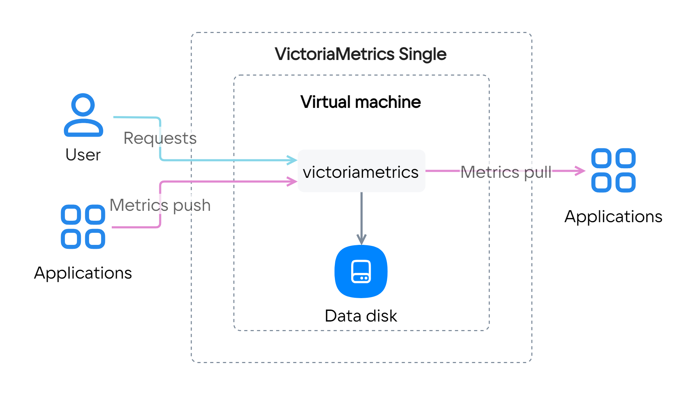
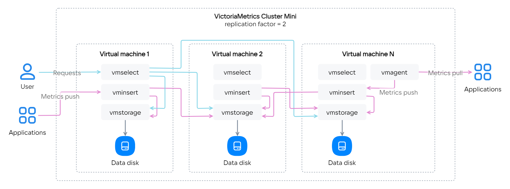
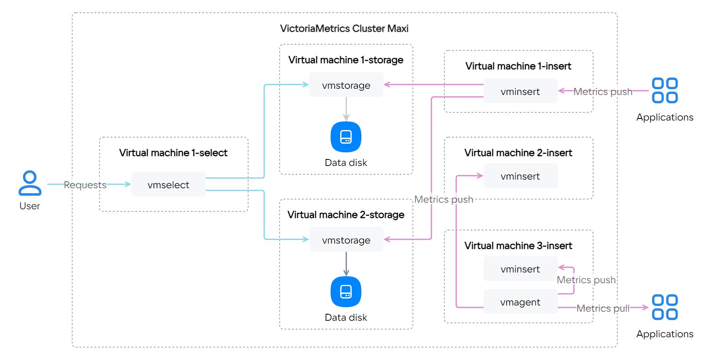

Вы можете собирать, хранить и анализировать метрики в базе данных временных рядов (time series database) с помощью сервиса [VictoriaMetrics](https://msk.cloud.vk.com/app/services/marketplace/v2/apps/service/f260ad2b-bdc1-4ccc-a35f-2f440681e0f6/latest/info/).

Инструкция поможет развернуть сервис VictoriaMetrics (на примере версии 1.93.9) на ВМ в VK Cloud и настроить сбор метрик.

Используя VictoriaMetrics, вы соглашаетесь с лицензионными соглашениями [Marketplace](/ru/additionals/start/legal/marketplace) и [VictoriaMetrics](https://victoriametrics.com/assets/VM_EULA.pdf).

Чтобы развернуть сервис VictoriaMetrics в проекте:

1. [Зарегистрируйтесь](/ru/additionals/start/account-registration) в VK Cloud.
1. [Разверните](../../instructions/pr-instance-add/) сервис в проекте, выбрав подходящий тарифный план (**Single**, **Cluster Mini**, **Cluster Maxi**):

   

    
Подробнее о конфигурациях для тарифных планов

   <tabs>
   <tablist>
   <tab>Single</tab>
   <tab>Cluster Mini</tab>
   <tab>Cluster Maxi</tab>
   </tablist>
   <tabpanel>

   Один сервер, отвечающий за прием, хранение и обработку метрик. Сервис разворачивается на одной ВМ, поддерживает вертикальное масштабирование (увеличение CPU и RAM).

   

   </tabpanel>
   <tabpanel>

   Кластер из нескольких узлов с [компонентами](https://docs.victoriametrics.com/Cluster-VictoriaMetrics.html#architecture-overview):

   - `vminsert` — прием метрик в различных форматах;
   - `vmselect` — выполнение запросов для метрик, сохраненных в рамках `vmstorage`;
   - `vmstorage` — хранение метрик на диске.

   Дополнительно на любом узле можно настроить [vmagent](https://docs.victoriametrics.com/vmagent.html), исполняемый файл входит в поставку.

   Экземпляр сервиса разворачивается на заданном количестве узлов, каждый узел включает все три компонента. Все узлы в кластере равнозначные. [Тип конфигурации](/ru/base/iaas/concepts/vm-concept#shablony_konfiguraciy) и размер дисков устанавливается одинаковым для всех узлов кластера. Поддерживает вертикальное (увеличение CPU и RAM) и горизонтальное (добавление узлов) масштабирование.

   

   </tabpanel>
   <tabpanel>

   Кластер из нескольких узлов с [компонентами](https://docs.victoriametrics.com/Cluster-VictoriaMetrics.html#architecture-overview):

   - `vminsert` — прием метрик в различных форматах;
   - `vmselect` — выполнение запросов для метрик, сохраненных в рамках `vmstorage`;
   - `vmstorage` — хранение метрик на диске.

   Дополнительно на любом узле можно настроить [vmagent](https://docs.victoriametrics.com/vmagent.html), исполняемый файл входит в поставку.

   Экземпляр сервиса разворачивается на заданном количестве узлов, каждый узел включает только один из компонентов. [Тип конфигурации](/ru/base/iaas/concepts/vm-concept#shablony_konfiguraciy) и размер дисков устанавливается индивидуально для каждого узла кластера. Поддерживает вертикальное (увеличение CPU и RAM) и горизонтальное (добавление узлов) масштабирование.

   

   </tabpanel>
   </tabs>

   

   <tabs>
   <tablist>
   <tab>Single</tab>
   <tab>Cluster Mini</tab>
   <tab>Cluster Maxi</tab>
   </tablist>
   <tabpanel>

   1. На шаге «Настройки VictoriaMetrics»:

      - **Резервное копирование**: выберите вариант `no`, чтобы не сохранять данные в объектное хранилище [Cloud Storage](/ru/base/s3). При варианте `yes` будут скопированы данные за последние 7 дней.
      - **Сколько хранить все метрики**: укажите время хранения метрик с нужным суффиксом: `h` (час), `d` (день), `w` (неделя), `y` (год). Если не указать суффикс, в качестве единицы измерения используются месяцы. Минимальное значение — `24h` (`1d`), по умолчанию — `12` (12 месяцев).
      - **Параметры дедупликаци**: укажите периодичность удаления одинаковых метрик, используйте суффиксы `ms`, `s`, `m`, `h`. Метрика — это совокупность самой метрики и ее метаданных. Например, метрики `cpu{host=hostname1}` и `cpu{host=hostname2}` считаются разными. Значение по умолчанию — `1ms`.

   1. Нажмите кнопку **Следующий шаг**.
   1. На шаге «Параметры сервера»:

      - **Сеть**: выберите существующую сеть или создайте новую. В зависимости от выбора типа сети список доступных полей изменится. Если выбран пункт **Создать новую сеть**, задайте тип SDN и настройку **Адрес подсети**.
      - **Зона доступности**: выберите, в каком из центров обработки данных будет запущена ВМ.
      - **Тип виртуальной машины**: выберите предустановленную конфигурацию ВМ. Подробнее в [обзоре сервиса Cloud Servers](/ru/base/iaas/concepts/vm-concept#shablony_konfiguraciy).
      - Для системного диска и диска с данными:

        - **Размер диска**: укажите нужный размер диска ВМ в гигабайтах.
        - **Тип диска**: выберите одно из значений — HDD, SSD или High-IOPS SSD. Подробнее в [обзоре сервиса Cloud Servers](/ru/base/iaas/concepts/vm-concept#diski).

   1. Нажмите кнопку **Следующий шаг**.
   1. На шаге «Подтверждение» ознакомьтесь с рассчитанной стоимостью сервиса и нажмите кнопку **Подключить тариф**.

   </tabpanel>
   <tabpanel>

   1. На шаге «Настройки VictoriaMetrics»:

      - **Резервное копирование**: выберите вариант `no`, чтобы не сохранять данные в объектное хранилище [Cloud Storage](/ru/base/s3). При варианте `yes` будут скопированы данные за последние 7 дней.
      - **Replication factor**: укажите количество копий метрик, которые будут записываться в `vmstorage` на разных ВМ.
      - **Сколько хранить все метрики**: укажите время хранения метрик с нужным суффиксом: `h` (час), `d` (день), `w` (неделя), `y` (год). Если не указать суффикс, в качестве единицы измерения используются месяцы. Минимальное значение — `24h` (`1d`), по умолчанию — `12` (12 месяцев).
      - **Параметры дедупликаци**: укажите периодичность удаления одинаковых метрик, используйте суффиксы `ms`, `s`, `m`, `h`. Метрика — это совокупность самой метрики и ее метаданных. Например, метрики `cpu{host=hostname1}` и `cpu{host=hostname2}` считаются разными. Значение по умолчанию — `1ms`.

   1. Нажмите кнопку **Следующий шаг**.
   1. На шаге «Параметры серверов»:

      - **Количество серверов**: укажите количество разворачиваемых ВМ в кластере.
      - **Сеть**: выберите существующую сеть или создайте новую. В зависимости от выбора типа сети список доступных полей изменится. Если выбран пункт **Создать новую сеть**, задайте тип SDN и настройку **Адрес подсети**.
      - **Зона доступности**: выберите, в каком из центров обработки данных будет запущена ВМ.
      - **Тип виртуальной машины**: выберите предустановленную конфигурацию ВМ. Подробнее в [обзоре сервиса Cloud Servers](/ru/base/iaas/concepts/vm-concept#shablony_konfiguraciy).
      - Для системного диска и диска с данными:

        - **Размер диска**: укажите нужный размер диска ВМ в гигабайтах.
        - **Тип диска**: выберите одно из значений — HDD, SSD или High-IOPS SSD. Подробнее в [обзоре сервиса Cloud Servers](/ru/base/iaas/concepts/vm-concept#diski).

   1. Нажмите кнопку **Следующий шаг**.
   1. На шаге «Подтверждение» ознакомьтесь с рассчитанной стоимостью сервиса и нажмите кнопку **Подключить тариф**.

   </tabpanel>
   <tabpanel>

   1. На шаге «Настройки Кластера»:

      - **Резервное копирование**: выберите вариант `no`, чтобы не сохранять данные в объектное хранилище [Cloud Storage](/ru/base/s3). При варианте `yes` будут скопированы данные за последние 7 дней.
      - **Replication factor**: укажите количество копий метрик, которые будут записываться в `vmstorage` на разных ВМ.
      - **Сколько хранить все метрики**: укажите время хранения метрик с нужным суффиксом: `h` (час), `d` (день), `w` (неделя), `y` (год). Если не указать суффикс, в качестве единицы измерения используются месяцы. Минимальное значение — `24h` (`1d`), по умолчанию — `12` (12 месяцев).
      - **Параметры дедупликаци**: укажите периодичность удаления одинаковых метрик, используйте суффиксы `ms`, `s`, `m`, `h`. Метрика — это совокупность самой метрики и ее метаданных. Например, метрики `cpu{host=hostname1}` и `cpu{host=hostname2}` считаются разными. Значение по умолчанию — `1ms`.

   1. Нажмите кнопку **Следующий шаг**.
   1. На шаге «Общие параметры»:

      - **Сеть**: выберите существующую сеть или создайте новую. В зависимости от выбора типа сети список доступных полей изменится. Если выбран пункт **Создать новую сеть**, задайте настройку **Адрес подсети**.
      - **Зона доступности**: выберите, в каком из центров обработки данных будет запущена ВМ.
      - **Размер диска**: укажите нужный размер диска ВМ в гигабайтах.
      - **Тип диска**: выберите одно из значений — HDD, SSD или High-IOPS SSD. Подробнее в [обзоре сервиса Cloud Servers](/ru/base/iaas/concepts/vm-concept#diski).

   1. Нажмите кнопку **Следующий шаг**.
   1. На шаге «Параметры компонентов»:

      - Для каждого из компонентов `vmselect`, `vminsert` и `vmstorage` укажите количество разворачиваемых ВМ в кластере и [тип виртуальной машины](/ru/base/iaas/concepts/vm-concept#shablony_konfiguraciy).
      - Для диска с данными для `vmstorage`:

        - **Размер диска**: укажите нужный размер диска ВМ в гигабайтах.
        - **Тип диска**: выберите одно из значений — HDD, SSD или High-IOPS SSD. Подробнее в [обзоре сервиса Cloud Servers](/ru/base/iaas/concepts/vm-concept#diski).

   1. На шаге «Подтверждение» ознакомьтесь с рассчитанной стоимостью сервиса и нажмите кнопку **Подключить тариф**.

   </tabpanel>
   </tabs>

   После завершения установки на почту придет одноразовая ссылка с доступами.

1. Перейдите по ссылке из письма.
1. Сохраните данные для доступа к VictoriaMetrics.

   <info>

   Если вы не сохранили данные для доступа, [сгенерируйте](../../instructions/pr-instance-manage#obnovlenie_dostupa_k_instansu_servisa) новые.

   </info>

1. (Опционально) Настройте сбор метрик в зависимости от выбранной конфигурации:

   - **Single**: воспользуйтесь [инструкцией из официальной документации](https://docs.victoriametrics.com/Single-server-VictoriaMetrics.html#how-to-scrape-prometheus-exporters-such-as-node-exporter).
   - **Cluster Mini** и **Cluster Maxi**: воспользуйтесь утилитой [vmagent](https://docs.victoriametrics.com/vmagent.html).

   Для расширенной конфигурации сервиса используйте официальную инструкцию [VictoriaMetrics](https://docs.victoriametrics.com/guides/).
