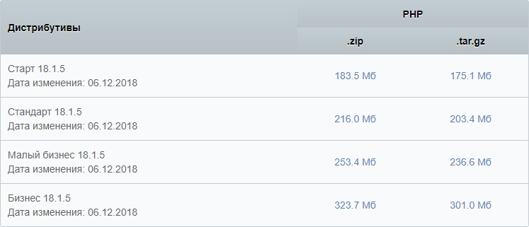
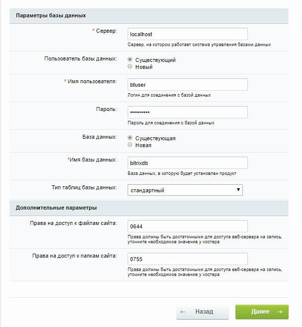
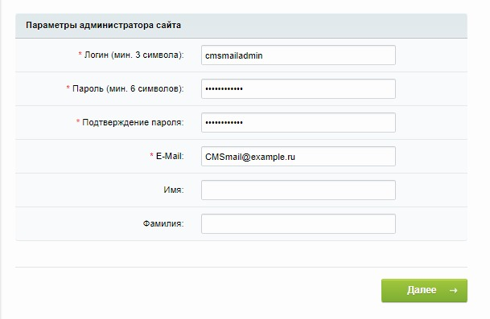

1С-Битрикс: Управление сайтом - профессиональная система управления интернет-ресурсами, с помощью которой можно создавать и поддерживать информационные порталы, интернет-магазины и корпоративные сайты.

Требования
----------

*   Операционная система Ubuntu версии 16.04.
*   Пользователь с доступом к команде sudo.
*   Установленный стек LAMP. 

Если у вас еще не установлен стек LAMP:

*   Вы можете получить готовый стек LAMP в облаке [в виде настроенной виртуальной машины](https://mcs.mail.ru/app/services/marketplace/) на Ubuntu 18.04 и установить [1С-Битрикс: Управление сайтом на нем](https://mcs.mail.ru/help/1c-bitrix-linux/bitrix-ubuntu-18). При регистрации вы получаете бесплатный бонусный счет, которого хватает, чтобы тестировать сервер несколько дней. 
*   Вы можете установить стек LAMP самостоятельно. О том, как установить стек LAMP на Ubuntu 16.04, [читайте тут](https://mcs.mail.ru/help/lamp-on-linux/lamp-ubuntu-16).[](https://mcs.mail.ru/help/lamp-setup/lamp-ubuntu-18)

Подготовка к установке 1С-Битрикс: Управление сайтом
----------------------------------------------------

1.  Перейдите на сайт [https://www.1c-bitrix.ru/download/cms.php](https://www.1c-bitrix.ru/download/cms.php) и выберите нужный дистрибутив (например, Стандарт):
    

****

2.  Откройте окно терминала.
    
3.  Установите дополнительные пакеты PHP, выполнив команду:
    

```
sudo apt-get install php-common php-mbstring php-xmlrpc  -y
```

4.  Перейдите в домашний каталог, выполнив команду:
    

```
cd ~
```

5.  Создайте временный каталог tempBT, выполнив команду:
    

```
mkdir tempBT
```

6.  Перейдите в каталог tempBT, выполнив команду:
    

```
cd ~/tempBT
```

7.  Скачайте соответствующий выбранному дистрибутиву архив, выполнив команду:
    

```
wget https://www.1c-bitrix.ru/download/standard_encode.tar.gz
```

8.  Распакуйте архив в каталог /var/www/html, выполнив команду:
    

```
sudo tar xzvf standard_encode.tar.gz -C /var/www/html
```

9.  Удалите временный каталог tempBT, выполнив команду:
    

```
sudo rm -Rf ~/tempBT
```

10.  Замените владельца каталогов и файлов в корневом каталоге веб-сервера, используя команду: 
    

```
sudo chown -R имя_пользователя:www-data /var/www/html
где имя_пользователя - это имя пользователя sudo, www-data - имя группы
Например: sudo chown -R www-data:www-data /var/www/html
```

**Внимание**

Во избежание ошибок веб-сервера Apache при запуске скриптов используйте имя пользователя www-data и имя группы www-data по умолчанию.

11.  Если необходимо предоставить доступ к файлам корневого каталога веб-сервера другому пользователю, включите этого пользователя в группу www-data, используя команду:

```
sudo usermod -a -G www-data имя_пользователя
Например: sudo usermod -a -G www-data btuser
```

12.  Настройте права доступа к файлам и папкам корневого каталога, используя команду:
    

```
sudo chmod -R 775 /var/www/html
```

13.  В файле php.ini измените значения параметров, отвечающих за корректную работу 1С-Битрикс: Управление сайтом.

**Примечание**

Для быстрого поиска параметров в файле используйте сочетание клавиш CTRL+W.

Для этого:

*   Откройте файл php.ini для редактирования, выполнив команду: 

```
sudo nano /etc/php/7.0/apache2/php.ini
```

*   Для параметра short_open_tag укажите значение On: 

```
short_open_tag = On
```

****

*   Для параметра mbstring.func_overload укажите значение 2: 

```
mbstring.func_overload = 2
```

****

*   Для параметра opcache.revalidate_freq укажите значение 0: 

```
opcache.revalidate_freq=0
```

****

*   Для параметра date.timezone укажите значение Europe/Moscow:

```
date.timezone = Europe/Moscow
```

****

*   В строке: 

```
;mbstring.func_overload = 2
```

уберите точку с запятой:

```
mbstring.func_overload = 2
```

**

**

*   Сохраните изменения, используя сочетание клавиш CTRL+O, и завершите редактирование, используя сочетание клавиш CTRL+X.

14.  Создайте конфигурационный файл bitrix.conf, выполнив команду:
    

```
sudo nano /etc/apache2/sites-available/bitrix.conf
```

В этот файл добавьте следующие строки:

```
<VirtualHost \*:80>
DocumentRoot /var/www/html/
ServerName <внешний IP-адрес вашего веб-сервера>
<Directory /var/www/html/>
Options +FollowSymlinks
AllowOverride All
Require all granted
</Directory>
ErrorLog ${APACHE_LOG_DIR}/bitrix_error.log
CustomLog ${APACHE_LOG_DIR}/bitrix_access.log combined
</VirtualHost>
```

Сохраните изменения, используя сочетание клавиш CTRL+O, и завершите редактирование, используя сочетание клавиш CTRL+X.

15.  Отключите сайт по умолчанию 000-default.conf, выполнив команду:
    
    ```
    sudo a2dissite 000-default.conf  
    ```
    

16.  Подключите новый виртуальный хост, выполнив команду:
    

```
sudo a2ensite bitrix.conf
```

17.  Подключите модуль Apache rewrite, выполнив команду:
    

```
sudo a2enmod rewrite
```

18.  Перезагрузите веб-сервер Apache, выполнив команду:
    

```
sudo systemctl reload apache2
```

**Настройка СУБД MySQL**
------------------------

Чтобы начать работу с 1С-Битрикс: Управление сайтом, необходимо создать и настроить выделенную базу данных MySQL. Для этого: 

1.  Откройте окно терминала.
    
2.  Для перехода в оболочку MySQL выполните команду: 
    

```
sudo mysql -u root -p 
```

Используйте аутентификацию учетной записи root, относящуюся исключительно к СУБД MySQL.

3.  Создайте новую базу данных для 1С-Битрикс: Управление сайтом, используя команду: 
    

```
CREATE DATABASE имя_базы;
Например: CREATE DATABASE bitrixdb;
```

**Внимание**

После всех команд СУБД MySQL должна ставиться точка с запятой.

4.  Создайте пользователя с правами полного доступа к созданной базе данных и назначьте ему пароль, используя команду:
    

```
CREATE USER имя_пользователя@localhost IDENTIFIED BY 'пароль';
Например: CREATE USER btuser@localhost IDENTIFIED BY 'mypassword';
```

5.  Предоставьте пользователю привилегии, необходимые для создания и изменения таблиц базы данных, выполнив команду:  
    

```
GRANT ALL PRIVILEGES ON  имя_базы.\* TO имя_пользователя@localhost;
Например: GRANT ALL PRIVILEGES ON bitrixdb.\* TO btuser@localhost;
```

6.  Актуализируйте предоставление привилегий к таблицам базы данных, выполнив команду:
    

```
FLUSH PRIVILEGES;
```

7.  Выйдите из оболочки MySQL, выполнив команду: 
    

```
exit
```

**Установка 1С-Битрикс: Управление сайтом**
-------------------------------------------

Для установки 1С-Битрикс: Управление сайтом в адресной строке веб-браузера введите:

```
http://<внешний IP-адрес вашего веб-сервера>
```

В результате будет запущен мастер установки, следуйте его указаниям:

1.  Ознакомьтесь с вводной информацией и нажмите кнопку **Далее**.
2.  Ознакомьтесь с лицензионным соглашением и нажмите кнопку **Далее**.
3.  При необходимости укажите данные для регистрации своей копии продукта. Затем установите флажок **Установить в кодировке UTF-8** и нажмите кнопку **Далее**.

****

4.  Убедитесь, что все поля с элементом **Текущее значение** выделены зеленым, и нажмите кнопку **Далее**.
5.  Укажите параметры базы данных.

**

**

Используйте имя пользователя базы данных, пароль и имя базы данных, которые вы указали при настройке БД MySQL [](https://docs.google.com/document/d/1jl_ugmDJOyott1UJb7h1rDTa0vFpH6GrcQ6A1aXpBKE/edit#heading=h.u2usy4a5aptn). Другим параметрам рекомендуется оставить значения по умолчанию. Затем нажмите кнопку **Далее** и дождитесь завершения установки.

6.  Укажите параметры для создания учетной записи администратора и нажмите кнопку **Далее**. ********

7.  Выберите типовое решение для конфигурации (например, 1С-Битрикс: Персональный сайт) и нажмите кнопку **Далее**.

В результате вы перейдете к индивидуальной настройке выбранного шаблона. Выберите решение, которое вы хотите использовать для вашего сайта, введите название и имя владельца сайта. Затем нажмите кнопку **Установить**.

Будет запущена установка выбранного шаблона. По завершении установки нажмите кнопку **Перейти на сайт**.

**Обратная связь**

Возникли проблемы или остались вопросы? [Напишите нам, мы будем рады вам помочь](https://mcs.mail.ru/help/contact-us).