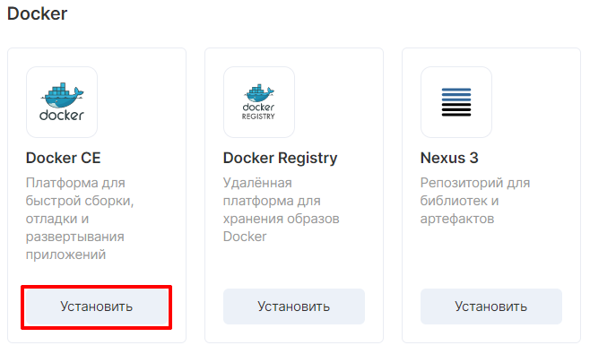
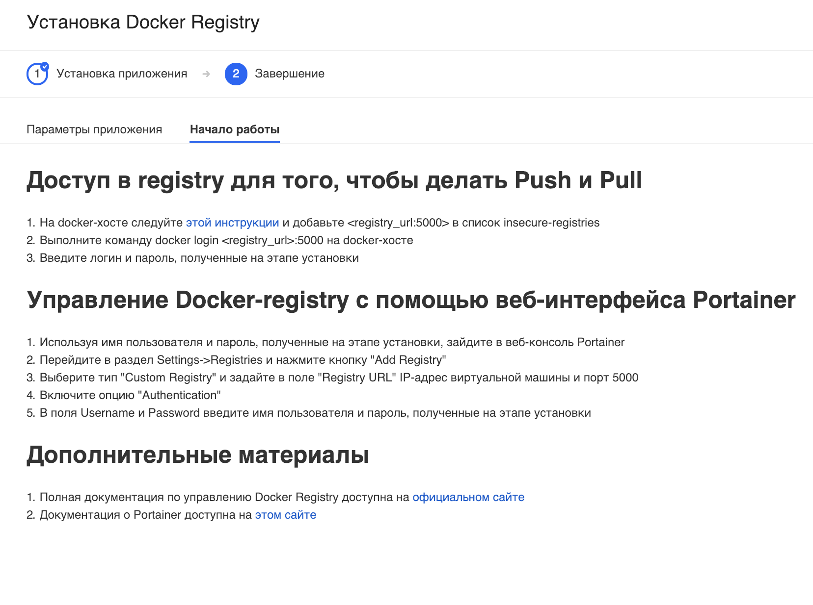
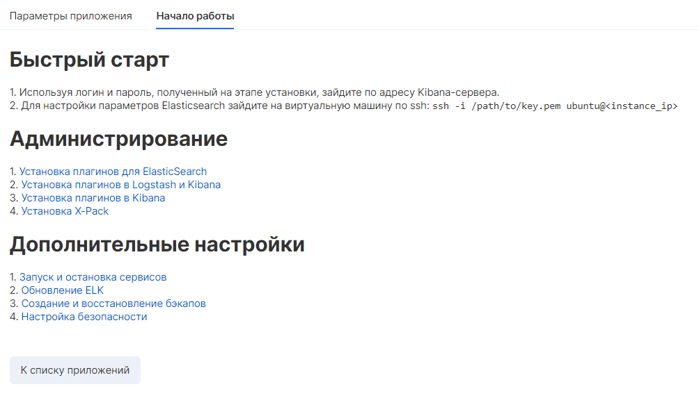
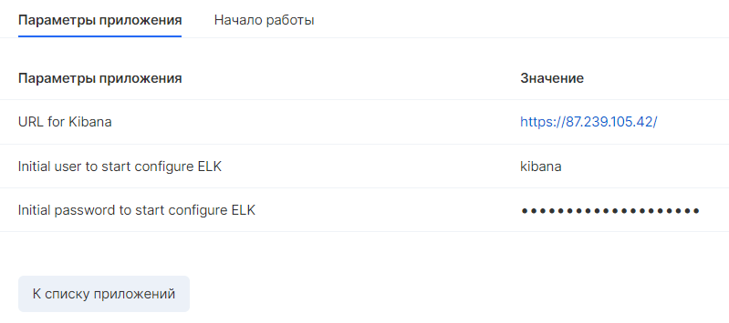
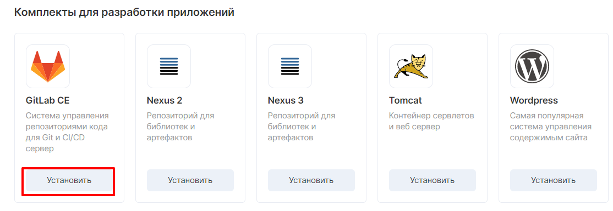
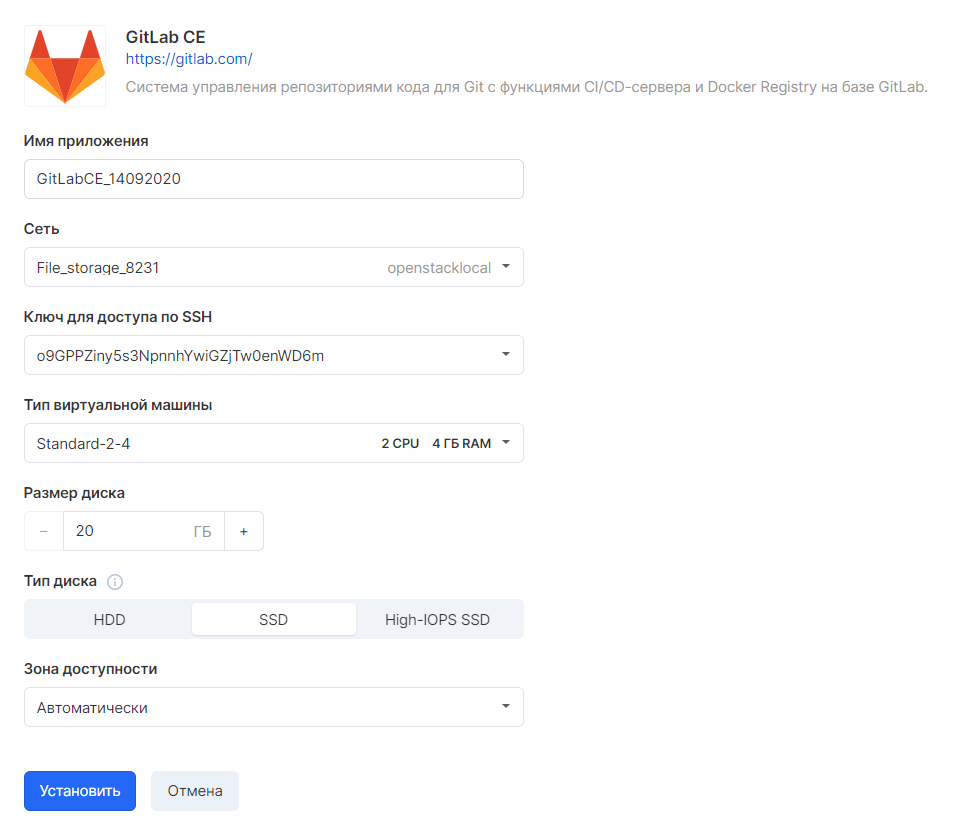

Docker CE
---------

When you select the appropriate application, the settings window opens:

After selecting the appropriate characteristics, you need to wait a few minutes to install the application.

After installation, an application card will open with connection parameters:

Docker Registry
---------------

After selecting the appropriate application, a window with a choice of parameters will open:

 The application will be installed within a few minutes. Next, a window with VM characteristics will open:

Nexus
-----

When you select Nexus, a window opens with the necessary parameters:

The application is installed in a few minutes. Next, a window appears with characteristics:

ELK
---

In the next window, you need to select the VM parameters:

A few minutes after installation, an application card will open with application parameters and a description of how to get started:

ELK Multi instance
------------------

When you select the appropriate application, a window for setting parameters for elasticsearch instance and gatewayinstance opens:

Further, in the additional settings, you will be prompted to specify the number of nodes for Elasticsearch

After a few minutes of installation, information on the application parameters and a description of how to get started will be available:

GitLab CE
---------

Next, at the installation stage, you must specify the application parameters:

At the end of the installation, an application card will appear:

Panel title
-----------

Panel content