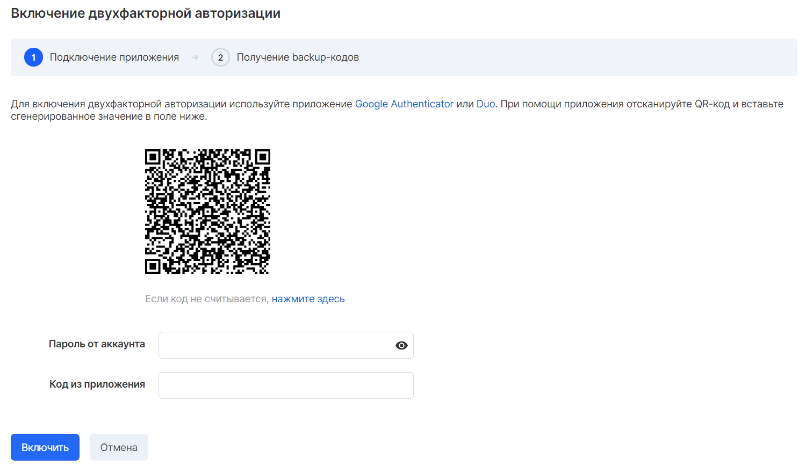
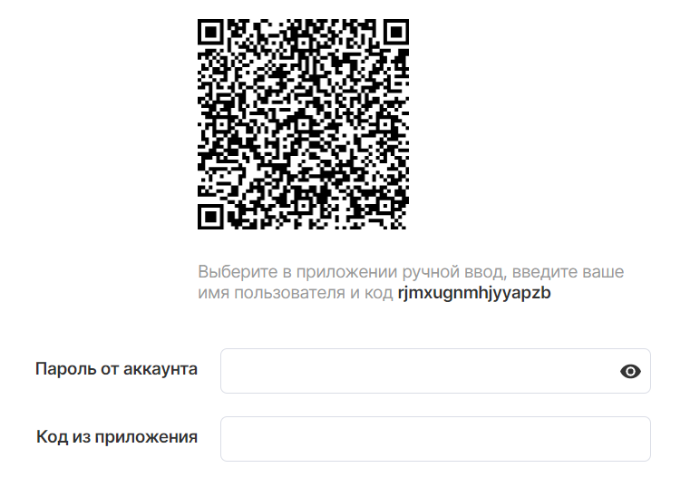
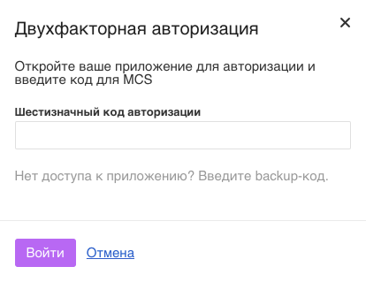

In your [personal account](https://mcs.mail.ru/app/account/profile) for enhanced account security, it is possible to enable two-factor authentication.

Two-factor authentication, also known as two-step verification (DPA or 2FA), is a type of multi-factor authentication. DPA is a technology that provides user identification using a combination of two different components. The components vary, but the following combinations are most commonly used:

*   password + code from SMS
*   password + code from token (or app)
*   password + code from email message

VK CS services use a combination of "password + code from the application". Installation information and download links for one-time code generation apps are below:

*   [Google Authenticator](https://support.google.com/accounts/answer/1066447)
*   [Duo](https://duo.com/product/trusted-users/two-factor-authentication/duo-mobile)

Enabling 2FA
------------

Enabling two-factor authentication is available in [the account settings](https://mcs.mail.ru/app/account/profile) on the "Security" tab by clicking the "Enable protection" button:

To successfully activate the function, you must:

*   Download the Google Authenticator mobile app ( [Android](https://play.google.com/store/apps/details?id=com.google.android.apps.authenticator2) and [iOS](https://apps.apple.com/ru/app/google-authenticator/id388497605) ) or Duo ( [Android](https://play.google.com/store/apps/details?id=com.duosecurity.duomobile&hl=en) and [iOS](https://itunes.apple.com/us/app/duo-mobile/id422663827?mt=8) )
*   Open the app and add a new account
*   Scan the QR code in the application from your personal account
*   Enter the confirmation code generated by the application and the password for your VK CS account in your VK CS account
*   Confirm the entry with the "Enable" button.

**Note**

If you cannot read the QR code, you can enter the application connection code manually by clicking on the corresponding link under the QR code in the window.

As confirmation of the addition of the 2FA key in the next step, the window will display the backup access codes.

**Attention**

Save the backup codes in a safe place.

If you lose your backup codes and do not have access to the mailbox to which your account is registered, you will not be able to restore access to your VK CS account.

Using 2FA
---------

Logging into your account with 2FA enabled is done by the following steps

*   Go to the site [https://mcs.mail.ru](https://mcs.mail.ru) and click the "Login" button
*   Enter your account login and password
*   Enter a one-time 6-digit code generated by the mobile application and confirm the entry with the "Login" button

**Note**

The one-time code is valid for ~ 30 seconds from the moment of its generation.

The number of attempts to log in to the system is not limited, but if, after a certain number of attempts to log in, you still fail, you should use one of the unused backup codes to access your account, then disable 2FA and reconnect it.

Disable 2FA
-----------

Disabling 2FA is made in the account settings menu on the "Security" tab. To disable the function, enter the password for the current VK CS account and the code from the application, confirm your entry with the "Disable" button.

Password managers
-----------------

For the convenience of storing and using a large number of account passwords, backup codes and other confidential information in a virtual storage protected by a master password, locked using the [PBKDF2](https://ru.wikipedia.org/wiki/PBKDF2 "PBKDF2") standard , you can use third-party software, for example:

*   [Lastpass](https://www.lastpass.com/)
*   [1password](https://1password.com/)

The password database can be stored both locally and synchronized between other trusted devices.