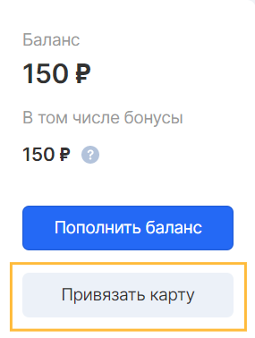
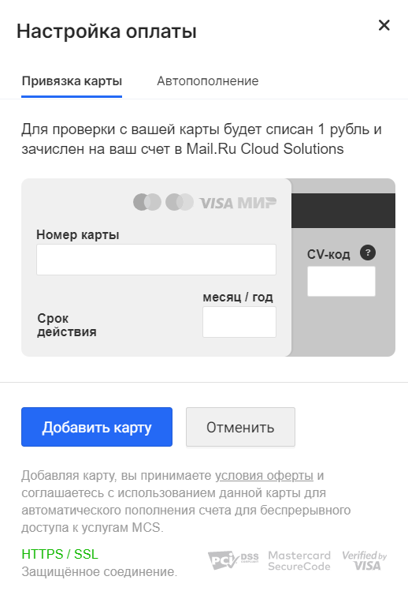
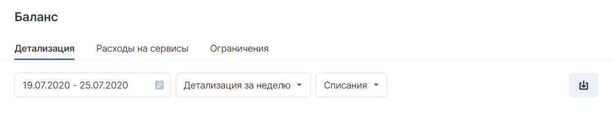

Billing is a set of tools for accounting for resource use, generating reports, interacting with payment systems and receiving financial documents on the VK CS platform.

Balance
-------

Balance is the current state of funds in the VK CS project account. The balance status is displayed in the upper part of the [Personal Account](https://mcs.mail.ru/app/main/) , and is also available in the corresponding section on the left.

*   Decreasing the balance occurs when resources are consumed.
*   The balance increases when funds are credited.

**Disabling services**

Upon reaching the zero balance, the project resources will be automatically stopped until the project balance is replenished.

After replenishing the balance, billing tools will allow you to use the services again, but you will need to manually launch each resource.

**Attention**

After the positive balance is restored, the project is activated by the billing system and can take up to 4 hours.

**Deleting project data**

In the absence of a positive balance recovery, the project resources will be queued for deletion, depending on the availability of payments for the entire period of the project's existence:

*   If there were no cash flows in the project, then after 3 days all resources will be deleted;
*   If the payment was made, then the resources will be placed in the queue for deletion after 30 days (or upon reaching the balance equal to -1000 rubles) after the services were stopped.

The delete queue is a mechanism for cleaning up resources, in which data from the project and the VK CS platform are deleted irrevocably, without any possibility of their recovery.

Payment
-------

Funds can be credited from both an individual and a legal entity.

Replenishment is carried out in the "Balance" section of your personal account by clicking on the "Replenish balance" button. You should indicate the amount to be credited and the method of payment:

**Individuals**

Users can fund their account using many popular payment systems, such as: bank cards, Sberbank Online, Qiwi, SMS, Webmoney, Yandex.Money, WebMoney, etc.

Payment operations are made with the support of the [Money.Mail.Ru](https://money.mail.ru/oferta/payfast) service.

The payment is made in real time and is credited within 10 minutes.

**Legal entities**

For legal entities, residents of the Russian Federation, it is possible to create and upload a payment document (invoice) for subsequent payment by bank transfer.

When choosing the method of crediting via "Bank Transfer", a file with an invoice will be automatically generated and uploaded, the payment details of which will contain the necessary data:

*   Payee's organization details
*   Account number
*   Purpose of payment
*   Amount of payment

**Attention**

Before making a payment, make sure that the information about the purpose of the payment and the details are correct. The absence of the VK CS project in the purpose of payment, as well as payment from the current account of a legal entity, whose details are different from those specified in the project settings, may lead to a refusal to credit funds to the project balance.

Funds sent by bank transfer are credited automatically. It should be noted that the processing time for a transaction depends on the bank and may take up to 3 banking (business) days.

The funds will be credited to the balance after checking the receipt of the transfer to the account of the payee.

The money deposited into the account can be spent to pay for the consumption of VK CS resources and services. All prices and tariffs are available in the [Price calculator](https://mcs.mail.ru/pricing/) section on the main page of the site, as well as when creating each resource in your personal account:

Map binding
-----------

To facilitate the process of replenishing the balance using a bank card, you can link it to the current project. This function is available in the Balance section and is activated by the "Link card" button:

In the Payment settings window, specify the card number, expiration date and CV-code, then confirm the data entry with the "Add card" button:

To check the card, 1 ruble will be debited and credited to the VK CS project account.

**Auto-completion**

You can set up automatic replenishment of the balance at the stage of linking the card or later in the Balance section. To activate, select the amount for auto-top-up, which will be credited upon reaching the threshold of the balance on the account.

Reporting
---------

The statistics of resource and cash consumption is available in the main part of the screen of the Billing section:

A customizable period, type of detail and cash flow generates a report available for uploading in \* .xlsx format. The uploaded file can allow you to build individual reporting.

Financial documents
-------------------

For all payments made, users receive financial documents.

**Individuals**

When making a payment, individuals receive a receipt for payment in accordance with [Federal Law-54](http://base.garant.ru/12130951/) "On the use of cash registers . " The check is sent to the email of the VK CS project owner. The original payment receipt is not provided.

**Legal entities**

At the end of the reporting period, provided that funds are credited to the account from a legal entity and the organization's details are filled in in the project settings, closing financial documents may be available.

**Attention**

When making payments for services by bank cards and in other ways other than paying an invoice from a legal entity, these payments are not reflected in the Reconciliation Act and are not provided for the formation of the FRT.

The UPD form contains all the details of the invoice established by cl. 5, 5.1, 5.2 of article 169 of the Tax Code of the Russian Federation. In the presence of a UPD, an invoice or a Certificate of Completion is not provided separately.

UPD can be obtained in one of the following ways:

**Document flow (EDF)**

Electronic document management is the main method of exchange of electronic documents in VK CS, carried out via telecommunication channels (TCS) of the EDI operator.

An electronic document is a file certified by an electronic signature. It does not need to be printed out, since it is in electronic form as a legally significant original.

Electronic document management (EDM) takes place through the system of the EDM operator included in the trust network of the Federal Tax Service of the Russian Federation.

What do electronic documents give and why connect to EDF:

*   Send documents instantly.
*   Reduce financial costs.
*   Optimize business processes.
*   Simplify interaction with government agencies.
*   To increase the loyalty of counterparties.
*   Convert the archive into electronic form.

To maintain EDM VK CS uses the [Kontur.Diadok](https://www.diadoc.ru/) and [VLSI system](https://sbis.ru/) .

You can connect to one of these EDM systems independently by sending an invitation from one of the specified systems. In the request, you must specify the name of the organization, full details, including the name of the CEO, and the system to which the organization will be connected.

When working with another operator, you must independently configure roaming by specifying the following details:

EDF participant ID: 2BM-7743001840-2012052807514600749280000000000.

**Post of Russia**

Sending paper originals of documents is made by the Russian Post after the 15th day following the reporting period of the month.

Documents are sent after a [request to technical support](mailto:support@mcs.mail.ru) and to the address of the recipients, in whose projects the details of the legal address are indicated.

The reconciliation report is provided on an individual basis upon request to technical support. The appeal should indicate the details of the organization, the project, as well as the reporting period of the required act.

**Note**

If, for some reason, it was not possible to receive a document via EDM or Russian Post, you can request a copy of the FRT in \* .pdf format when [contacting technical support](mailto:support@mcs.mail.ru) .

The request should indicate the name and details of the organization, the project and the reporting period of the closing document.

**Tax accounting**

For tax residents of the Russian Federation, the amount of VAT is indicated in payment and reporting documents.

Notifications
-------------

In order to ensure the stability of the work of resources in projects, Billing tools send notifications of several types:

*   Excess costs;
*   Reaching balance thresholds

You can set the spending limit for each project in the current calendar month on the "Limits" tab in the Billing section . When the set limit is reached, a notification will be sent.

**Attention**

This option can be activated only on behalf of the account of the owner or co-owner of the project

The billing system will also help to predict when the balance will be used up by sending a notification 14 days before reaching zero balance.

Promo codes and promotions
--------------------------

As part of the marketing campaigns, users of VK CS services can receive a promotional code that entitles them to use additional services of the VK CS platform.

The promotional code received by the participant of the promotion can be activated by the technical support staff. To activate, you should [send an appeal](mailto:support@mcs.mail.ru) indicating the account, project and promotional code that must be activated. After verification of the relevance of the code, it will be activated.

Refunds
-------

If you need a refund, you should [contact technical support](mailto:support@mcs.mail.ru) . The procedure for individuals and legal entities is different:

**Attention**

Upon refund, funds are transferred from the main account, which does not include the bonus balance.

**Individuals**

Refunds are made to a bank card and can be made on the basis of the provided check for payment of services.

The amount to be refunded cannot be more than the amount paid. It is possible to form a request for a refund for several checks, if the amount to be refunded exceeds the amount of funds of one check.

When contacting support, you must specify the following information:

*   Account name
*   Project name
*   Refundable amount
*   Reason for return
*   Refund details: first 6 digits and last 4 digits of a bank card
*   Link to the received electronic receipt or its screenshot

Refunds are made within 30 days.

**Legal entities**

Refunds can be made to the current account of a legal entity upon providing the following information in a request for technical support:

*   Account name
*   Project name
*   Refundable amount
*   Reason for return
*   Bank details of a legal entity
*   Return application certified by the signature and seal of the General Director or a person authorized by the Power of Attorney

Refunds are made within 30 days.