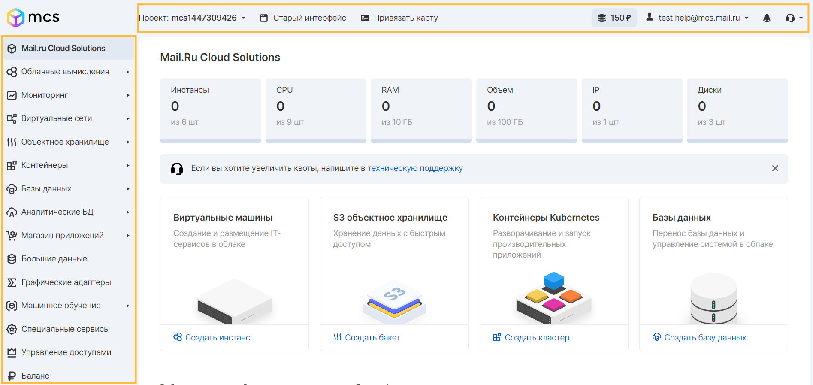
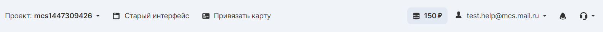
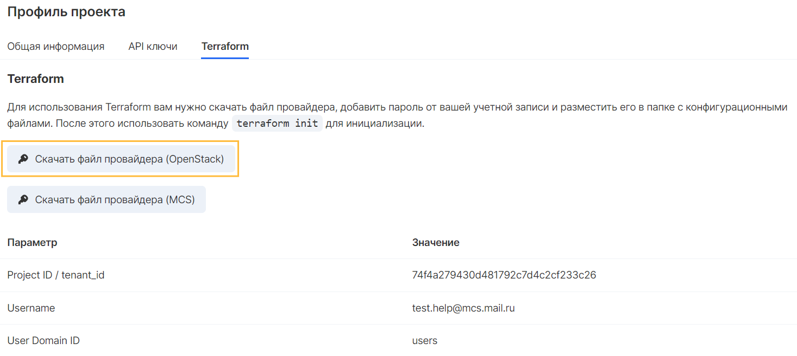

Administrators need to administer and manage project resources to perform various work functions, and these controls must be understood and protected.

VK Cloud Solutions platform provides several management interfaces for users.

## VK CS Control Panel

The VK CS control panel, or personal account, consists of information about the project (top), the services panel (left), and the main work screen (center).



Let's look at some elements of this panel:



In the **upper part** you can see:

* Information about the project;
* Linking the card for automatic replenishment of the balance;
* The current balance of the project and the transition to the "Balance" section;
* Account Properties;
* System notifications;
* Ways to contact support quickly.

VK CS services are located on the left side of the screen. The set of services changes as the functionality of the platform is expanded.

**The main (central) part** of the screen reflects the management capabilities of the relevant services and resources.

## CLI

Working with the virtual infrastructure is also possible through OpenStackClient. OpenStackClient is a client that allows you to use the OpenStack API through a command-line interface using a single and simple command structure. 

The complete list of clients and information on their use is in the official [developer documentation] (https://docs.openstack.org/python-openstackclient/latest /).

### Installing the openstack-client

The python3-openstackclient package includes a basic set of commands for managing the platform.

The following instructions will help you install openstackclient:

#### Linux

##### Using apt (Debian, Ubuntu):

```
apt update
apt install python3-openstackclient 
```

##### Using dnf (RHEL 8, CentOS 8, Fedora):

```
dnf install [https://www.rdoproject.org/repos/rdo-release.el8.rpm](https://www.rdoproject.org/repos/rdo-release.el8.rpm) 
dnf update
dnf install python3-openstackclient
```

##### Using yum (CentOS 7):

```
yum install [https://rdoproject.org/repos/rdo-release.rpm](https://rdoproject.org/repos/rdo-release.rpm) 
yum update 
yum install python2-openstackclient
```

##### Using pip3:

To install using pip3, the following packages must be present in the system: gcc, pyhton3-dev, python3-pip.

```
pip3 install -UI pbr testresources setuptools pytz wheel 
pip3 install -UI python-openstackclient
```

#### Windows

Before you start, you should install the latest version of [Python3](https://www.python.org/downloads/window) and [Microsoft Build Tools](https://visualstudio.microsoft.com/ru/visual-cpp-build-tools /). In the Visual Studio installer, you need to select "C++ Build Tools" in the "Workloads" section; mark only the SDK for Windows 10 and MSVC - C++ build tools in the installation components.

Next, run the following commands on the command line:

```
pip3 install -UI pbr setuptools pytz wheel 
pip3 install -UI python-openstackclient
```

### Installing additional openstack packages

The following individual clients have been deprecated in favor of the general openstack-client. Instead of installing and exploring all these clients, installing and using the OpenStack client is recommended.

In some cases, it is necessary to install a client for a separate project since the functionality of the OpenStack client may not be enough. To install a separate client package, replace the name 'PROJECT` in this command with 'pip install` using the list below:

```
\# pip install python-PROJECTclient
```

* cinder - Block storage API and extensions
* glance - Image API
* heat - orchestration API
* magnum - Kubernetes Container Infrastructure Management API
* manila - Shared file systems File Storage API
* neutron - Networks API
* nova - Cloud Computing (VM) API and extensions
* sahara - Big Data Processing API
* trove - Database API

### Authorization in the CLI

Upload the [API keys] in the panel (https://mcs.mail.ru/app/project/keys /) the openrc personal account file for the CLI configuration.

>**Important:**<br>Each region uses its openrc file. You can learn more about the regions in the article [Regions](https://mcs.mail.ru/docs/ru/additionals/start/user-account/regions ).

Then, follow the steps corresponding to the procedure for the operating system on your computer:

#### Linux

Import variables from the openrc file using the `source` command:

```
source file.sh 
```

#### Windows

Open the openrc file downloaded from your personal account, find the variables starting with OS_ in it, and import it to the command line using the `SET' command, for example, substituting the value from the saved openrc file without quotes into each variable:

```
set OS_INTERFACE=public
set OS_AUTH_URL=[https://infra.mail.ru:35357/v3/](https://infra.mail.ru:35357/v3/)
set OS_USERNAME=email
set OS_PROJECT_ID=projectID
set OS_REGION_NAME=regionName
set OS_USER_DOMAIN_NAME=users
set OS_PASSWORD=your_password
set OS_IDENTITY_API_VERSION=3
```

The following variable values should be used for PowerShell: 

```
$env:OS_INTERFACE = "public"
$env:OS_AUTH_URL = "[https://infra.mail.ru:35357/v3/](https://infra.mail.ru:35357/v3/)"
$env:OS_USERNAME = "email"
$env:OS_PROJECT_ID = "projectID"
$env:OS_REGION_NAME = "regionName"
$env:OS_USER_DOMAIN_NAME = "users"
$env:OS_PASSWORD = "your_password"
$env:OS_IDENTITY_API_VERSION = "3"
```

>**Important:**<br>For the `OS_PASSWORD' variable, you must enter a valid account password; it is not in the openrc file.

#### Checking the operation of the CLI

Check the operation of the CLI using the command, for example:

```
openstack flavor list
```

As a result, a list of available instance configurations will be obtained.

Or:

```
aws --version
```

## S3 CLI

VK CS platform uses S3-compatible object storage as a [Cloud Storage] service (https://mcs.mail.ru/app/services/storage /).

To work with Cloud Storage, you can install AWS S3 CLI:

### Linux

Installation is carried out using the command:

```
pip install awscli
```

### Windows

You can install it using [64-bit](https://s3.amazonaws.com/aws-cli/AWSCLI64.msi) and [32-bit](https://s3.amazonaws.com/aws-cli/AWSCLI32.msi ) of the installer program, as well as using the command:

```
pip install awscli
```

## SQS CLI

For more information about working with the Cloud Queues message queuing service via the CLI, see the article [Working with Cloud Queues in the AWS CLI](https://mcs.mail.ru/docs/ru/manage/cloud-queues/cloud-queues-cli).
## API

To manage VK CS platform resources, you can use the API to launch instances, create images, assign metadata to instances and images, create containers and storage objects, and perform other actions in projects.

>**Important:**<br>The list of endpoints varies depending on the selected region. You can learn more about the regions in the article [Regions](https://mcs.mail.ru/docs/ru/additionals/start/user-account/regions ).

The list of available endpoints is always available in the VK CS panel [in the "API Endpoints" section] (https://mcs.mail.ru/app/project/endpoints /).

### API usage Examples

After authentication with Identity, you can use other APIs to create and manage resources in the project. 

To start sending API requests, use one of the following methods:

* **cURL** is a command-line tool that allows you to send HTTP requests and receive responses.
* **Openstack CLI** is a client that allows you to access the API through easy-to-use commands.
* **REST clients** - Mozilla and Google provide browser-based graphical interfaces for REST. For Firefox, see [RestClient](https://addons.mozilla.org/en-US/firefox/addon/restclient /). For Chrome, see [rest-client](https://code .google.com/archive/p/rest-client/).
*   **OpenStack Python Software Development Kit (SDK)** - SDK for writing Python automation scripts that create and manage resources in a project. The SDK implements Python bindings to the OpenStack API, which allows you to perform automation tasks in Python by making Python object calls instead of direct REST calls. All OpenStack command-line tools are implemented using the Python SDK.
*   **OpenStack APIs**

## Terraform

With Terraform, you can manage the infrastructure in the cloud as a code (IaC). Terraform allows you to spend less time on routine operations and reduces the risk of errors due to the use of scripts.

### Terraform Installation

To get started, you should [download the package](https://www.terraform.io/downloads.html ) from the developer's official website under the operating system used. The downloaded archive contains binary code and is not an independent installer program.

It is recommended to place the unpacked file in a dedicated directory for a subsequent call.

### Authorization

To use Terraform, download the provider's file, change the configuration by adding the account password, and place it in the root directory with the binary file.

Each region has its configuration file. You can find more information about the regions in the article [Regions](https://mcs.mail.ru/docs/ru/additionals/start/user-account/regions )

The Openstack RC file is located in [Project Settings in the personal account](https://mcs.mail.ru/app/project/terraform /):



You can check the work using the command:

```
terraform init
```

The configuration will be initialized, which will result in the creation of an additional directory and the saving of variables.