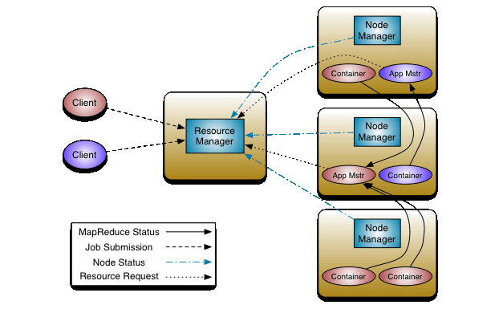

The Apache Hadoop project develops open source software for reliable, scalable distributed computing.

The Apache Hadoop software library is a platform that enables distributed processing of large datasets between clusters using simple programming models. It is designed to scale from individual servers to thousands of machines, each offering separate computing and storage.

The Apache Hadoop project includes the following modules:

*   Hadoop Common - Common utilities that support other Hadoop modules
*   HDFS is a distributed file system that provides high-performance access to application data.
*   Hadoop YARN is a framework for scheduling jobs and managing cluster resources.
*   Hadoop MapReduce is a YARN-based system for parallel processing of large datasets.

HDFS
----

This distributed file system is designed to run on standard hardware. HDFS is highly resilient and is designed to be deployed on low-cost hardware. HDFS provides high-performance data access and is suitable for data-intensive applications.

The main architectural goal of HDFS is to detect failures and quickly and automatically recover from them.

Applications running on HDFS need streaming access to their datasets. HDFS is more for batch processing than for interactive use. The emphasis is on high bandwidth data access.

HDFS has a master / slave architecture. An HDFS cluster consists of a single NameNode, the master server that manages the file system namespace and regulates client file access. In addition, there are several DataNodes that manage the storage connected to the nodes. HDFS provides a file system namespace and allows you to store user data in files. Internally, the file is split into one or more blocks, and these blocks are stored in a set of nodes. The NameNode performs file system namespace operations such as opening, closing, renaming files and directories. DataNodes are responsible for serving read and write requests from file system clients. DataNodes also perform block creation, deletion, and replication on the NameNode command.

Hadoop YARN
-----------

The fundamental idea behind YARN is to separate resource management and job scheduling / monitoring functions into separate daemons. The idea is to have a global ResourseManager (RM) and ApplicationMaster (AM) for each application.

ResourseManager and NodeManager form the data computation structure. ResouresManager has the highest status and allocates resources among all applications in the system. NodeManager is an infrastructure agent for each machine that is responsible for containers, monitors their resource use (processor, memory, disk, network) and reports this to RM.

RM has two main components: Scheduler and ApplicationManager.

The scheduler is responsible for allocating resources among the various running applications, subject to known capacity and queue limits. The scheduler does not monitor or track. The scheduler performs its scheduling function based on the application's resource requirements. Has a pluggable policy that is responsible for dividing cluster resources between different queues.

The ApplicationManager is responsible for accepting submitted jobs, negotiating the container to run a specific ApplicationMaster, and providing a service to restart the ApplicationManager container in case of failure. The ApplicationMaster for each application is responsible for coordinating and scheduling the respective resource containers, tracking their status, and monitoring execution.

Hadoop MapReduce
----------------

Hadoop MapReduce is a software framework for writing applications that process large (multi-terabyte) amounts of data in parallel on large clusters in a reliable and fault-tolerant manner.

MapReduce's job is to split the input dataset into independent blocks that are processed in parallel. The framework sorts the map output, which is then fed into lightweight tasks. As a rule, the input and output of tasks is stored in the file system. The framework takes care of the scheduling of tasks, monitors them and re-executes the outstanding ones.

Typically, compute and storage nodes are the same, that is, the MapReduce infrastructure and HDFS run on the same set of nodes. This configuration allows the platform to efficiently schedule tasks on nodes where data is already present, resulting in very high aggregate cluster throughput.