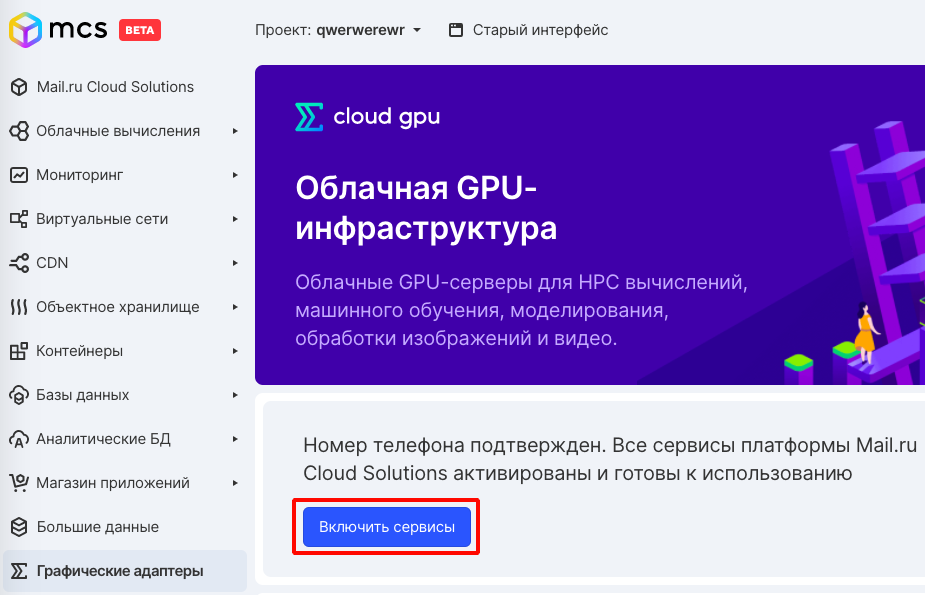
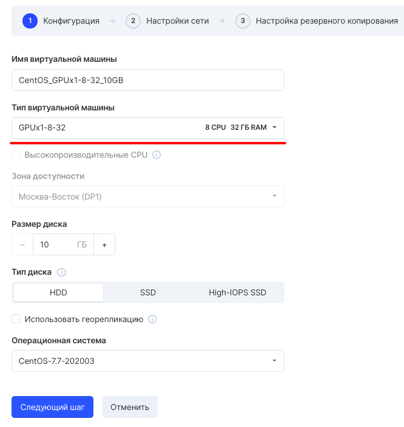

VK Cloud Solutions introduces NVIDIA GPU Cloud Computing. GPU cloud computing empowers companies to tackle tasks that were previously either impossible or resource-intensive.

Uses the highest performing NVIDIA® Tesla® V100 GPUs for deep neural network training and inference.

High performance computing (HPC)
--------------------------------

Solving tasks requiring large computing power is easier to carry out using cloud computing on the GPU. This reduces the time for research and waiting for results.

Server side graphics rendering
------------------------------

Server-side graphics rendering speed with the most advanced NVIDIA® Tesla® V100 GPU, significantly faster than the rendering speed of a regular graphics card.

Time spent on tasks in deep learning, graphical visualization, and HPC can be cut **from days** **to hours** . Whether you train neural networks, tackle complex design challenges, or advance research, NVIDIA® Tesla® V100 and VK Cloud Solutions maximize performance.

GPU-accelerated cloud computing
-------------------------------

New generations of scientific applications and tasks related to artificial intelligence and machine learning require colossal amounts of computing power that even modern CPU servers cannot handle. GPU-accelerated servers are used to successfully solve such problems.

Depending on the type of tasks 1, a modern GPU server can replace up to 100 conventional CPU servers. This is achieved through different ways of performing tasks. The CPU is made up of multiple cores optimized for sequential processing, while the GPU uses thousands of smaller cores to efficiently process parallel tasks.

GPU-based cloud computing will take performance to a new level and significantly reduce processing time, while saving the company money.

VK CS provides NVIDIA® Tesla® V100 graphics cards with 16GB VRAM.

Billing
-------

Tariffication is per second. Rent and deploy computing power in minutes and turn it off as soon as you complete your tasks. Pay only for the actual use of resources with per-second billing.

Current rates can be seen [on this page](https://mcs.mail.ru/cloud-gpu/) .

Connection
----------

To connect, just send an application [from the service page](https://mcs.mail.ru/app/services/gpu/) and (after confirmation) virtual machines with a Tesla graphics card installed will become available for creation.

After confirming the application, configurations with the GPU prefix will appear in the set of virtual machine configurations. These are configurations with a Tesla graphics card installed.

Software
--------

We recommend installing the following GPU software:

*   CUDA Toolkit: [Official Documentation](https://developer.nvidia.com/cuda-toolkit)
*   Deepo (supports. CUDA 10.2): [official documentation](https://github.com/ufoym/deepo)