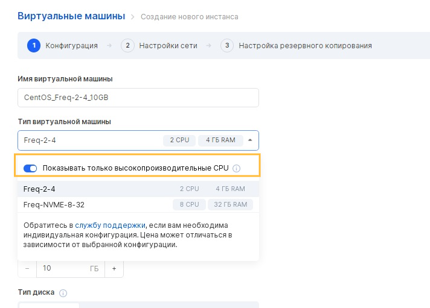
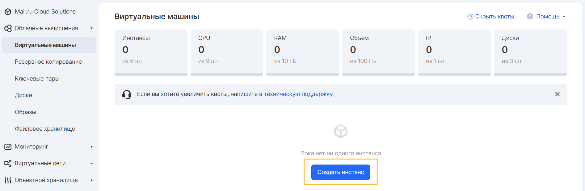
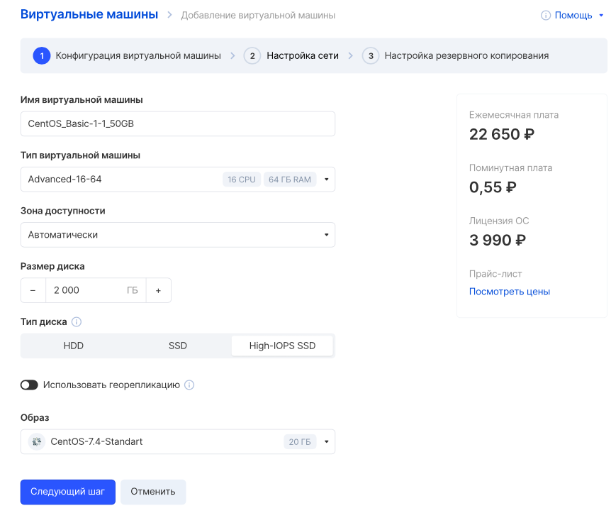
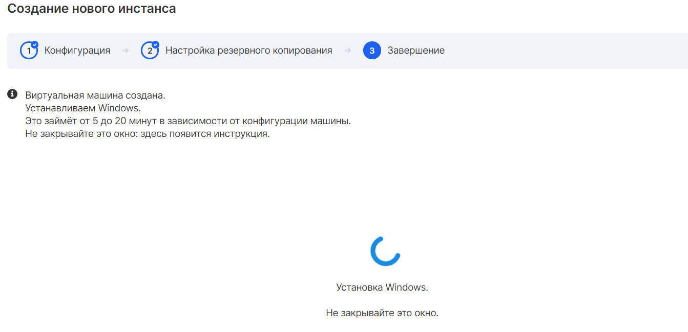

The Cloud Computing service has a wide range of functionality, thanks to which you can create and manage scalable virtual machines.

Virtual machines can have Linux and Windows operating systems available when creating virtual machines. Each operating system disk is automatically replicated within its own AZ for reliable data storage.

The VK CS infrastructure is protected in accordance with Federal Law No. 152.

Before starting work
--------------------

To create a virtual machine, you must register on the VK CS Platform, go to your personal account and make sure that the Cloud Computing service is active, the account balance is positive, and there are enough quotas to create the desired instance configuration.

Configuration templates
-----------------------

There are several groups of configurations (flavors) of virtual machines that are available in the project for creating virtual machines:

<table style="width: 100%; margin-right: calc(0%);"><tbody><tr><td style="width: 16.6329%; background-color: rgb(239, 239, 239);">Name</td><td style="width: 34%; background-color: rgb(239, 239, 239);">Configuration options</td><td style="width: 49.2658%; background-color: rgb(239, 239, 239);">Description</td></tr><tr><td style="width: 16.6329%;">Basic</td><td style="width: 34%;">Up to 2 vCPU Up to 4 GB RAM</td><td style="width: 49.2658%;">base group containing low-performance VM configurations</td></tr><tr><td style="width: 16.6329%;">Standard</td><td style="width: 34%;">2 to 4 vCPU 4 GB to 16 GB RAM</td><td style="width: 49.2658%;">group with more CPU and RAM</td></tr><tr><td style="width: 16.6329%;">Advanced</td><td style="width: 34%;">8 to 16 vCPU 16 GB to 64 GB RAM</td><td style="width: 49.2658%;">group for creating high-performance instances</td></tr><tr><td style="width: 16.6329%;">Heavy</td><td style="width: 34%;">From 16 vCPU From 64 GB RAM</td><td style="width: 49.2658%;">a special group characterizing individual performance configurations</td></tr><tr><td style="width: 16.6329%;">Custom</td><td style="width: 34%;">Not limited</td><td style="width: 49.2658%;">group of individual configurations created on demand</td></tr></tbody></table>

By default, Basic, Standard and Advanced configurations are available in the project. To create Heavy or Custom configurations, [contact our technical support](mailto:support@mcs.mail.ru) . The cost of Heavy and Custom configurations is calculated individually for each request.

VM performance
--------------

VK CS server equipment located in data centers hosting virtual machines has the following characteristics:

<table style="width: 99%; margin-right: calc(1%);"><tbody><tr><td style="width: 36.7519%; background-color: rgb(239, 239, 239);">Parameter</td><td style="width: 63.1202%; background-color: rgb(239, 239, 239);">Value</td></tr><tr><td style="width: 36.7519%;">Processors (Standard)</td><td class="currently-active" style="width: 63.1202%;">
Intel (R) Xeon (R) Gold 6230 CPU @ 2.10GHz

Intel (R) Xeon (R) Gold 6238R CPU @ 2.20GHz
</td></tr><tr><td style="width: 36.7519%;">Processors (High Performance)</td><td style="width: 63.1202%;">
Intel (R) Xeon (R) Gold 6230 CPU @ 3.40GHz

Intel (R) Xeon (R) Gold 6238R CPU @ 3.70GHz
</td></tr><tr><td style="width: 36.7519%;">RAM</td><td style="width: 63.1202%;">DDR4, Synchronous, 2400 MHz</td></tr><tr><td style="width: 36.7519%;">Link</td><td style="width: 63.1202%;">up to 1Gbps, no traffic restrictions</td></tr><tr><td style="width: 36.7519%;">Virtualization type</td><td style="width: 63.1202%;">KVM + OpenStack</td></tr></tbody></table>

By default, configurations are available in the project that allow you to create virtual machines on servers with processors of the "Standard" category: Intel (R) Xeon (R) Gold 6230 CPU @ 2.10GHz and Intel (R) Xeon (R) Gold 6238R CPU @ 2.20GHz ...

To gain access to the high-performance Intel (R) Xeon (R) Gold 6230 CPU @ 3.40GHz and Intel (R) Xeon (R) Gold 6238R CPU @ 3.70GHz processors, please [contact technical support](mailto:support@mcs.mail.ru) . The cost of configuring a virtual machine with a high-performance processor is calculated individually for each request.

After gaining access, you can create a virtual machine with a high-performance processor in your personal account by checking the "Show only high-performance CPUs" option in the instance creation wizard:

VM creation
-----------

A virtual machine is created in the Virtual machines section of the Cloud computing section using the "Create instance" button.

When you click on the button, the virtual machine configurator will open in the window, which consists of several stages, which as a result determines the parameters of the created VM.

At all stages, the configurator informs about the cost of the created instance, additional features, and also allows you to contact support in case of questions.

Depending on the OS family of the machine being created, the fields of information required for creation are dynamically changed:

**For Windows OS**

<table border="0" cellpadding="0" cellspacing="0" style="margin-right: calc(1%); width: 99%;" width="315"><tbody><tr><td style="width: 35.8047%;"><strong>Parameter</strong></td><td style="width: 63.9314%;"><strong>Description</strong></td></tr><tr><td height="19" style="width: 35.8047%;" width="79.68253968253968%">Virtual machine name</td><td style="width: 63.9314%;" width="20.317460317460316%">Instance display name. Also sets hostname in OS</td></tr><tr><td height="19" style="width: 35.8047%;">Virtual machine type</td><td style="width: 63.9314%;">Preset VM configuration (CPU and RAM)</td></tr><tr><td height="19" style="width: 35.8047%;">High performance CPU</td><td style="width: 63.9314%;">If there are configurations with high-performance processors in the project, enabling the option will switch the list of virtual machine types to display such configurations</td></tr><tr><td height="19" style="width: 35.8047%;">Accessibility zone</td><td style="width: 63.9314%;">Choosing the data center where the instance will be launched</td></tr><tr><td height="19" style="width: 35.8047%;">Disk size</td><td style="width: 63.9314%;">Sets the size of the VM disk in GB</td></tr><tr><td height="19" style="width: 35.8047%;">Disc type</td><td style="width: 63.9314%;">The type of instance disk being created, <a href="https://mcs.mail.ru/help/ru_RU/vm-volumes/volume-sla" rel="noopener noreferrer" target="_blank">more details</a></td></tr><tr><td height="19" style="width: 35.8047%;">Operating system</td><td style="width: 63.9314%;">Operating system image (version, revision)</td></tr><tr><td height="19" style="width: 35.8047%;">Network</td><td style="width: 63.9314%;">Creating a VM in an external (ext-net) or private network</td></tr><tr><td height="19" style="width: 35.8047%;">Subnet address</td><td style="width: 63.9314%;">Appears when you select the Create New Network option. Sets the CIDR of the new subnet</td></tr><tr><td height="19" style="width: 35.8047%;">DNS name</td><td style="width: 63.9314%;">Appears when you select a private network. Sets the DNS name of the VM, <a href="https://mcs.mail.ru/help/networks/private-dns" rel="noopener noreferrer" target="_blank">more details</a></td></tr><tr><td height="19" style="width: 35.8047%;">Virtual machine key</td><td style="width: 63.9314%;">Appears when you select a private network. Used to decrypt admin password</td></tr><tr><td height="19" style="width: 35.8047%;">Use config disk</td><td style="width: 63.9314%;">Enabling this option configures the network in the operating system when creating a VM in ext-net or a private network without a DHCP server</td></tr><tr><td height="19" style="width: 35.8047%;">Firewall settings</td><td style="width: 63.9314%;">Selecting available security groups that include allowing traffic flow rules</td></tr><tr><td height="19" style="width: 35.8047%;">Assign external IP</td><td style="width: 63.9314%;">Appears when you select a private network. Assign floating IP</td></tr></tbody></table>

**For Linux OS**

<table border="0" cellpadding="0" cellspacing="0" style="margin-right: calc(1%); width: 99%;" width="315"><tbody><tr><td style="width: 35.5409%;"><strong>Parameter</strong></td><td style="width: 64.3272%;"><strong>Description</strong></td></tr><tr><td height="19" style="width: 35.5409%;" width="79.68253968253968%">Virtual machine name</td><td style="width: 64.3272%;" width="20.317460317460316%">Instance display name. Also sets hostname in OS</td></tr><tr><td height="19" style="width: 35.5409%;">Virtual machine type</td><td style="width: 64.3272%;">Preset VM configuration (CPU and RAM)</td></tr><tr><td height="19" style="width: 35.5409%;">High performance CPU</td><td style="width: 64.3272%;">If there are configurations with high-performance processors in the project, enabling the option will switch the list of virtual machine types to display such configurations</td></tr><tr><td height="19" style="width: 35.5409%;">Accessibility zone</td><td style="width: 64.3272%;">Choosing the data center where the instance will be launched</td></tr><tr><td height="19" style="width: 35.5409%;">Disk size</td><td style="width: 64.3272%;">Sets the size of the VM disk in GB</td></tr><tr><td height="19" style="width: 35.5409%;">Disc type</td><td style="width: 64.3272%;">The type of instance disk being created, more details</td></tr><tr><td height="19" style="width: 35.5409%;">Operating system</td><td style="width: 64.3272%;">Operating system image (version, revision)</td></tr><tr><td height="19" style="width: 35.5409%;">Network</td><td style="width: 64.3272%;">Creating a VM in an external (ext-net) or private network</td></tr><tr><td height="19" style="width: 35.5409%;">Subnet address</td><td style="width: 64.3272%;">Appears when you select the Create New Network option. Sets the CIDR of the new subnet</td></tr><tr><td height="19" style="width: 35.5409%;">DNS name</td><td style="width: 64.3272%;">Appears when you select a private network. Sets the DNS name of the VM, more details</td></tr><tr><td height="19" style="width: 35.5409%;">Virtual machine key</td><td style="width: 64.3272%;">Used to access the instance via ssh</td></tr><tr><td height="19" style="width: 35.5409%;">Use config disk</td><td style="width: 64.3272%;">Enabling this option configures the network in the operating system when creating a VM in ext-net or a private network without a DHCP server</td></tr><tr><td height="19" style="width: 35.5409%;">Firewall settings</td><td style="width: 64.3272%;">Selecting available security groups that include allowing traffic flow rules</td></tr><tr><td height="19" style="width: 35.5409%;">Assign external IP</td><td style="width: 64.3272%;">Appears when you select a private network. Assign floating IP</td></tr></tbody></table>

The next step is to set up a virtual network. You can select an existing network or create a new one (for more details, see the article " [Creating and removing networks](https://mcs.mail.ru/help/ru_RU/networks/create-net) ").

The next step is to set up an automatic VM backup plan.

After that, you should go to the creation stage by clicking the "Add virtual machine" button.

Completion
----------

The virtual machine will be created in 10-15 minutes. During this period, the operating system is being deployed to the instance disk, and system tools are also running to configure the virtual machine in accordance with the specified parameters.

**Attention**

Do not close the new instance creation window.

After completing the setup of the instance, a page with the characteristics of the server and instructions for connecting to it will open.