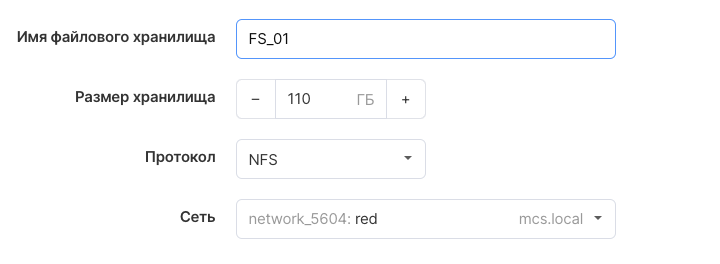
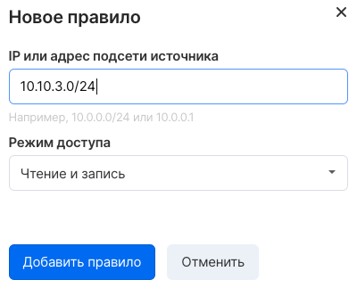

The File Storage Service is a set of services for managing file storage facilities on the VK CS platform. From this service, you can create a remote file system, mount the file system on virtual machines, and then read and write data from instances to and from the file system.

File storages can be connected to project instances using the CIFS or NFS protocols, with shared access by the client's IP address.

**Note**

File storage can only be accessed from virtual machines within the VK CS project.

VK CS control panel
-----------------

To create a storage [in your VK CS account, you](https://mcs.mail.ru/app/services/infra/shares/) should:

1.  Go to the File Storages page of the Cloud Computing service.
2.  Click the "Create" button in the top menu:
3.  Enter the name of the instance, size, select the access protocol and network. To access the storage from Windows, we recommend choosing the CIFS protocol, from Linux - NFS:
4.  Go to the next step, configure the rules for accessing the storage, specifying the IP address and rights (you can add several rules):
5.  Select "Add file server", after which the process of creating the repository will begin.

To delete a file storage, you must first unmount it on virtual machines, then select the "Delete" item in the context menu of the required file storage.

OpenStack CLI
-------------

To create a file store in the manila client, run the commands:

Create a file storage network based on an existing private network:

```
 manila share-network-create --neutron-net-id <private network ID> --neutron-subnet-id <subnet ID> --name <storage network name>
```

Create file storage:

```
 manila create --share-network <file storage network ID> <protocol> <size>
```

Get a list of file servers:

```
 manila list
```

Make sure the instance is active:

```
 manila show <instance ID>
```

Add access rule:

```
 manila access-allow <file storage ID> ip <network address in CIDR format>
```

Check access rules:

```
 manila access-list <file storage ID>
```

To delete a file storage, you must unmount it on instances and run the command to delete it:

```
 manila delete <repository ID>
```