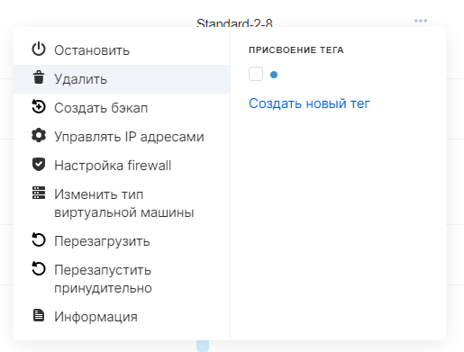
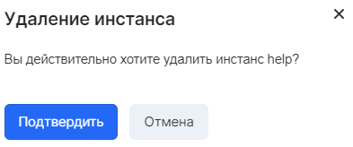

Deleting an instance deletes the virtual machine and the root disk of the server, unless otherwise configured by the disk deletion policy.

**Caution**

It is not possible to reverse the delete operation, so it is recommended that you back up the server first.

If you need to delete only the virtual machine, you should disconnect the disks before deleting and replace the root disk with a temporary one.

VK CS control panel
-----------------

To delete an instance [in your VK CS account, you](https://mcs.mail.ru/app/services/infra/servers/) should:

1.  Go to the Virtual Machines page of the Cloud Computing section.
2.  In the context menu of the instance, select the "Delete" item:
3.  Confirm the operation:

OpenStack CLI
-------------

To delete an instance in the OpenStack client, use the command:

```
 openstack server delete <server ID>
```

View Disk Removal Policy:

```
 nova show <instance ID>
```

As a result of the command execution, the "os-extended-volumes: volumes_attached" line lists the IDs of the disks and their deletion policy ("delete_on_termination").