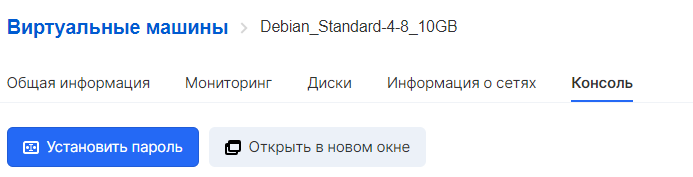
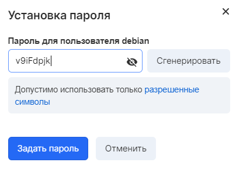
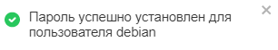

In VK CS, it is possible to set a user password for Windows and Linux operating systems. For this, the following conditions must be met:

*   The instance was created from the image provided by VK CS, or the QEMU guest agent is installed and running on the system
*   At least 15 minutes have passed since the VM was created

VK CS control panel
-----------------

To set a password [in your VK CS personal account](https://mcs.mail.ru/app/services/infra/servers/) , you should:

1.  Go to the Cloud Computing Virtual Machines page.
2.  Click on the required instance, go to the "Console" tab.
3.  Select "Set password". In the appeared password setting menu, enter the password in the input form or select the "Generate" option:
    
    **Attention**
    
    The password must contain upper and lower case letters of the Latin alphabet, numbers, symbols ! "# $% & () \* +, -.:; <=>? @ [] ^ _\` {} ~
    
    The password must contain at least one letter or number, in addition to special characters.
    
4.  Click on "Set password". This will send a command to the instance to change the password for the user, which is displayed in the menu in step 3. If the operation is successful, a notification will appear in the interface:

OpenStack CLI
-------------

To set a password in the OpenStack client, run the command:

```
 openstack server set --root-password <instance ID>
```

A password prompt appears.

You can get an instance ID in the VK CS panel or by running:

```
 openstack server list
```