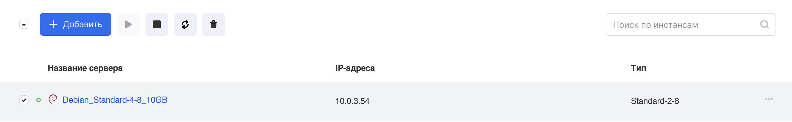
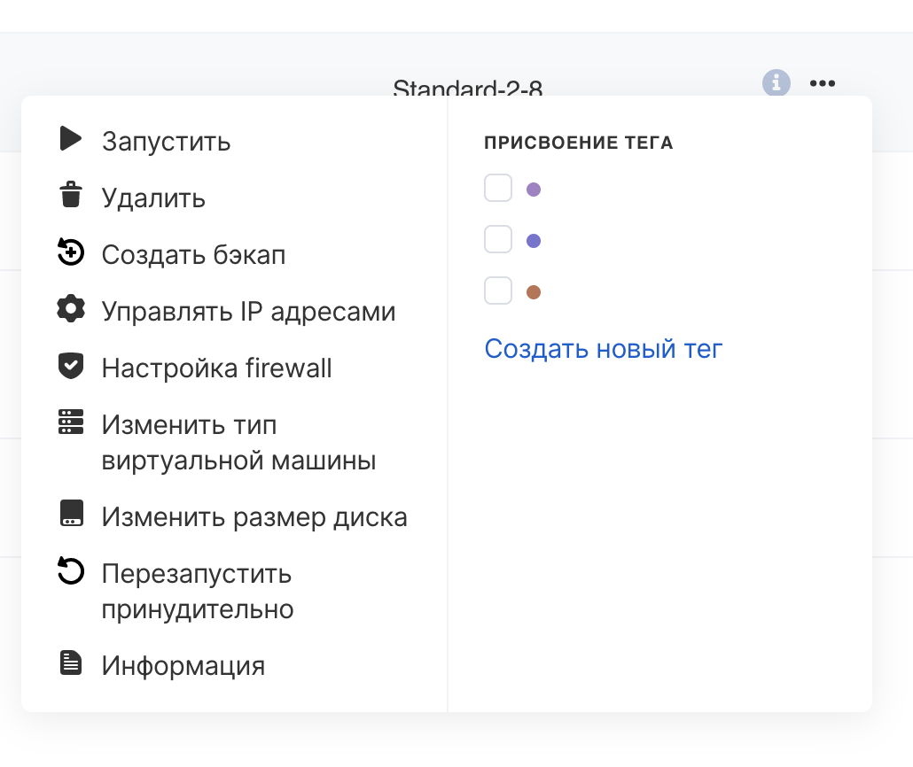
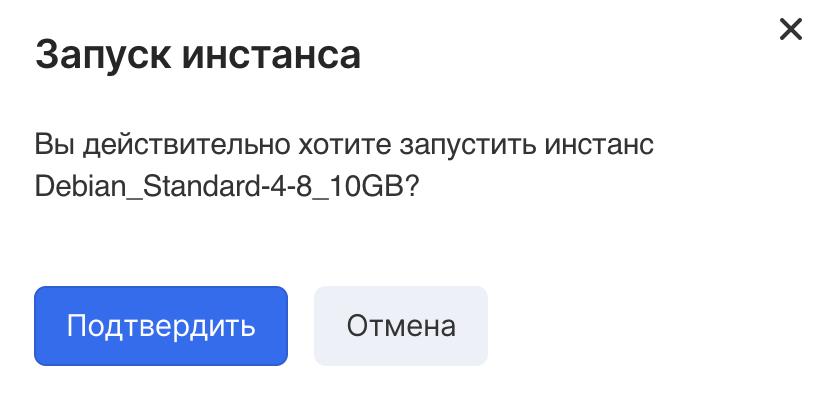
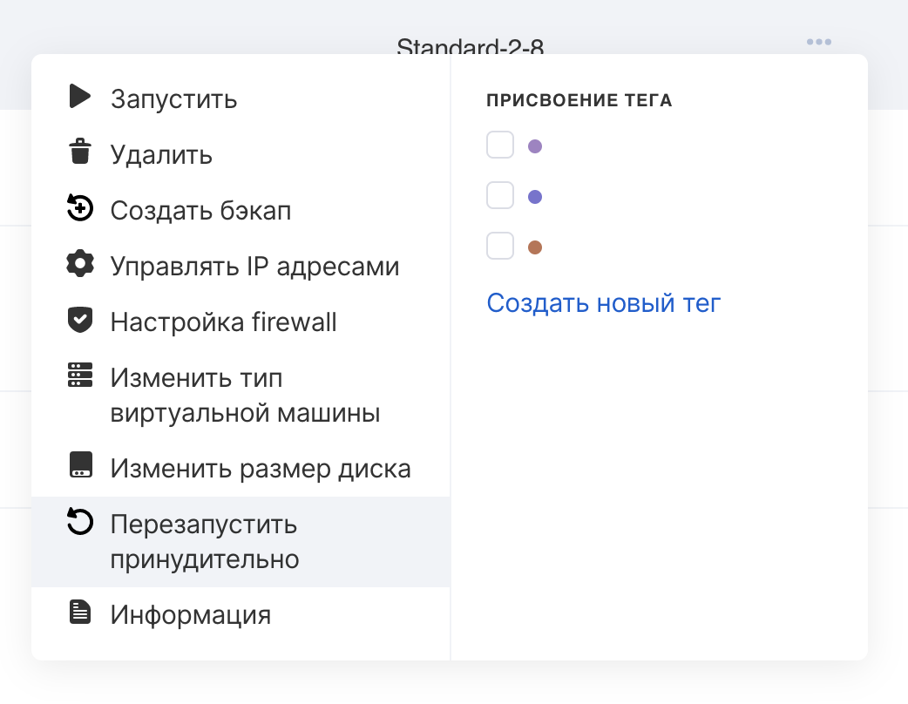

VK CS control panel
-----------------

To work with a VM [in your VK CS account, you](https://mcs.mail.ru/app/services/infra/servers/) should:

1.  Go to the Virtual Machines page of the Cloud Computing section.
2.  Select instances and click on the action button in the top menu. Stop, start, reboot and delete machines are available. Actions can also be called from the context menu:
3.  Select the required action and confirm the operation:

If the instance does not respond for some reason, you can use a forced reboot, you can call the option from the context menu of the virtual machine:

**Information**

A normal reboot attempts to gracefully shutdown the instance's operating system (graceful shutdown), a forced reboot is equivalent to a power cycle.

OpenStack CLI
-------------

To turn on the VM, you need to run in the OpenStack client:

```
 openstack server start <instance ID>
```

Shutdown:

```
 openstack server stop <instance ID>
```

Reboot:

```
 openstack server reboot <instance ID>
```

Force reboot:

```
 openstack server reboot --hard <instance ID>
```