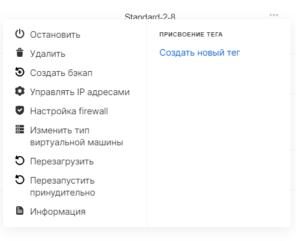
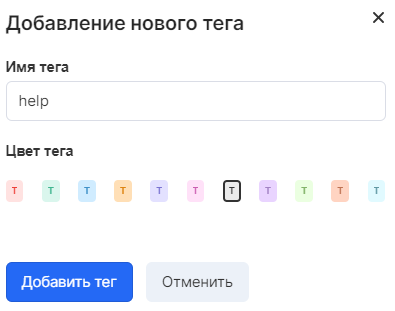
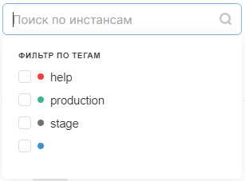

You can add tags to virtual machines - arbitrary combinations of characters that allow you to index instances or filter by a specific tag.

VK CS control panel
-----------------

To manage tags [in your VK CS account, you](https://mcs.mail.ru/app/services/infra/servers/) should:

1.  Go to the Virtual Machines page of the Cloud Computing section.
2.  In the context menu of the instance, in the "tagging" section, select existing tags or create a new one:
3.  When creating a new tag, it is possible to choose the color and name of the tag:
4.  You can search for instances by tag:

OpenStack CLI
-------------

Tags are managed in the openstack client using nova commands.

Adding a tag:

```
 nova server-tag-add <instance ID> <tag>
```

View server tags:

```
 nova server-tag-list <instance ID>
```

Removing a tag:

```
 nova server-tag-delete <instance ID> <tag>
```

Removing all tags for an instance:

```
 nova server-tag-delete-all <instance ID>
```