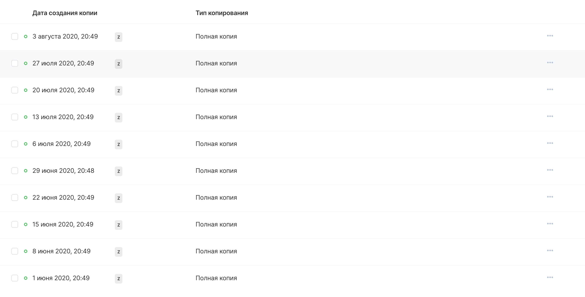

Controlling the availability of backups helps to prevent the loss of important data, and also provides information about possible recovery points for a virtual machine in the event of its failure or the need to undo the changes made.

VK CS control panel
-----------------

To view backups [in your VK CS account, you](https://mcs.mail.ru/app/services/infra/servers/) should:

1.  Go to the "Backup" section of the "Cloud Computing" service.
2.  Go to the required backup plan in the "Automatic" or "Manual" section, the interface for viewing backups will appear:

To delete a backup, select "Delete copy" from the context menu of the recovery point.

To pause or resume the creation of backups, select the required plan on the "Backup" page and click on "Stop" or "Activate" in the top menu.

OpenStack CLI
-------------

To view the backup copies of the plan in the karbor client, you must:

Get a list of providers:

```
 karbor provider-list
```

Get a list of backup plans:

```
 karbor plan-list
```

Get a list of restore points:

```
 karbor checkpoint-list <provider ID> --plan_id <plan ID>
```

To view the restore point, run the command:

```
 karbor checkpoint-show <provider ID> <recovery point ID>
```

To remove a restore point:

```
 karbor checkpoint-delete <provider ID> <restore point ID>
```