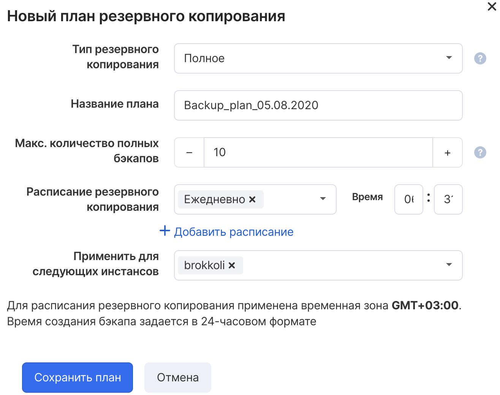

VK CS has the ability to back up virtual machines on a schedule.

Automatic backup is presented as a "Backup Plan" and includes all disks in an instance, adding or removing VM disks also changes the plan.

**Attention**

Backups are placed in a shared data storage and are billed according to the tariff. Detailed information about the storage cost can be seen in the Billing project details.

After the virtual machine is deleted, all backups are saved in the project. Deleting the backups created by the plan will require a manual operation to delete the plan itself. Manual backups can be deleted at any time if necessary.

Configuring a backup plan is available from several interfaces.

VK CS control panel
-----------------

To create a plan [in your VK CS account, you](https://mcs.mail.ru/app/services/infra/servers/) should:

1.  Go to the "Backup" section of the "Cloud Computing" service.
2.  On the Automatic tab, click Add to add the plan.
3.  Configure backup options:
    
    <table style="width: 100%;"><tbody><tr><td style="width: 39.3333%; background-color: rgb(239, 239, 239);">Parameter</td><td style="width: 60.5334%; background-color: rgb(239, 239, 239);">Description</td></tr><tr><td style="width: 39.3333%;">Backup type</td><td style="width: 60.5334%;">Full or incremental backups. Incremental allows you to save space, reduce costs and increase the speed of creating backups</td></tr><tr><td style="width: 39.3333%;">Plan name</td><td style="width: 60.5334%;">Backup plan name</td></tr><tr><td style="width: 39.3333%;">Max. number of full backups</td><td style="width: 60.5334%;">Configures the number of full backups to keep</td></tr><tr><td style="width: 39.3333%;">Backup Schedule</td><td style="width: 60.5334%;">Specifies the days and times for making copies. Multiple schedules can be created</td></tr><tr><td style="width: 39.3333%;">Apply for the following instances</td><td style="width: 60.5334%;">Selecting virtual machines for which copies will be created</td></tr></tbody></table>
    
4.  Click "Save Plan".

To edit a backup plan in the "Backup" section, select "Edit" in the context menu of the plan.

To delete a plan, select "Delete" in the context menu of the plan. This will also delete all restore points (backups).

OpenStack CLI
-------------

To create a backup in the karbor client you need:

Get a list of providers:

```
 karbor provider-list
```

Get a list of resources that can be backed up:

```
 karbor protectable-list
```

Get a list of instances available for backup:

```
 karbor protectable-list-instances OS :: Nova :: Server
```

Create trigger (backup schedule):

```
 karbor trigger-create '<name>' 'time' "pattern" = "<schedule in crontab format>", "format" = "crontab"
```

Create a backup plan:

```
 karbor plan-create '<name>' '<provider ID>' 'Server ID' = 'OS :: Nova :: Server' = '<resource name>'
```

Create backup operation:

```
 karbor scheduledoperation-create '<name>' <trigger ID> "plan_id" = "<plan ID>", "provider_id" = "<provider ID>", "max_backups" = "<number of stored backups>"
```