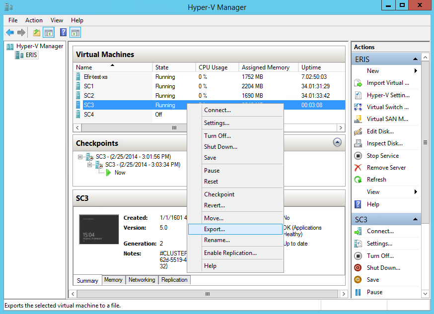
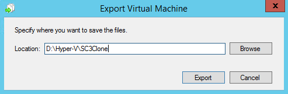

Migration of virtual machines between services / platforms on which they can be launched and operated, as a rule, consists of several stages:

**Attention**

Before migrating a VM, make sure the following requirements are met:

*   The operating system has a 64-bit architecture
*   VM uses BIOS
*   The current user has Administrator rights
*   VM must have at least one connected disk

Preparing for migration
-----------------------

Before migrating a virtual machine, you should perform preparatory actions aimed at providing the existing virtual server with functionality:

**Driver Integration**

The first step is to download and install the VirtIO package drivers into your existing virtual machine.

*   [Windows](https://fedorapeople.org/groups/virt/virtio-win/direct-downloads/archive-virtio/virtio-win-0.1.171-1/) - download and installation [instructions](https://mcs.mail.ru/help/migration-training/windows-hyper-v)
*   [Linux](https://www.linux-kvm.org/page/Virtio) - download and installation instructions

In some cases, if automatic installation of drivers is not possible, you may need to manually add them and install drivers from the downloaded VirtIO driver package.

After installing the drivers, you need to install the QEMU Guest Agent. An installer is used that matches the architecture of the existing virtual machine.

**Adding drivers to the registry**

To correctly identify the drivers, you need to add them to the Windows system registry.

To do this, you should:

1.  Upload [Virtio Registry File](http://migration.platform9.com.s3-us-west-1.amazonaws.com/virtio.reg) to your instance.
2.  Open Windows Registry Editor and import the downloaded file.

Exporting a virtual machine
---------------------------

**Attention**

The virtual machine must be stopped before performing export operations.

There are several ways to export VMs from Hyper-V:

**Hyper-V Manager**

To export a virtual machine to a file, select the desired VM, then export it using the Export function in the virtual machine menu.



In the export window, specify the path to save the exported object.



**PowerShell**

You can export the required virtual machine using the command

```
 Export-VM -Name <virtual_machine_name> -Path '<full_path>'
```

Loading VM image into VK CS
-------------------------

The resulting \* .vhdx file should be loaded into an existing VK CS project.

It is recommended to use the Openstack CLI to load the virtual machine image in order to avoid possible errors in processing large files by the web interface. To load the \* .vhdx image, use the command:

```
 openstack image create --private --container-format bare --disk-format vhdx --property store = s3 --file <file.vhdx> <image_name>
```

If the instance created from the image must support backup, you must load it with the metadata of the presence of the guest agent:

```
 $ openstack image create --private --container-format bare --disk-format vhdx --file <file.vhdx> --property hw_qemu_guest_agent = yes --property store = s3 --property os_require_quiesce = yes <image_name>
```