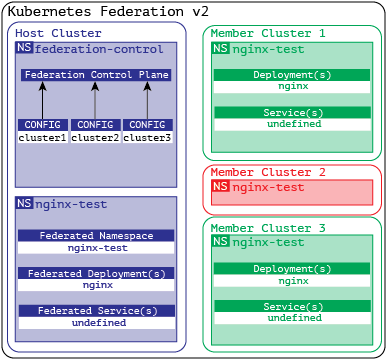

In the Kubernetes world, there are several similar concepts that may have common functionality but represent different deployment models. The simplest deployment model is a single cluster used by a single development team, where no separation is required. Multi-cluster management is the ability to take control of many of these individual clusters. While single cluster deployment is the easiest deployment path, it is not the best use of compute resources as it requires all cluster overhead for each group / use. This is compounded when security and quality assurance teams also need to have their own space to test and deploy the same applications.

Kubernetes Multi-tenancy is the ability to have multiple distinct scopes (usually namespaces) in a single cluster where quotas and security policies can be applied across boundaries to improve overall resource utilization and simplify the overall infrastructure needed to support the environment.

There are times when you still need to leverage multiple separate clusters, be it a separation of development and production, running sensitive workloads, or even multiple data centers. In this scenario, there may still be multi-tenancy in some or all of the clusters, but this is now a multi-cluster deployment. Multi-cluster management allows for a single interface that can control aspects of each cluster connected to the multi-cluster management plane.

Kubernetes Federation expands on some of the multi-cluster attributes, but does not cover all multi-cluster scenarios. When multiple clusters are combined, they actually share parts of their configuration, which is managed by a so-called cluster of nodes and sent to the federated member clusters. The advantage of sharing high-level portions of the configuration is that any resources configured to take advantage of federation will treat all member clusters as a single distributed cluster under the control of the host cluster.

Kubernetes Federation
---------------------

One of the most common scenarios in which federation is desirable is to scale an application across multiple data centers. The application is packaged in deployment, and configured to use federation, and it evenly distributes the required number of replicas across the working nodes in all clusters. Since not all configuration needs to be passed from the host to all members, this allows local variables in each member cluster to be additional to the combined configuration. This allows you to tailor cluster-specific things such as domain names and network policies, which may differ depending on the environment.

Basic architecture of Kubernetes Federation
-------------------------------------------

The core concept of Kubernetes Federation is a host cluster containing any configuration that would be propagated to member clusters. A host cluster can be a member and run real workloads, but typically organizations will have a host cluster as a separate cluster for simplicity.

All cluster-wide configurations are processed through a single API and define both what is included in the scope of the federation and which clusters this part of the configuration will also be transferred. The details of what goes into the merged configuration are determined by a series of templates, policies, and overrides for a particular cluster.

Federated configuration manages DNS records for any multicluster services in addition to the necessary access to all member clusters to create, apply, and delete any configuration items, including deployments. Typically, each deployment will have its own namespace, which will be consistent across all member clusters.

For example, Kubernetes federation is configured with three member clusters. The first runs on the Google cloud in Canada, the second on Azure in Singapore, and the third on the IBM cloud in the UK. And there is the option to deploy application A in the test-app1 namespace in gke-canada and ibm-uk, while application B will deploy to gke-canada and aks-singapore.

More information on the Kubefed architecture [can be found on the project's GitHub](https://github.com/kubernetes-sigs/kubefed) .

Configuring Kubernetes Federation
---------------------------------

The base thread selects the cluster to become the node cluster and configures the required roles and service accounts, and deploys the federation control plane.

```
 cat << EOF | kubectl apply -f -
apiVersion: v1
kind: ServiceAccount
metadata:
name: tiller
namespace: kube-system
---
apiVersion: rbac.authorization.k8s.io/v1
kind: ClusterRoleBinding
metadata:
name: tiller
roleRef:
apiGroup: rbac.authorization.k8s.io
kind: ClusterRole
name: cluster-admin
subjects:
- kind: ServiceAccount
name: tiller
namespace: kube-system
EOF


helm init --service-account tiller
```

Next, you need to install the KubeFed control plane via Helm.

```
 helm repo add kubefed-charts \
https://raw.githubusercontent.com/kubernetes-sigs/kubefed/master/charts
helm install kubefed-charts / kubefed --name kubefed --version = \
--namespace kube-federation-system
```

The setup process in Kubernetes Federation
------------------------------------------

Now that the federation is up and running between a couple of Kubernetes clusters, it's time to start taking advantage of the capabilities to simplify service and application administration. The most common object types federated are deployments and services that point to the applications contained in those deployments.

The first two pieces of the puzzle that are needed are a central namespace created in the host cluster to contain the pooled deployment resources, and a pooled namespace of the same name in each cluster that will contain the deployed resources:

```
 apiVersion: v1
kind: Namespace
metadata:
name: nginx-test
---
apiVersion: types.kubefed.io/v1beta1
kind: FederatedNamespace
metadata:
name: nginx-test
namespace: nginx-test
spec:
placement:
clusters:
- name: cluster1
- name: cluster2
- name: cluster3
```

The functional piece of the puzzle is the actual federated nginx deployment, which will create four replicas that are evenly distributed across the specified clusters and use the nginx-test namespace on all clusters:

```
 apiVersion: types.kubefed.io/v1beta1
kind: FederatedDeployment
metadata:
name: nginx-test
namespace: nginx-test
spec:
template:
metadata:
labels:
app: nginx
spec:
replicas: 4
selector:
matchLabels:
app: nginx
template:
metadata:
labels:
app: nginx
spec:
containers:
- image: nginx
name: nginx
placement:
clusters:
- name: cluster1
- name: cluster3
```

The diagram below shows how the configuration is propagated across active clusters that are pooled. It should be noted that the configuration did not get into the cluster excluded from it. While cluster2 has a namespace, it has no deployed artifacts, which means that just because the namespace exists in a member cluster doesn't mean everything is automatically propagated to it without being declared in a federated deployment.

