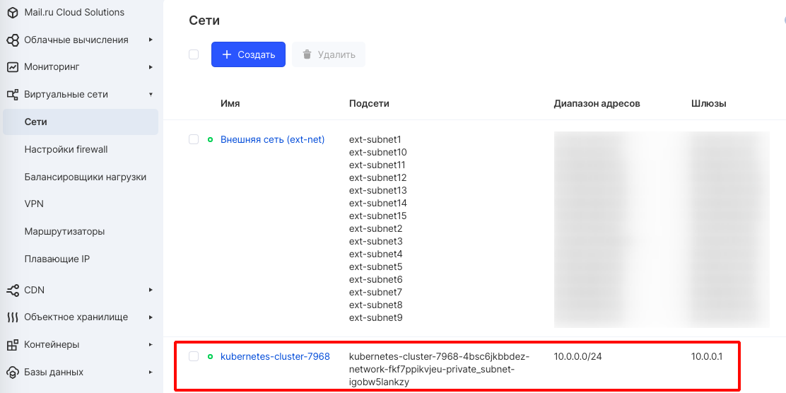
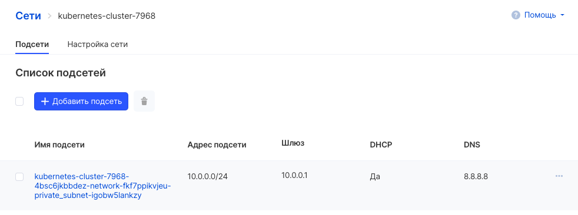
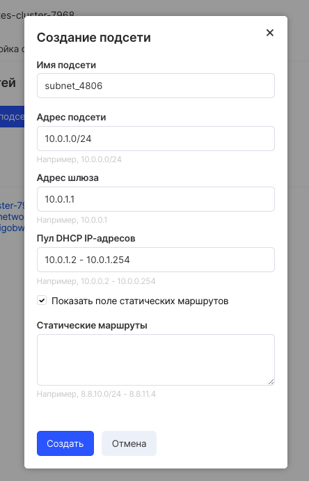

Kubernetes is designed for sharing machines between applications. Generally, sharing computers requires that two applications do not try to use the same ports. Port coordination between multiple developers is very complex at scale and exposes users to cluster-level issues that they cannot control.

Dynamic port allocation creates a lot of complexities for the system - every application must accept ports as flags, API servers must know how to insert dynamic port numbers into config blocks, services must know how to find each other, etc. Instead of getting busy By this, Kubernetes takes a different approach.

Kubernetes networking model
---------------------------

Each Pod gets its own IP address. This means you don't need to explicitly create links between the Pods and you almost never need to deal with mapping container ports to host ports. This creates a clean, backward-compatible model that Pods can work with as virtual machines or physical hosts in terms of port allocation, naming, service discovery, load balancing, application configuration, and migration.

Kubernetes has the following fundamental requirements for any network implementation (prohibiting any intentional network segmentation policies):

*   modules on a node can communicate with all modules on all nodes without NAT
*   agents on a node (e.g. system daemons) can communicate with all modules on that node

**Note**

For platforms that support Pods on the host network (e.g. Linux), pods on the host's host network can communicate with all pods on all hosts without NAT.

This model is not only less complex overall, but is fundamentally compatible with Kubernetes' desire to easily port applications from virtual machines to containers. If your work was previously done in a virtual machine, your virtual machine had an IP address and could communicate with other virtual machines in your project. This is the same basic model.

Kubernetes IP addresses exist in Pod scope - containers within the Pod share their network namespaces, including their IP addresses. This means that all containers inside the Pod can reach each other's ports via localhost. This also means that the containers inside the Pod must coordinate the use of the port, but this is no different from the processes in the virtual machine. This is called the "IP-per-pod" model.

How this is implemented is a detail of the particular container runtime used.

It is possible to query the ports on the nodes themselves that are forwarding to your Pod (called host ports), but this is a very rare operation. The implementation of this forwarding is also a detail of the container runtime. The program itself is not aware of the existence or absence of host ports.

Network management
------------------

Networks are managed in [the "Networks" section of your personal account](https://mcs.mail.ru/app/services/server/networks/) . When a cluster is created, as a rule, a network for this cluster is also created.

By clicking on the name of the network, you can go to the settings of its subnets:

and add a new subnet if necessary:

If you click on the subnet name, you can get to the subnet information card. The "Ports" tab is the most interesting, since the "Information" tab is partially duplicated on the cards higher in the hierarchy.

On the Ports tab, you can see the network connections / network entities connected to the cluster and add new ones if necessary.

### Important

When creating a cluster, you can specify the network in which the cluster will be deployed (if the network has already been created). If there is no network or it is not specified, then the cluster will create its own private network.

You can also choose to create a cluster without external IP (shadowport technology). To create such a cluster, you need to contact support [through the feedback form](https://mcs.mail.ru/help/contact-us) indicating the project ID.