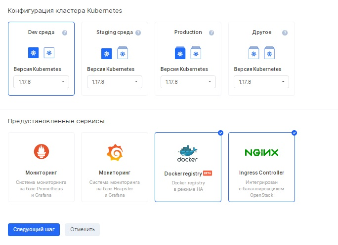

Description
-----------

A load balancer is a method of distributing jobs (traffic) across multiple servers in order to optimize resource utilization, reduce query service time, scale out a cluster (dynamically adding and removing devices), and providing fault tolerance.

Balancer Management
-------------------

To work with container balancers, you need the [kubectl](https://kubernetes.io/docs/reference/kubectl/overview/) utility.

You can control various options of the NGINX Ingress Controller using ConfigMap or annotations. In the case of using ConfigMap, these parameters will be applied globally to all Ingress resources, in the case of annotations - only to the Ingress that uses this annotation. The following table shows the correspondence between the available annotations and ConfigMap keys.

**Matching annotations**

<table border="0" cellpadding="0" cellspacing="0" style="margin-right: calc(0%); width: 100%;" width="483"><tbody><tr><td class="xl64" height="38" style="background-color: rgb(239, 239, 239);" width="16.770186335403725%">annotation</td><td class="xl64" style="background-color: rgb(239, 239, 239);" width="19.875776397515526%">ConfigMap key</td><td class="xl64" style="background-color: rgb(239, 239, 239);" width="44.3064182194617%">Description</td><td class="xl64" style="background-color: rgb(239, 239, 239);" width="19.047619047619047%">Default value</td></tr><tr><td class="xl64" height="192" width="16.770186335403725%">kubernetes.io/ingress.class</td><td class="xl64" width="19.875776397515526%">N / A</td><td class="xl64" width="44.3064182194617%">Determines which Ingress controller should handle the Ingress resource. Set the nginx value to have the NGINX Ingress controller handle it.</td><td class="xl64" width="19.047619047619047%">N / A</td></tr><tr><td class="xl64" height="96" width="16.770186335403725%">nginx.org/proxy-connect-timeout</td><td class="xl64" width="19.875776397515526%">proxy-connect-timeout</td><td class="xl64" width="44.3064182194617%">Sets the value of the proxy_connect_timeout directive.</td><td class="xl64" width="19.047619047619047%">60s</td></tr><tr><td class="xl64" height="96" width="16.770186335403725%">nginx.org/proxy-read-timeout</td><td class="xl64" width="19.875776397515526%">proxy-read-timeout</td><td class="xl64" width="44.3064182194617%">Sets the value of the proxy_read_timeout directive.</td><td class="xl64" width="19.047619047619047%">60s</td></tr><tr><td class="xl64" height="96" width="16.770186335403725%">nginx.org/client-max-body-size</td><td class="xl64" width="19.875776397515526%">client-max-body-size</td><td class="xl64" width="44.3064182194617%">Sets the value of the client_max_body_size directive.</td><td class="xl64" width="19.047619047619047%">1m</td></tr><tr><td class="xl64" height="96" width="16.770186335403725%">nginx.org/proxy-buffering</td><td class="xl64" width="19.875776397515526%">proxy-buffering</td><td class="xl64" width="44.3064182194617%">Enables or disables buffering of responses from the proxy server.</td><td class="xl64" width="19.047619047619047%">True</td></tr><tr><td class="xl64" height="77" width="16.770186335403725%">nginx.org/proxy-buffers</td><td class="xl64" width="19.875776397515526%">proxy-buffers</td><td class="xl64" width="44.3064182194617%">Sets the value of the proxy_buffers directive.</td><td class="xl64" width="19.047619047619047%">Depends on the platform.</td></tr><tr><td class="xl64" height="77" width="16.770186335403725%">nginx.org/proxy-buffer-size</td><td class="xl64" width="19.875776397515526%">proxy-buffer-size</td><td class="xl64" width="44.3064182194617%">Sets the value of the proxy_buffer_size directive</td><td class="xl64" width="19.047619047619047%">Depends on the platform.</td></tr><tr><td class="xl64" height="96" width="16.770186335403725%">nginx.org/proxy-max-temp-file-size</td><td class="xl64" width="19.875776397515526%">proxy-max-temp-file-size</td><td class="xl64" width="44.3064182194617%">Sets the value of the proxy_max_temp_file_size directive.</td><td class="xl64" width="19.047619047619047%">1024m</td></tr><tr><td class="xl64" height="192" width="16.770186335403725%">nginx.org/proxy-hide-headers</td><td class="xl64" width="19.875776397515526%">proxy-hide-headers</td><td class="xl64" width="44.3064182194617%">Sets the value of one or more proxy_hide_header directives. Example: "nginx.org/proxy-hide-headers": "header-a, header-b"</td><td class="xl64" width="19.047619047619047%">N / A</td></tr><tr><td class="xl64" height="192" width="16.770186335403725%">nginx.org/proxy-pass-headers</td><td class="xl64" width="19.875776397515526%">proxy-pass-headers</td><td class="xl64" width="44.3064182194617%">Sets the value of one or more proxy_pass_header directives. Example: "nginx.org/proxy-pass-headers": "header-a, header-b"</td><td class="xl64" width="19.047619047619047%">N / A</td></tr><tr><td class="xl64" height="96" width="16.770186335403725%">N / A</td><td class="xl64" width="19.875776397515526%">server-names-hash-bucket-size</td><td class="xl64" width="44.3064182194617%">Sets the value of the server_names_hash_bucket_size directive.</td><td class="xl64" width="19.047619047619047%">Depends on the size of the processor's cache line.</td></tr><tr><td class="xl64" height="96" width="16.770186335403725%">N / A</td><td class="xl64" width="19.875776397515526%">server-names-hash-max-size</td><td class="xl64" width="44.3064182194617%">Sets the value of the server_names_hash_max_size directive.</td><td align="right" class="xl64" width="19.047619047619047%">512</td></tr><tr><td class="xl64" height="58" width="16.770186335403725%">N / A</td><td class="xl64" width="19.875776397515526%">http2</td><td class="xl64" width="44.3064182194617%">Enables HTTP / 2 on SSL-enabled servers.</td><td class="xl64" width="19.047619047619047%">False</td></tr><tr><td class="xl64" height="346" width="16.770186335403725%">nginx.org/redirect-to-https</td><td class="xl64" width="19.875776397515526%">redirect-to-https</td><td class="xl64" width="44.3064182194617%">Sets a 301 redirect rule based on the http_x_forwarded_protoheader value in the server block to force incoming traffic to go over HTTPS. Useful for SSL termination in load balancer in front of Ingress controller - see 115</td><td class="xl64" width="19.047619047619047%">False</td></tr><tr><td class="xl64" height="211" width="16.770186335403725%">ingress.kubernetes.io/ssl-redirect</td><td class="xl64" width="19.875776397515526%">ssl-redirect</td><td class="xl64" width="44.3064182194617%">Sets an unconditional 301 redirect rule for all inbound HTTP traffic to force inbound traffic over HTTPS.</td><td class="xl64" width="19.047619047619047%">True</td></tr><tr><td class="xl64" height="77" width="16.770186335403725%">N / A</td><td class="xl64" width="19.875776397515526%">log-format</td><td class="xl64" width="44.3064182194617%">Sets a custom log format.</td><td class="xl64" width="19.047619047619047%">See the template file.</td></tr><tr><td class="xl64" height="211" width="16.770186335403725%">nginx.org/hsts</td><td class="xl64" width="19.875776397515526%">hsts</td><td class="xl64" width="44.3064182194617%">Enables HTTP Strict Transport Security (HSTS): The HSTS header is added to responses from backends. The preload directive is included in the header.</td><td class="xl64" width="19.047619047619047%">False</td></tr><tr><td class="xl64" height="96" width="16.770186335403725%">nginx.org/hsts-max-age</td><td class="xl64" width="19.875776397515526%">hsts-max-age</td><td class="xl64" width="44.3064182194617%">Sets the value of the HSTS header max-age directive.</td><td class="xl64" width="19.047619047619047%">2592000 (1 month)</td></tr><tr><td class="xl64" height="77" width="16.770186335403725%">nginx.org/hsts-include-subdomains</td><td class="xl64" width="19.875776397515526%">hsts-include-subdomains</td><td class="xl64" width="44.3064182194617%">Adds the includeSubDomains directive to the HSTS header.</td><td class="xl64" width="19.047619047619047%">False</td></tr><tr><td class="xl64" height="77" width="16.770186335403725%">N / A</td><td class="xl64" width="19.875776397515526%">ssl-protocols</td><td class="xl64" width="44.3064182194617%">Sets the value of the ssl_protocols directive.</td><td class="xl64" width="19.047619047619047%">TLSv1 TLSv1.1 TLSv1.2</td></tr><tr><td class="xl64" height="96" width="16.770186335403725%">N / A</td><td class="xl64" width="19.875776397515526%">ssl-prefer-server-ciphers</td><td class="xl64" width="44.3064182194617%">Enables or disables the ssl_prefer_server_ciphers directive.</td><td class="xl64" width="19.047619047619047%">False</td></tr><tr><td class="xl64" height="77" width="16.770186335403725%">N / A</td><td class="xl64" width="19.875776397515526%">ssl-ciphers</td><td class="xl64" width="44.3064182194617%">Sets the value of the ssl_ciphers directive.</td><td class="xl64" width="19.047619047619047%">HIGH:! ANULL:! MD5</td></tr><tr><td class="xl64" height="192" width="16.770186335403725%">N / A</td><td class="xl64" width="19.875776397515526%">ssl-dhparam-file</td><td class="xl64" width="44.3064182194617%">Sets the contents of the dhparam. The controller will create a file and set the value of the ssl_dhparam directive with the path to the file.</td><td class="xl64" width="19.047619047619047%">N / A</td></tr><tr><td class="xl64" height="77" width="16.770186335403725%">N / A</td><td class="xl64" width="19.875776397515526%">set-real-ip-from</td><td class="xl64" width="44.3064182194617%">Sets the value of the set_real_ip_from directive.</td><td class="xl64" width="19.047619047619047%">N / A</td></tr><tr><td class="xl64" height="77" width="16.770186335403725%">N / A</td><td class="xl64" width="19.875776397515526%">real-ip-header</td><td class="xl64" width="44.3064182194617%">Sets the value of the real_ip_header directive.</td><td class="xl64" width="19.047619047619047%">X-Real-IP</td></tr><tr><td class="xl64" height="77" width="16.770186335403725%">N / A</td><td class="xl64" width="19.875776397515526%">real-ip-recursive</td><td class="xl64" width="44.3064182194617%">Enables or disables the real_ip_recursive directive.</td><td class="xl64" width="19.047619047619047%">False</td></tr><tr><td class="xl64" height="307" width="16.770186335403725%">nginx.org/server-tokens</td><td class="xl64" width="19.875776397515526%">server-tokens</td><td class="xl64" width="44.3064182194617%">Enables or disables server_tokensdirective. In addition, you can use NGINX Plus to provide a custom string value, including an empty string value that disables the Server field.</td><td class="xl64" width="19.047619047619047%">True</td></tr><tr><td class="xl64" height="96" width="16.770186335403725%">N / A</td><td class="xl64" width="19.875776397515526%">main-snippets</td><td class="xl64" width="44.3064182194617%">Sets a custom snippet in the main context.</td><td class="xl64" width="19.047619047619047%">N / A</td></tr><tr><td class="xl64" height="77" width="16.770186335403725%">N / A</td><td class="xl64" width="19.875776397515526%">http-snippets</td><td class="xl64" width="44.3064182194617%">Sets a custom snippet in the context of http.</td><td class="xl64" width="19.047619047619047%">N / A</td></tr><tr><td class="xl64" height="96" width="16.770186335403725%">nginx.org/location-snippets</td><td class="xl64" width="19.875776397515526%">location-snippets</td><td class="xl64" width="44.3064182194617%">Sets a custom fragment in the context of a location.</td><td class="xl64" width="19.047619047619047%">N / A</td></tr><tr><td class="xl64" height="96" width="16.770186335403725%">nginx.org/server-snippets</td><td class="xl64" width="19.875776397515526%">server-snippets</td><td class="xl64" width="44.3064182194617%">Sets a custom snippet in the server context.</td><td class="xl64" width="19.047619047619047%">N / A</td></tr><tr><td class="xl64" height="154" width="16.770186335403725%">nginx.org/lb-method</td><td class="xl64" width="19.875776397515526%">lb-method</td><td class="xl64" width="44.3064182194617%">Sets the load balancing method. By default, "" defines the looping method.</td><td class="xl64" width="19.047619047619047%">""</td></tr><tr><td class="xl64" height="77" width="16.770186335403725%">nginx.org/listen-ports</td><td class="xl64" width="19.875776397515526%">N / A</td><td class="xl64" width="44.3064182194617%">Configures the HTTP ports that NGINX will listen on.</td><td class="xl64" width="19.047619047619047%">[80]</td></tr><tr><td class="xl64" height="96" width="16.770186335403725%">nginx.org/listen-ports-ssl</td><td class="xl64" width="19.875776397515526%">N / A</td><td class="xl64" width="44.3064182194617%">Configures the HTTPS ports that NGINX will listen on.</td><td class="xl64" width="19.047619047619047%">[443]</td></tr><tr><td class="xl64" height="77" width="16.770186335403725%">N / A</td><td class="xl64" width="19.875776397515526%">worker-processes</td><td class="xl64" width="44.3064182194617%">Sets the value of the worker_processes directive.</td><td class="xl64" width="19.047619047619047%">auto</td></tr><tr><td class="xl64" height="96" width="16.770186335403725%">N / A</td><td class="xl64" width="19.875776397515526%">worker-rlimit-nofile</td><td class="xl64" width="44.3064182194617%">Sets the value of the worker_rlimit_nofile directive.</td><td class="xl64" width="19.047619047619047%">N / A</td></tr><tr><td class="xl64" height="96" width="16.770186335403725%">N / A</td><td class="xl64" width="19.875776397515526%">worker-connections</td><td class="xl64" width="44.3064182194617%">Sets the value of the worker_connections directive.</td><td align="right" class="xl64" width="19.047619047619047%">1024</td></tr><tr><td class="xl64" height="96" width="16.770186335403725%">N / A</td><td class="xl64" width="19.875776397515526%">worker-cpu-affinity</td><td class="xl64" width="44.3064182194617%">Sets the value of the worker_cpu_affinity directive.</td><td class="xl64" width="19.047619047619047%">N / A</td></tr><tr><td class="xl64" height="96" width="16.770186335403725%">N / A</td><td class="xl64" width="19.875776397515526%">worker-shutdown-timeout</td><td class="xl64" width="44.3064182194617%">Sets the value of the worker_shutdown_timeout directive.</td><td class="xl64" width="19.047619047619047%">N / A</td></tr><tr><td class="xl64" height="250" width="16.770186335403725%">nginx.org/keepalive</td><td class="xl64" width="19.875776397515526%">keepalive</td><td class="xl64" width="44.3064182194617%">Sets the value of the keepalive directive. Please note that proxy_set_header Connection ""; added to the generated config when the value is&gt; 0.</td><td align="right" class="xl64" width="19.047619047619047%">0</td></tr><tr><td class="xl64" height="77" width="16.770186335403725%">N / A</td><td class="xl64" width="19.875776397515526%">proxy-protocol</td><td class="xl64" width="44.3064182194617%">Includes PROXY protocol for incoming connections.</td><td class="xl64" width="19.047619047619047%">False</td></tr><tr><td class="xl64" height="38" width="16.770186335403725%">nginx.org/rewrites</td><td class="xl64" width="19.875776397515526%">N / A</td><td class="xl64" width="44.3064182194617%">Configuring URL rewriting.</td><td class="xl64" width="19.047619047619047%">N / A</td></tr><tr><td class="xl64" height="77" width="16.770186335403725%">nginx.org/ssl-services</td><td class="xl64" width="19.875776397515526%">N / A</td><td class="xl64" width="44.3064182194617%">Enables HTTPS when connecting to service endpoints.</td><td class="xl64" width="19.047619047619047%">N / A</td></tr><tr><td class="xl64" height="58" width="16.770186335403725%">nginx.org/websocket-services</td><td class="xl64" width="19.875776397515526%">N / A</td><td class="xl64" width="44.3064182194617%">Activates websockets for the server.</td><td class="xl64" width="19.047619047619047%">N / A</td></tr><tr><td class="xl64" height="115" width="16.770186335403725%">nginx.org/max-fails</td><td class="xl64" width="19.875776397515526%">max-fails</td><td class="xl64" width="44.3064182194617%">Sets the value of the max_fails parameter of the server directive.</td><td align="right" class="xl64" width="19.047619047619047%">1</td></tr><tr><td class="xl64" height="115" width="16.770186335403725%">nginx.org/fail-timeout</td><td class="xl64" width="19.875776397515526%">fail-timeout</td><td class="xl64" width="44.3064182194617%">Sets the value of the fail_timeout parameter of the server directive.</td><td class="xl64" width="19.047619047619047%">10s</td></tr></tbody></table>

When creating a new Kubernetes cluster, there is already a pre-installed Ingress Controller:



After completing the steps to create a cluster under Virtual Networks - Load Balancers, a load balancer is automatically created for the Ingress Controller:


This feature eliminates the separate step of creating a balancer for the cluster.

**Important**

Certain parameters can only be configured using ConfigMap, or only using annotations.

Configuration with ConfigMaps
-----------------------------

You should edit the nginx-config.yaml file by setting the necessary parameters.

Next, you should apply this file on the Kubernetes cluster:

```
 kubectl apply -f nginx-config.yaml
```

This will change the NGINX Ingress Controller configuration.

If you need to update some parameters, you need to modify the nginx-config.yaml file and run the following command again:

```
 kubectl apply -f nginx-config.yaml
```

Configuration using annotations
-------------------------------

If you need to customize settings for a specific Ingress, the easiest way is to use annotations. Values used in annotations take precedence over ConfigMap.

For example (cafe-ingress-with-annotations.yaml):

```
 apiVersion: extensions / v1beta1
kind: Ingress
metadata:
name: cafe-ingress-with-annotations
annotations:
nginx.org/proxy-connect-timeout: "30s"
nginx.org/proxy-read-timeout: "20s"
nginx.org/client-max-body-size: "4m"
nginx.org/location-snippets: |
if (ssl_client_verify = SUCCESS) {
set auth_basic off;
}
if (ssl_client_verify! = SUCCESS) {
set auth_basic "Restricted";
}
auth_basic auth_basic;
auth_basic_user_file "/var/run/secrets/nginx.org/auth-basic-file";
nginx.org/server-snippets: |
ssl_verify_client optional;
spec:
rules:
- host: cafe.example.com
http:
paths:
- path: / tea
backend:
serviceName: tea-svc
servicePort: 80
- path: / coffee
backend:
serviceName: coffee-svc
servicePort: 80
```

Balancer with internal IP address
---------------------------------

This example shows how to create a service that is accessible via LoadBalancer, but without an external IP address. Annotation service.beta.kubernetes.io/openstack-internal-load-balancer: activates this behavior: instead of the public IP address, the internal one will be allocated. This can be useful in hybrid scenarios where the service consumers are applications on the internal network outside the Kubernetes cluster.

```
 kubectl create -f load-balancer-internal / service-internal-lb.yaml
```

**Manifesto**

```
 ---
apiVersion: v1
kind: Service
metadata:
name: nginx-internal-lb
labels:
k8s-app: nginx-backend
annotations:
service.beta.kubernetes.io/openstack-internal-load-balancer:
spec:
type: LoadBalancer
externalTrafficPolicy: Cluster
selector:
k8s-app: nginx-backend
ports:
- port: 80
name: http
targetPort: 80
---
apiVersion: apps / v1
kind: Deployment
metadata:
name: nginx-backend
spec:
replicas: 2
selector:
matchLabels:
app: nginx-webservice
minReadySeconds: 5
strategy:
type: RollingUpdate
rollingUpdate:
maxUnavailable: 1
maxSurge: 1
template:
metadata:
labels:
app: nginx-webservice
spec:
containers:
- name: nginx
image: library / nginx: 1.15-alpine
ports:
- containerPort: 80
```

After installing the manifest:

```
 watch kubectl get service
NAME CLUSTER-IP EXTERNAL-IP PORT (S) AGE
nginx-internal-lb 10.0.0.10 192.168.0.181 80: 30000 / TCP 5m
```

Balancer with static IP address
-------------------------------

This example shows how to create a service accessible by LoadBalancer using a reserved public IP address.

**Manifesto**

```
 ---
apiVersion: v1
kind: Service
metadata:
name: nginx-existing-lb-ip-2
labels:
k8s-app: nginx-backend
spec:
type: LoadBalancer
externalTrafficPolicy: Cluster
loadBalancerIP: 95.163.250.115
selector:
k8s-app: nginx-backend
ports:
- port: 80
name: http
targetPort: 80
---
apiVersion: apps / v1
kind: Deployment
metadata:
name: nginx-backend
spec:
replicas: 2
selector:
matchLabels:
app: nginx-webservice
minReadySeconds: 5
strategy:
type: RollingUpdate
rollingUpdate:
maxUnavailable: 1
maxSurge: 1
template:
metadata:
labels:
app: nginx-webservice
spec:
containers:
- name: nginx
image: library / nginx: 1.15-alpine
ports:
- containerPort: 80
```

Balancer using sessions
-----------------------

This example shows how to create a service available with LoadBalancer that redirects traffic to target pods not using round-robin balancing, but based on previous requests from the same client. This can help solve many problems with traditional stafetul web applications. SessionAffinity: ClientIP parameter activates the so-called Session Affinity, i.e. all requests of the same user will go to the same pod as long as this one is alive.

```
 kubectl create -f load-balancer-sticky / service-sticky-lb.yaml
```

**Manifesto**

```
 ---
apiVersion: v1
kind: Service
metadata:
name: nginx-internal-lb
labels:
k8s-app: nginx-backend
annotations:
service.beta.kubernetes.io/openstack-internal-load-balancer:
spec:
type: LoadBalancer
sessionAffinity: ClientIP
externalTrafficPolicy: Cluster
selector:
k8s-app: nginx-backend
ports:
- port: 80
name: http
targetPort: 80
---
apiVersion: apps / v1
kind: Deployment
metadata:
name: nginx-backend
spec:
replicas: 2
selector:
matchLabels:
app: nginx-webservice
minReadySeconds: 5
strategy:
type: RollingUpdate
rollingUpdate:
maxUnavailable: 1
maxSurge: 1
template:
metadata:
labels:
app: nginx-webservice
spec:
containers:
- name: nginx
image: library / nginx: 1.15-alpine
ports:
- containerPort: 80
```

After installing the manifest

```
 watch kubectl get service
NAME CLUSTER-IP EXTERNAL-IP PORT (S) AGE
nginx-internal-lb 10.0.0.10 192.168.0.181 80: 30000 / TCP 5m
```