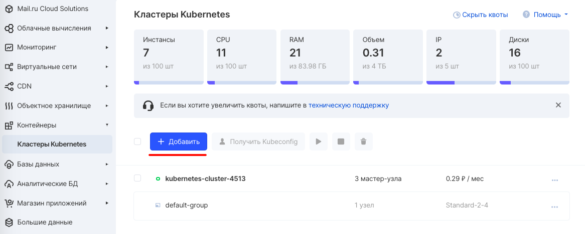
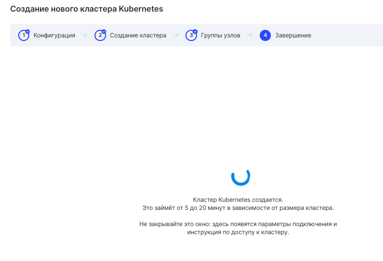

Description
-----------

A Kubernetes cluster is made up of a set of machines called node's that run containerized applications. The cluster must have at least one worker node.

Work nodes host pod's, which are application components. The control plane manages the worker nodes and pods in the cluster. In industrial environments, the control plane is typically run on multiple computers, and the cluster is typically deployed on multiple nodes to ensure fault tolerance and high reliability.

Cluster creation
----------------

To create a cluster, go to the ["Containers" section of the VK CS control panel](https://mcs.mail.ru/app/services/containers/add/) and click the "Add" button.

Then you should select the desired development environment:

*   Dev environment (development)
*   Staging environment (pre-release environment)
*   Production (combat or live environment, for such an environment at least 3 master nodes are recommended)

After clicking the "Next step" button, you need to select a cluster configuration:

The creation wizard reflects the following configuration fields:

<table border="0" cellpadding="0" cellspacing="0" style="margin-right: calc(0%); width: 100%;" width="568"><tbody><tr><td height="19" style="background-color: rgb(239, 239, 239); text-align: center;" width="35.2112676056338%"><strong>Field</strong></td><td style="background-color: rgb(239, 239, 239); text-align: center;" width="64.78873239436619%"><strong>Description</strong></td></tr><tr><td class="xl65" height="38" width="35.2112676056338%">Virtual machine type Master</td><td class="xl65" width="64.78873239436619%">Head node configuration - the number of CPUs and RAM of the controlling machine ("Master"). For productive environments, a minimum configuration of CPU = 2 RAM = 4Gb is recommended.</td></tr><tr><td class="xl65" height="38" width="35.2112676056338%">Number of Master nodes</td><td class="xl65" width="64.78873239436619%">The number of control machines (machines of the "Master" type). For production environments, a minimum of 3 master nodes is recommended.</td></tr><tr><td class="xl65" height="38" width="35.2112676056338%">Disk size on the Master-node, GB</td><td class="xl65" width="64.78873239436619%">Disk volume on control Master nodes.</td></tr><tr><td class="xl65" height="38" width="35.2112676056338%">Node virtual machine type</td><td class="xl65" width="64.78873239436619%">The type of configuration for a worker node is the number of CPU and RAM.</td></tr><tr><td class="xl65" height="19" width="35.2112676056338%">Number of Node</td><td class="xl65" width="64.78873239436619%">The number of working nodes.</td></tr><tr><td class="xl65" height="38" width="35.2112676056338%">Disk size on Node-node, GB</td><td class="xl65" width="64.78873239436619%">Disk space for worker nodes.</td></tr><tr><td class="xl65" height="58" width="35.2112676056338%">Disk type for Master and Node-nodes</td><td class="xl65" width="64.78873239436619%">Disk type (HDD / SSD).</td></tr><tr><td class="xl65" height="38" width="35.2112676056338%">Kubernetes version</td><td class="xl65" width="64.78873239436619%">The version of Kubernetes that will be installed on the cluster nodes.</td></tr><tr><td class="xl65" height="77" width="35.2112676056338%">Net</td><td class="xl65 " width="64.78873239436619%">The network where the cluster will be deployed, if created. If there is no network, then the cluster will create its own private network. You can also choose to create a cluster without external IP (shadowport technology). To create such a cluster, you need to contact support <a href="https://mcs.mail.ru/help/contact-us" title="">through the feedback form</a> indicating the project ID.</td></tr><tr><td class="xl65" height="19" width="35.2112676056338%">Cluster name</td><td class="xl65" width="64.78873239436619%">Cluster name.</td></tr><tr><td class="xl65" height="77" width="35.2112676056338%">Virtual machine key</td><td class="xl65" width="64.78873239436619%">If a key pair has already been created, it is recommended to specify it. You need to make sure that the file is saved from it. You can also create a new key pair - it is needed to connect to the cluster nodes via ssh.</td></tr></tbody></table>

The next step will ask you to select the number of Node.

It will take some time to complete the creation of the cluster.

--