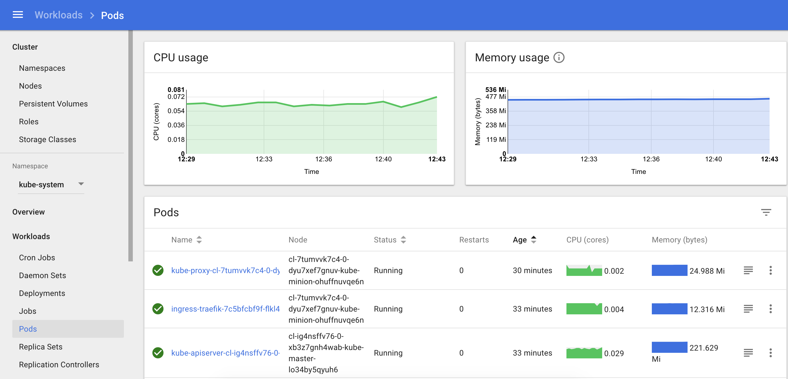
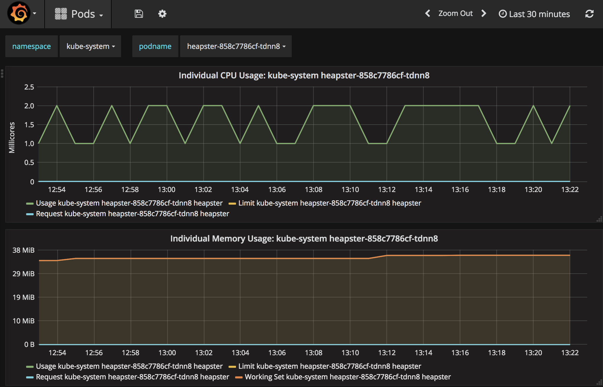

Description
-----------

The Kubernetes cluster contains built-in monitoring tools based on Heapster, InfluxDB time-series database, and Grafana.

As a result, the Kubernetes Dashboard displays monitoring data from both Node nodes and each individual Pod.



Advanced monitoring of Kubernetes infrastructure and all custom applications can be configured using Grafana. Every Pod that is deployed to a Kubernetes cluster will be automatically registered with Grafana. Also, with the help of Grafana, you can configure alerts about unavailability of resources.

Connection
----------

To enter the Grafana panel, you need to establish a connection to the cluster using the command

```
kubectl -n prometheus-monitoring port-forward service/kube-prometheus-stack-grafana 8001:80
```

and open the Grafana interface in a browser:

[http://127.0.0.1:8001](http://127.0.0.1:8001/api/v1/namespaces/kube-system/services/monitoring-grafana/proxy)

For the first login use:

*   Login: **admin**
*   Password: **admin**



**Note**

After the first login, it is recommended to change the user's password in Grafana.